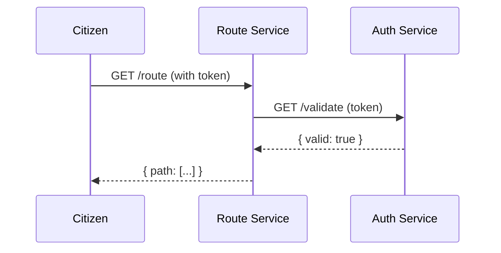

# Chapter 2: Microservices Architecture

In [Chapter 1: Core Infrastructure (HMS-SYS)](01_core_infrastructure__hms_sys__.md) we laid the plumbing for discovery, configuration, logging and security. Now we’ll learn how to design our system as a collection of focused, independent services—each doing one thing well.

## Why Microservices?

Imagine a city made of specialized buildings rather than one giant tower. In HMS-UTL, each building is a microservice:
- **Independent**: Teams can build and deploy without stepping on each other’s toes.  
- **Focused**: One service = one responsibility (e.g., route optimization).  
- **Scalable**: Grow only the parts under heavy load.  
- **Reliable**: A failure in one building doesn’t collapse the whole city.  

### Central Use Case: Postal Route Optimization

A Federal Postal Service portal needs to compute delivery routes for millions of addresses.  
- **Route Service** calculates the fastest path.  
- **Auth Service** verifies citizen tokens before any request.  

When a citizen calls “Get me my route,” the Route Service rings up Auth Service to check permissions—just like a courier calling for backup.

---

## Key Concepts

1. **Single Responsibility**  
   Each microservice does one task (e.g., authentication, routing, data storage).

2. **API Contracts**  
   Clear, versioned HTTP or gRPC endpoints define how services talk.

3. **Service Discovery**  
   Find peers dynamically via [HMS-SYS](01_core_infrastructure__hms_sys__.md) rather than hard-coding URLs.

4. **Loose Coupling**  
   Services only know about APIs, not internal implementations.

5. **Resilience & Scaling**  
   Failures are contained; you can spin up extra instances of only the busy services.

---

## Building Our Example Services

### 1. Auth Service (auth-service)

```javascript
// auth-service/index.js
const express = require('express');
const hmsSys = require('hms-sys');
const app = express();

// 1. Init core infra
hmsSys.init({ env: 'prod', configServer: 'https://config.gov' });
hmsSys.discovery.register('auth-service', 'http://localhost:3001');

// 2. Simple token check endpoint
app.get('/validate', (req, res) => {
  const token = req.headers.authorization;
  // (Imagine policy lookup here)
  res.json({ valid: token === 'Bearer citizen123' });
});

app.listen(3001, () => hmsSys.logger.info('Auth Service up'));
```

This service registers itself, exposes `/validate`, and logs startup.

### 2. Route Service (route-service)

```javascript
// route-service/index.js
const express = require('express');
const hmsSys = require('hms-sys');
const axios = require('axios');
const app = express();

hmsSys.init({ env: 'prod', configServer: 'https://config.gov' });
hmsSys.discovery.register('route-service', 'http://localhost:3000');

app.get('/route', async (req, res) => {
  // 1. Discover Auth Service
  const authUrl = hmsSys.discovery.get('auth-service');
  // 2. Validate token
  const authResp = await axios.get(`${authUrl}/validate`, {
    headers: { authorization: req.headers.authorization }
  });
  if (!authResp.data.valid) return res.status(401).send('Unauthorized');

  // 3. Compute route (stubbed)
  res.json({ path: ['PointA', 'PointB', 'PointC'] });
});

app.listen(3000, () => hmsSys.logger.info('Route Service up'));
```

Here, `/route` first calls Auth Service, then returns a mock path.

---

## What Happens Under the Hood?



1. **Discovery**: Route Service asks HMS-SYS where Auth Service lives.  
2. **Validation**: Route Service sends citizen’s token to Auth Service.  
3. **Computation**: Once valid, Route Service runs its routing logic.  

---

## Inside Service Discovery

Let’s peek at a simplified discovery client used by both services.

```javascript
// hms-sys/discovery.js
const registry = {};

function setup() {
  // Connect to real registry—or use this in-memory store
}

function register(name, url) {
  registry[name] = url;
}

function get(name) {
  if (!registry[name]) throw new Error('Service not found');
  return registry[name];
}

module.exports = { setup, register, get };
```

- **setup()** would normally hook into Consul, etcd, or similar.  
- **register()** publishes your service’s address.  
- **get()** retrieves a peer’s address by name.

---

## Summary

You’ve seen how to break an application into discrete, self-contained services that talk over well-defined APIs. This modular approach:

- Isolates failures  
- Enables independent deployments  
- Scales each service to its own demand  

Next up, we’ll dive into how each microservice manages its business logic and data with the **[Backend Services (HMS-SVC)](03_backend_services__hms_svc__.md)** module.

---

Generated by [AI Codebase Knowledge Builder](https://github.com/The-Pocket/Tutorial-Codebase-Knowledge)