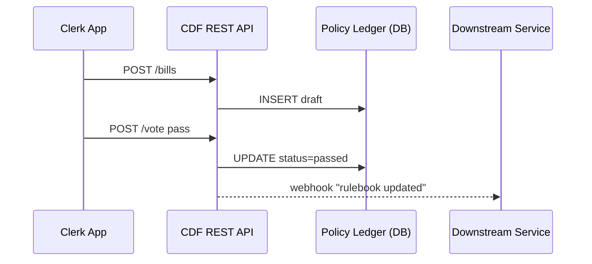

# Chapter 2: Policy Lifecycle Engine (HMS-CDF)

> “Imagine a miniature Capitol Hill that lives inside your codebase.”  
> That is the core idea behind HMS-CDF.

[← Back to Chapter 1](01_multi_layered_system_architecture_.md)

---

## 1. Why Do We Need a “Digital Capitol Hill”?

Picture the U.S. Fire Administration releasing a **new sprinkler rule** after a tragic warehouse blaze:

1. Draft wording is circulated.  
2. Inspectors suggest tweaks.  
3. Final text is enacted.  
4. Every inspection form—and every IoT sprinkler sensor—must now reference the *same* rule text.

Today this process often lives in scattered PDFs and email threads. One team uses “draft 3,” another uses “final 2,” and violations get thrown out in court.

**HMS-CDF ends that chaos** by turning the legislative workflow into trackable, machine-readable events.

---

## 2. What *Is* HMS-CDF?  
A Beginner’s Mental Model

```
Draft Bill  ──┐
Amendment ──┐ │  (version tree)
Vote Pass  ─┼─┼────▶ 🎯  Enacted Policy (canonical)
Vote Fail  ─┘ │
Withdraw   ──┘
```

Think of HMS-CDF as:

* A **version-controlled rulebook** (like Git for laws).
* An **audit log** that remembers *who* changed *what* and *when*.
* A **single API** your apps can query for “the current, legally binding text.”

---

## 3. Key Concepts (No Law Degree Required)

| Term              | Everyday Analogy | What HMS-CDF Stores |
|-------------------|------------------|---------------------|
| Clause            | A single line in a contract | JSON blob with metadata |
| Bill              | A *collection* of new/edited clauses | List of clause IDs |
| Amendment         | A pull-request to a bill | Diff + author |
| Vote              | Up/Down reaction | Timestamp + outcome |
| Enactment         | Merging to `main` | Immutable snapshot |
| Effective Date    | Go-live tag | Date field |

---

## 4. Quick Tour: Creating & Enacting a Rule

Let’s walk through adding the sprinkler requirement.

### 4.1. Draft the Bill

```bash
curl -X POST /cdf/api/v1/bills -d '{"title":"Sprinkler Safety 2024"}'
```

Response:
```json
{ "bill_id": "B42" }
```

### 4.2. Add a Clause

```bash
curl -X POST /cdf/api/v1/bills/B42/clauses \
     -d '{"text":"All storage facilities ≥ 5000 sqft must have sprinklers."}'
```

The bill now has **1 clause**.

### 4.3. Propose an Amendment

```bash
curl -X POST /cdf/api/v1/bills/B42/amendments \
     -d '{"clause_index":0,"new_text":"… ≥ 2500 sqft …"}'
```

Explanation (beginner-friendly):
1. We locate clause 0.  
2. Replace “5000” with “2500”.  
3. Store the diff; nothing is enacted yet.

### 4.4. Record the Vote

```bash
curl -X POST /cdf/api/v1/bills/B42/vote -d '{"outcome":"pass"}'
```

### 4.5. Enact!

```bash
curl -X POST /cdf/api/v1/bills/B42/enact -d '{"effective":"2024-10-01"}'
```

Downstream systems (inspection apps, IoT devices, etc.) can now ask:

```bash
curl /cdf/api/v1/rules?date=2024-12-31
```

…and receive the authoritative sprinkler rule—no matter how many drafts existed.

---

## 5. What Happens Under the Hood?



1. Every event (draft, amendment, vote) is **append-only**.  
2. An “enact” event triggers a **snapshot** of the final text.  
3. A webhook notifies any interested service (e.g., inspection form generator).

---

## 6. Peeking at the Code (Super Simplified)

*File: `hms-cdf/models.py`*

```python
from dataclasses import dataclass, field
from datetime import date
import uuid

@dataclass
class Clause:
    id: str = field(default_factory=lambda: str(uuid.uuid4()))
    text: str = ""

@dataclass
class Bill:
    id: str = field(default_factory=lambda: str(uuid.uuid4()))
    title: str = ""
    clauses: list[Clause] = field(default_factory=list)
    status: str = "draft"        # draft | passed | enacted
    effective: date | None = None
```

Explanation:  
• Just two data classes keep track of everything.  
• Real code adds auth, diffing, and persistence, but the shape is the same.

*File: `hms-cdf/service.py`*

```python
def enact_bill(bill_id: str, effective: date):
    bill = db.get_bill(bill_id)
    if bill.status != "passed":
        raise ValueError("Bill must pass before enactment.")
    bill.status = "enacted"
    bill.effective = effective
    db.save_snapshot(bill)   # immutable copy
    notify_subscribers(bill)
```

Less than 15 lines! Yet it guarantees:

1. Only *passed* bills can be enacted.  
2. A frozen copy is saved for audits.  
3. Everyone listening gets pinged.


---

## 7. Where Does HMS-CDF Live in the 3-Floor Architecture?

* Middle Floor (**HMS-SVC**): API endpoints and rule logic.  
* Basement (**HMS-SYS**): Stores the append-only ledger & snapshots.  
* Top Floor (**HMS-MFE**): Clerks edit bills via a micro-frontend UI.

Refer back to [Chapter 1](01_multi_layered_system_architecture_.md) if you need a mental refresh.

---

## 8. Hands-On: Run It Locally in 60 Seconds

```bash
git clone hms-utl
cd hms-utl/hms-cdf
docker compose up -d           # starts Postgres + API
./scripts/demo_sprinkler.sh    # runs the curl commands above
```

Check `logs/ledger.jsonl` to watch each event append in real time.

---

## 9. What You Learned

✔ The headache of **policy version confusion**  
✔ How HMS-CDF models bills, amendments, votes, and enactments  
✔ Simple API calls to create and publish authoritative rules  
✔ The internal flow: append-only events → snapshot → webhook  
✔ Where HMS-CDF fits in the larger HMS building

Ready to see how *humans* approve or reject those machine-generated drafts?  
Jump into the next chapter: [Governance Layer & Human-in-the-Loop (HITL)](03_governance_layer___human_in_the_loop__hitl__.md)

---

Generated by [AI Codebase Knowledge Builder](https://github.com/The-Pocket/Tutorial-Codebase-Knowledge)