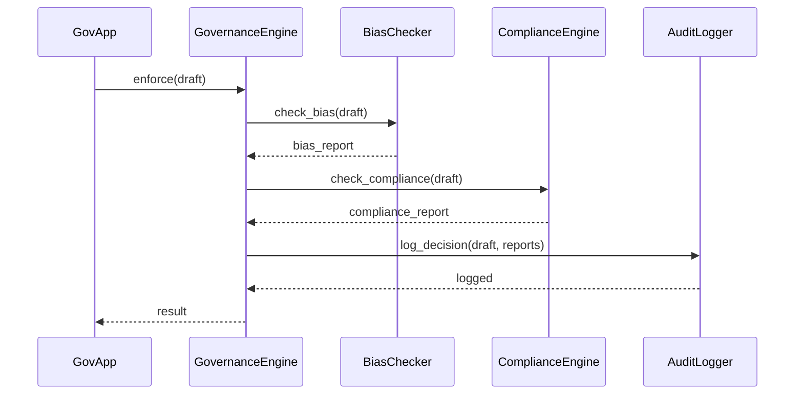

# Chapter 3: AI Governance Framework

In [Chapter 2: AI Process Proposal Engine](02_ai_process_proposal_engine_.md), we learned how the system turns citizen feedback into automated proposals. Before any AI-driven suggestion or action goes live, we need a **constitution** for our AI—rules that keep everything ethical, safe, transparent, and compliant. That’s the job of the **AI Governance Framework**.

---

## 1. Why We Need an AI Governance Framework

Imagine a federal social services agency wants to speed up benefit approvals using AI. Without clear guardrails, the model could:

- Introduce unfair bias against certain groups
- Leak private data in its explanations
- Violate laws like GDPR or HIPAA
- Leave no record of decisions for later audits

Our **AI Governance Framework** defines the “rights and obligations” of every AI agent—just like a constitution for AI—to ensure trust and accountability at every step.

---

## 2. Key Concepts

1. **Policy Rules**  
   Define what AI _can_ or _cannot_ do (e.g., “No use of sensitive demographic data”).

2. **Bias Checker**  
   Scans suggestions or predictions for unfair outcomes.

3. **Compliance Engine**  
   Verifies that actions meet regulations (GDPR, HIPAA).

4. **Audit Logger**  
   Records every decision, input, and rule applied.

5. **Transparency Log**  
   Stores human-readable explanations for audits or public review.

---

## 3. Using the AI Governance Framework

Below is a minimal example where a government app submits a draft policy to our governance layer:

```python
# file: example_governance_usage.py
from hms_utl.governance import GovernanceEngine

engine = GovernanceEngine()
draft = {
    "id": "draft123",
    "content": "Use facial recognition at airport security"
}
# Enforce rules, check bias/compliance, and log
result = engine.enforce(draft)
print("Governance result:", result)
```

Beginner-friendly explanation:

1. We import and instantiate **GovernanceEngine**.  
2. We send a draft policy (the “content” AI wants to run).  
3. `enforce()` runs bias checks, compliance checks, logs everything, and returns a result.

Possible `result` values:

- `{ "status": "approved" }`  
- `{ "status": "rejected", "reason": "Bias risk detected" }`

---

## 4. Under the Hood: Step-by-Step Flow



1. **GovApp** calls `enforce()`.  
2. **BiasChecker** inspects for unfair patterns.  
3. **ComplianceEngine** verifies legal adherence.  
4. **AuditLogger** records the draft, checks, and final decision.  
5. Framework returns an approval or rejection.

---

## 5. Internal Implementation Highlights

### 5.1 hms_utl/governance.py

```python
# file: hms_utl/governance.py
from .rules import BiasChecker, ComplianceEngine
from .audit_logger import AuditLogger

class GovernanceEngine:
    def __init__(self):
        self.bias = BiasChecker()
        self.compliance = ComplianceEngine()
        self.audit = AuditLogger()

    def enforce(self, draft):
        bias_report = self.bias.check(draft)
        comp_report = self.compliance.check(draft)
        decision = "approved" if bias_report.ok and comp_report.ok else "rejected"
        self.audit.log(draft, bias_report, comp_report, decision)
        return {"status": decision, "bias": bias_report, "compliance": comp_report}
```

**Explanation:**  
- We tie together three components.  
- `enforce()` runs bias and compliance checks.  
- We decide approve/reject, then log everything in `AuditLogger`.

---

### 5.2 hms_utl/rules.py

```python
# file: hms_utl/rules.py
class BiasChecker:
    def check(self, draft):
        # Dummy check: flag “race” in content
        ok = "race" not in draft["content"].lower()
        return type("R", (), {"ok": ok, "details": "No bias" if ok else "Possible race bias"})
class ComplianceEngine:
    def check(self, draft):
        # Dummy check: reject health data without consent
        ok = "health" not in draft["content"].lower()
        return type("C", (), {"ok": ok, "details": "Compliant" if ok else "HIPAA violation"})
```

**Explanation:**  
- **BiasChecker** and **ComplianceEngine** each return a simple object with `ok` and `details`.

---

### 5.3 hms_utl/audit_logger.py

```python
# file: hms_utl/audit_logger.py
class AuditLogger:
    def log(self, draft, bias, comp, decision):
        # Imagine a secure government ledger here
        print(f"AuditLog | id={draft['id']} | decision={decision}")
```

**Explanation:**  
- We record draft ID and final decision. In real life, this writes to a tamper-proof database.

---

## Conclusion

You’ve learned how the **AI Governance Framework** acts as the AI’s constitution—enforcing ethical rules, checking bias, ensuring compliance, and logging every step. Next, we’ll invite human oversight into the loop in [Chapter 4: Human-in-the-Loop (HITL) Governance](04_human_in_the_loop__hitl__governance_.md).

---

Generated by [AI Codebase Knowledge Builder](https://github.com/The-Pocket/Tutorial-Codebase-Knowledge)