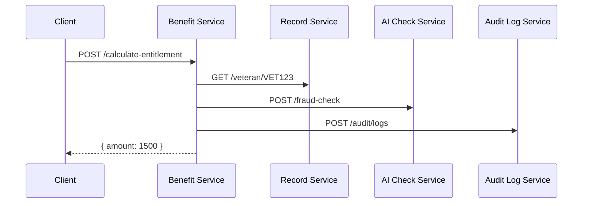

# Chapter 3: Backend Services (HMS-SVC)

In [Chapter 2: Microservices Architecture](02_microservices_architecture_.md) we saw how to split our system into focused services and let them discover each other via HMS-SYS. Now we’ll build the **brains** of our application—where business rules, data transformations, compliance checks, and domain workflows live. This is **Backend Services (HMS-SVC)**.

## Why Backend Services?

Imagine the Office of Career, Technical, and Adult Education (OCTAE) runs an online “Veteran Benefits” portal. A veteran submits a claim form and expects:
-  Automatic calculation of their benefit amount  
-  Verification of eligibility rules  
-  An audit trail for every step (for compliance)  

Rather than crowding these rules into the front end or scattering them across services, we create a **Benefit Service** in HMS-SVC. It speaks to data stores, triggers AI fraud checks, enforces policies, and returns a single, audited answer.

## Key Concepts

1. Business Logic  
   The “rules engine” that applies domain-specific calculations (e.g., benefit formulas).

2. Data Transformation  
   Turning user input into database queries and back into JSON results.

3. Domain Workflows  
   Orchestrating multi-step processes: fetch records, run compliance checks, calculate totals.

4. Validation & Compliance  
   Ensuring every request follows policy (e.g., no over-entitlement), with audit logs.

5. Service Endpoints  
   Exposing HTTP/gRPC endpoints other services or UIs can call.

## Building Our Central Use Case: Benefit Service

Let’s write a minimal `benefit-service` that calculates a veteran’s entitlement.

```javascript
// benefit-service/index.js
const express = require('express');
const hmsSys = require('hms-sys');
const calculator = require('./calculator');
const compliance = require('./compliance');
const app = express();

hmsSys.init({ env: 'prod', configServer: 'https://config.gov' });
hmsSys.discovery.register('benefit-service', 'http://localhost:4000');
app.use(express.json());

app.post('/calculate-entitlement', async (req, res) => {
  const { veteranId, benefitType } = req.body;
  // 1. Fetch & transform data
  const amount = await calculator.compute(veteranId, benefitType);
  // 2. Apply policy checks
  compliance.checkLimits(amount);
  // 3. Record audit (omitted)
  res.json({ veteranId, benefitType, amount });
});

app.listen(4000, () => hmsSys.logger.info('Benefit Service up'));
```

Explanation:
1. Initialize core infra ([HMS-SYS](01_core_infrastructure__hms_sys__.md)).  
2. Register this service so others can discover it.  
3. Define `/calculate-entitlement` to run calculation and compliance.  
4. Return a JSON result.

### Example Request & Response

**Request**  
POST http://localhost:4000/calculate-entitlement  
Body:  
```json
{ "veteranId": "VET123", "benefitType": "housing" }
```

**Response**  
```json
{ "veteranId":"VET123", "benefitType":"housing", "amount":1500 }
```

## Under the Hood: Workflow Sequence

When a client calls `/calculate-entitlement`, here’s what happens:



1. **Fetch Records**: Benefit Service retrieves veteran data.  
2. **AI Fraud Check**: It asks an AI service to validate the request.  
3. **Apply Compliance**: Checks limits and policies.  
4. **Audit**: Sends an audit record for traceability.  
5. **Respond**: Returns the computed amount.

## Inside HMS-SVC: Calculator & Compliance Modules

### calculator.js

```javascript
// File: benefit-service/calculator.js
const axios = require('axios');

async function compute(veteranId, benefitType) {
  // 1. Fetch record
  const url = require('hms-sys').discovery.get('record-service');
  const { data } = await axios.get(`${url}/veteran/${veteranId}`);
  // 2. Simple formula
  const base = data.yearsOfService * 100;
  return benefitType === 'housing' ? base * 1.5 : base;
}

module.exports = { compute };
```

Explanation:
- Discovers `record-service` via HMS-SYS.  
- Gets veteran data and applies a stubbed formula.

### compliance.js

```javascript
// File: benefit-service/compliance.js
function checkLimits(amount) {
  const MAX = 5000;
  if (amount > MAX) throw new Error('Exceeds allowable limit');
}

module.exports = { checkLimits };
```

Explanation:
- Enforces a simple maximum-entitlement policy.

## Summary

In this chapter, you learned how **Backend Services (HMS-SVC)**:
- Encapsulate business logic and workflows  
- Transform user requests into service calls  
- Enforce compliance and record audits  
- Provide reusable endpoints for any front end or API layer  

Next up, we’ll build on this by exposing these services to clients through our **[Backend API (HMS-API / HMS-MKT)](04_backend_api__hms_api___hms_mkt__.md)**.

---

Generated by [AI Codebase Knowledge Builder](https://github.com/The-Pocket/Tutorial-Codebase-Knowledge)