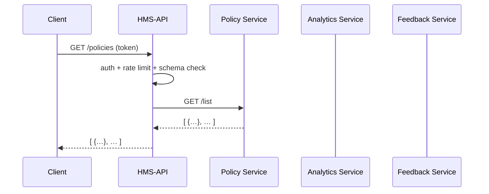

# Chapter 4: Backend API (HMS-API / HMS-MKT)

In [Chapter 3: Backend Services (HMS-SVC)](03_backend_services__hms_svc__.md) we built the core business logic and workflows. Now we’ll put a friendly, secure gateway in front of those services so mobile apps, partner systems, or external tools can talk to us. This is the **Backend API (HMS-API / HMS-MKT)**.

## Why a Backend API?

Think of HMS-API as the reception desk of a federal building. Instead of every visitor wandering the hallways, they check in here. The API:

- Presents a clear set of doors (endpoints) to manage policies, view analytics, or submit feedback.  
- Checks IDs (authentication tokens), controls traffic (rate limits), and verifies forms (schema validation).  
- Routes requests to the right department—our backend services from [Chapter 3](03_backend_services__hms_svc__.md).

### Central Use Case: U.S. Sentencing Commission

The U.S. Sentencing Commission wants real-time sync between its legacy case-management system and the HMS platform. They need to:

1. Fetch the latest sentencing policies.  
2. Retrieve usage metrics (How many queries per day?).  
3. Submit user feedback on policy changes.  

HMS-API makes this easy and secure.

---

## Key Concepts

1. **Endpoints**  
   URL paths like `/policies`, `/analytics`, `/feedback` that external clients call.  

2. **Authentication Tokens**  
   Visitors show a JWT or OAuth token in `Authorization` headers.  

3. **Rate Limiting**  
   Prevents overload by capping calls (e.g., 100 requests/minute).  

4. **Schema Validation**  
   Checks incoming JSON against a contract (e.g., `feedback.comment` must be a string).  

5. **Routing to Services**  
   After passing checks, requests forward to the correct backend service.

---

## How to Use HMS-API

Let’s write a minimal Node.js example showing three endpoints:

```javascript
// File: hms-api/server.js
const express = require('express');
const { init, discovery } = require('hms-sys');
const auth = require('./auth-middleware');
const rateLimit = require('./rate-limit');
const validate = require('./validate-schema');

init({ env: 'prod', configServer: 'https://config.gov' });

const app = express();
app.use(express.json(), auth, rateLimit);

// 1. Get policies
app.get('/policies', async (req, res) => {
  const url = discovery.get('policy-service');
  const data = await fetch(`${url}/list`);
  res.json(await data.json());
});

// 2. Get analytics
app.get('/analytics', async (req, res) => {
  const url = discovery.get('analytics-service');
  res.json(await fetch(`${url}/usage`).then(r => r.json()));
});

// 3. Submit feedback
app.post(
  '/feedback',
  validate('feedbackSchema'),
  async (req, res) => {
    const url = discovery.get('feedback-service');
    const resp = await fetch(`${url}/submit`, { 
      method: 'POST', body: JSON.stringify(req.body) 
    });
    res.status(resp.status).send();
  }
);

app.listen(4000, () => console.log('HMS-API up on 4000'));
```

Explanation:

1. We initialize core infra using [HMS-SYS](01_core_infrastructure__hms_sys__.md).  
2. We apply global `auth` and `rateLimit` middleware.  
3. Each route discovers the proper service and proxies the call.  
4. For feedback, we also validate the request body against a JSON schema.

### Example Call

Fetch policies:

```
GET /policies
Authorization: Bearer eyJ...
```

Response:

```json
[
  { "id": "POL-001", "title": "Sentencing Range A" },
  { "id": "POL-002", "title": "Sentencing Range B" }
]
```

Submit feedback:

```
POST /feedback
Authorization: Bearer eyJ...
Content-Type: application/json

{ "caseId": "1234", "comment": "Please clarify section 2." }
```

Response: `204 No Content`

---

## What Happens Under the Hood?



1. **Client** calls HMS-API with a token.  
2. HMS-API’s **auth-middleware** verifies the token.  
3. **rate-limit** ensures they aren’t over the cap.  
4. HMS-API discovers and forwards the request to the correct backend.  
5. The backend responds and HMS-API returns data to the client.

---

## Inside HMS-API: Middleware Snippets

### auth-middleware.js

```javascript
// File: hms-api/auth-middleware.js
module.exports = (req, res, next) => {
  const token = req.headers.authorization;
  if (!token || !isValid(token)) {
    return res.status(401).send('Unauthorized');
  }
  next();
};
// isValid() would verify JWT signature, issuer, expiry.
```

### rate-limit.js

```javascript
// File: hms-api/rate-limit.js
const counts = {};
module.exports = (req, res, next) => {
  const key = req.ip;
  counts[key] = (counts[key] || 0) + 1;
  if (counts[key] > 100) return res.status(429).send('Too Many Requests');
  next();
};
// In production, use a distributed store like Redis.
```

### validate-schema.js

```javascript
// File: hms-api/validate-schema.js
const schemas = { feedbackSchema: {/* JSON Schema */} };
module.exports = name => (req, res, next) => {
  const valid = validate(req.body, schemas[name]);
  if (!valid) return res.status(400).send('Bad Request');
  next();
};
```

These middlewares keep our gateway secure and predictable.

---

## Conclusion

In this chapter you learned how **HMS-API / HMS-MKT**:

- Exposes clear, versioned endpoints to the outside world  
- Verifies authentication tokens and applies rate limits  
- Validates request schemas for predictable data  
- Forwards traffic to the right backend services  

Next up, we’ll build the front end that calls these APIs in  
[Chapter 5: User Interface Components (HMS-MFE)](05_user_interface_components__hms_mfe__.md).

---

Generated by [AI Codebase Knowledge Builder](https://github.com/The-Pocket/Tutorial-Codebase-Knowledge)