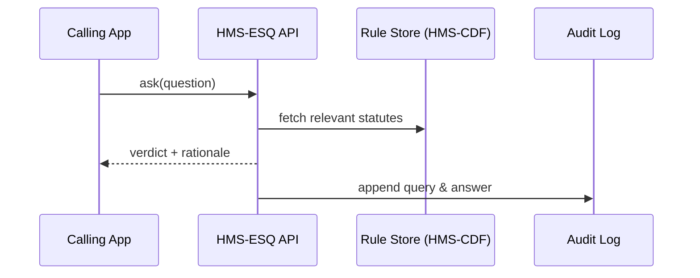

# Chapter 4: Compliance & Legal Reasoning Engine (HMS-ESQ)

*(a.k.a. “Your 24 / 7 Paralegal in 12 Lines of Code”)*  

[← Back to Chapter 3: Governance Layer & Human-in-the-Loop (HITL)](03_governance_layer___human_in_the_loop__hitl__.md)

---

## 0. Why Do We Need HMS-ESQ?

Picture a **procurement officer** at the Social Security Advisory Board.  
They want to order 200 laptops for field agents **today**.  
Questions flying around the cubicle:

* “Will this exceed the micro-purchase ceiling?”  
* “Do we need to solicit three quotes?”  
* “Which FAR clause applies if we store data in the cloud?”

Digging through 2 000 + pages of the Federal Acquisition Regulation (FAR) could take hours.  
**HMS-ESQ** answers in seconds—then **documents its reasoning** so auditors (or a FOIA request) can replay every step.

---

## 1. What *Is* HMS-ESQ?  
A beginner’s elevator pitch:

> A rules “search engine” that returns **Yes / No / Needs Human** *plus* the legal citations that justify the answer.

Think of it as a *stack of color-coded legal sticky notes* that a bot can flip through faster than any human.

---

## 2. Core Concepts (Only Five!)

| Term          | Plain-English Analogy                | Stored As |
|---------------|--------------------------------------|-----------|
| Statute Node  | One sticky note                      | JSON (`id`, `text`, `tags`) |
| Case Link     | Footnote pointing to a court case    | Edge between nodes |
| Question      | “Can I…?”                            | Natural-language or structured |
| Verdict       | `allowed` / `blocked` / `escalate`   | Enum |
| Rationale     | The highlighted passages & logic     | Markdown blob |

---

## 3. Quick Start – Ask Your First Legal Question

Below is a **complete** example; replace nothing but the question text.

```python
# file: demo_laptop_ceiling.py
from hms_esq import Client          # pip install hms-esq

esq = Client(base_url="http://localhost:8084")

question = """
Can the Social Security Advisory Board buy 200 laptops
at $900 each using a Government Purchase Card?
"""
answer = esq.ask(question)
print(answer.verdict)     # → "blocked"
print(answer.rationale)   # → FAR 13.201(b), Memo 2023-05 …
```

What just happened?

1. We asked in plain English.  
2. HMS-ESQ parsed the intent (“micro-purchase”, “$180 000”).  
3. It matched against FAR thresholds and returned `blocked`.  
4. It cited the exact clause so we can copy-paste into an email.

> 🛑 **Note:** A result of `escalate` will automatically send the question to the [Governance Layer & HITL](03_governance_layer___human_in_the_loop__hitl__.md) for human review.

---

## 4. How Does HMS-ESQ Work Internally?



Highlights:

1. **Rule Store** lives in [Policy Lifecycle Engine (HMS-CDF)](02_policy_lifecycle_engine__hms_cdf__.md) so rules stay versioned.  
2. Every call is written to an **append-only audit log**—no secrecy, no surprises.  
3. If confidence < 80 %, ESQ returns `escalate` and pings the HITL queue.

---

## 5. A Peek Under the Hood (10 + 12 lines)

### 5.1 Rule Schema

```python
# hms_esq/schema.py  (10 lines)
class Statute(BaseModel):
    id: str           # e.g., "FAR-13-201-b"
    text: str
    tags: list[str]   # ["micro-purchase", "threshold"]
    effective: date
```

### 5.2 Nano-Evaluator

```python
# hms_esq/evaluator.py  (12 lines)
def evaluate(question: str, statutes: list[Statute]) -> tuple[str, list]:
    money = extract_money(question)    # $ value or None
    hits  = [s for s in statutes if s.tags and "threshold" in s.tags]
    if money and money > 10000:
        return "blocked", hits
    if money is None:
        return "escalate", hits
    return "allowed", hits
```

Explanation:

1. **extract_money** is a tiny NLP helper (not shown).  
2. We look for the “threshold” tag.  
3. Verdict decision is *literally* three `if` statements—start simple!

---

## 6. Integrating With Other Layers

### 6.1 Inside a Procurement Bot (HMS-AGT – Chapter 6 Preview)

```python
# loan_bot.py snippet (7 lines)
verdict, why = esq.ask_sync("Buy 200 laptops at $900 each?")
if verdict == "allowed":
    gov.submit({"action":"place_order"})
else:
    gov.submit({"action":"place_order", "status":"blocked", "reason": why})
```

* The bot **never** bypasses the Governance layer.  
* Rationale gets forwarded so Officer Maria can see *why* it was blocked.

### 6.2 Manual Lookup from a Clerk UI (HMS-MFE)

```javascript
// SearchBar.jsx (React, 8 lines)
async function onAsk(q) {
  const r = await fetch("/esq/api/ask", {method:"POST", body: q});
  setResult(await r.json());   // shows verdict & citations
}
```

---

## 7. Hands-On Lab (2 Minutes)

```bash
# 1. Spin up ESQ + sample rule set
git clone hms-utl && cd hms-utl/demo
docker compose up esq

# 2. Run the quick-start script
python demo_laptop_ceiling.py
```

Open `logs/esq_audit.jsonl` to see the stored question, verdict, and rule IDs.

---

## 8. What You Learned

✓ Why automatic legal checks matter in day-to-day government work  
✓ Five key concepts: **Statute, Case Link, Question, Verdict, Rationale**  
✓ How to ask HMS-ESQ a question with < 15 lines of code  
✓ The behind-the-scenes flow: Query → Rule Fetch → Evaluate → Audit  
✓ How ESQ plugs into the Governance and Agent layers

Ready to make sure all that sensitive data is shared **only** with the right people?  
Jump to [Chapter 5: Data & Privacy Management Hub (HMS-DTA)](05_data___privacy_management_hub__hms_dta__.md).

---

Generated by [AI Codebase Knowledge Builder](https://github.com/The-Pocket/Tutorial-Codebase-Knowledge)