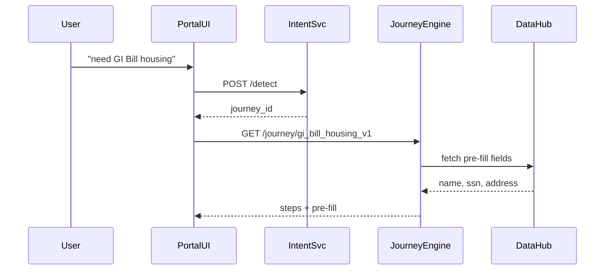

# Chapter 4: Intent-Driven Navigation & AI-Guided Journeys  
*A friendly continuation from [User Portal (HMS-MFE Public Interface)](03_user_portal__hms_mfe_public_interface__.md)*  

---

## 1 Why Ask “What Are You Trying To Do?”  

Picture Corporal Rivera. She logs in because she **“wants GI Bill housing allowance.”**  
She has no idea that:

* • Form VA-22-1999 is needed  
* • Her last school transcript must be attached  
* • She already gave DoD her address last year  

Instead of a maze of PDFs, the portal simply says:  

> “Tell us what you need.”  

She types “get GI Bill housing payments” → the platform detects the *intent*, loads a **journey** of steps, pre-fills everything it already knows, and shows a clean progress bar.  
Click-fatigue drops, error rates plunge, and Rivera is done before lunch.

---

## 2 Big Ideas in Plain English  

| Term | Think of it as… | Why it matters |
|------|-----------------|----------------|
| Intent | A user’s one-sentence goal | “I need GI Bill housing money” |
| Journey Template | Recipe card | Ordered list of steps to reach the goal |
| Step | Single task in the recipe | “Upload school transcript” |
| Pre-Fill | Auto-completed answer | System copies name/SSN so user doesn’t re-type |
| AI Coach | Netflix-style suggestion engine | Nudges the user, e.g., “Next: set up direct deposit” |

---

## 3 3-Minute Tour (Veteran Example)  

```mermaid
graph TD
A[User types\n“I want GI Bill housing”] --> B(Intent Service)
B --> C{Journey Template\nGI_BILL_HOUSING}
C --> D[Step 1: Confirm school\n(auto-prefilled)]
D --> E[Step 2: Upload transcript]
E --> F[Step 3: Choose payment method\n(auto-prefilled)]
F --> G[Done 🎉]
```

*Notice*: At Step 1 & 3 the form is **already filled** from DoD records—zero typing for Rivera.

---

## 4 Hands-On: Add Your First Intent Flow  

We will:  
1. Declare an intent in JSON.  
2. Build a **12-line** endpoint that detects it.  
3. See how the portal consumes the journey.

### 4.1 Define the Intent (`intents.json`)  

```json
[
  {
    "id": "GI_BILL_HOUSING",
    "phrases": ["gi bill housing", "bh allowance", "school housing payment"],
    "journey": "gi_bill_housing_v1"
  }
]
```

*Beginner note*: `phrases` are just sample keywords—no fancy AI yet.

### 4.2 Minimal Intent Service (`intent_svc.py`)  

```python
# ﹤20 lines, promise!
from fastapi import FastAPI
import json, re

intents = json.load(open("intents.json"))
app = FastAPI()

def match(text):
    for it in intents:
        if any(re.search(p, text, re.I) for p in it["phrases"]):
            return it
    return None

@app.post("/detect")
async def detect(body: dict):
    it = match(body["text"])
    return {"intent": it["id"] if it else None,
            "journey": it["journey"] if it else None}
```

Explanation:  
• Load phrases once.  
• Simple regex search; good enough to demo.  
• Return the matching journey id (or `null`).

### 4.3 Portal Side (React-lite)  

```javascript
async function startJourney(userInput){
  const r = await fetch("/intent/detect",{method:"POST",
      body:JSON.stringify({text:userInput})});
  const {journey}= await r.json();
  if(!journey) return alert("Sorry, try again.");
  window.location = `/journey/${journey}`;     // open dynamic flow
}
```

When Rivera types her need, the UI calls the Intent Service, gets `gi_bill_housing_v1`, and redirects to a smart form that walks her through the steps.

---

## 5 What Happens Under The Hood?  



1. Intent is detected.  
2. Journey Engine retrieves the step list.  
3. DataHub returns known data (e.g., from DoD API).  
4. Portal shows Rivera a half-done form.

---

## 6 Behind the Curtain: Journey Engine in 18 Lines  

```python
# journey_engine.py (simplified)
from fastapi import FastAPI
import json, httpx

journeys = json.load(open("journeys.json"))   # templates

app = FastAPI()

@app.get("/journey/{jid}")
async def get_journey(jid:str, user_id:str):
    tpl = next(j for j in journeys if j["id"]==jid)
    # ask DataHub for pre-fill
    async with httpx.AsyncClient() as c:
        r = await c.get(f"http://datahub/prefill?uid={user_id}")
    filled = {**tpl, "prefill": r.json()}
    return filled
```

Line-by-line:  
1. Load journey templates once.  
2. When called, pick the correct template.  
3. Call DataHub for known user facts.  
4. Return combined payload; the portal paints it.

---

## 7 Connecting The Dots To Other HMS-UTL Layers  

• Policy text and limits inside each step come directly from [Governance Layer (HMS-GOV)](01_governance_layer__hms_gov__.md).  
• All user clicks create immutable records in the [Policy Versioning & Audit Ledger](02_policy_versioning___audit_ledger_.md).  
• The Portal UI hosting these flows is the same shell you met in [User Portal](03_user_portal__hms_mfe_public_interface__.md).  
• Next chapter, an [AI Representative Agent (HMS-A2A)](05_ai_representative_agent__hms_a2a__.md) will join the party to *speak* on the user’s behalf (e.g., autopopulate entire forms).

---

## 8 FAQ  

**Q: Is the intent detection really just regex?**  
A: For demos, yes. In production swap in an NLP model (BERT, OpenAI, etc.) behind the same `/detect` endpoint—no portal change needed.  

**Q: How do new journeys get added?**  
A: Drop a new JSON template, redeploy Intent & Journey services. No front-end work.  

**Q: What if pre-fill data is wrong?**  
A: Each field shows an “edit” icon; user edits override the auto-value and are logged for audit.  

**Q: Can we A/B test journeys?**  
A: Absolutely—return different `journey_id`s based on user cohort and compare completion rates in the [Metrics & Monitoring Dashboard](15_metrics___monitoring_dashboard_.md).  

---

## 9 What You Learned  

• How “intent” short-cuts users past form lists.  
• Journey templates turn complex government tasks into bite-sized steps.  
• Simple services (`/detect`, `/journey`) plus DataHub enable auto-prefill.  
• Everything ties back to governance, audit, and the portal shell.  

Ready to give every citizen a **personal AI aide** that chats, fills forms, and reminds them of deadlines?  
Continue to [AI Representative Agent (HMS-A2A)](05_ai_representative_agent__hms_a2a__.md).

---

Generated by [AI Codebase Knowledge Builder](https://github.com/The-Pocket/Tutorial-Codebase-Knowledge)