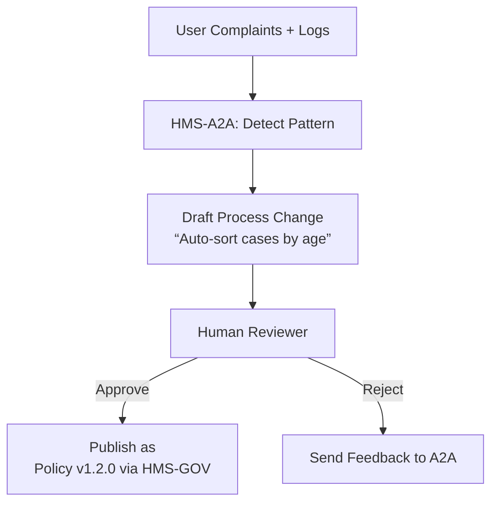
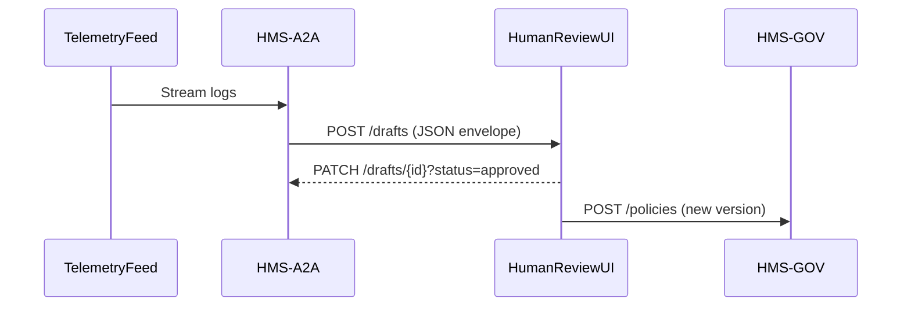

# Chapter 5: AI Representative Agent (HMS-A2A)


*A friendly continuation from [Intent-Driven Navigation & AI-Guided Journeys](04_intent_driven_navigation___ai_guided_journeys_.md)*  

---

## 1 Why Invent a “Robot Legislative Aide”?

Imagine the Office on Violence Against Women (OVW) receives **2,000 citizen comments** in one week:

*“Grant approvals are taking too long.”*  
*“Why can’t the status page sort by case number?”*  
*“The signature field rejects Unicode names.”*  

A human analyst could read, tag, and summarize all 2,000 notes—but not before next quarter’s budget hearing.  
**HMS-A2A** is the never-sleeping aide that:

1. Listens to logs, tickets, and user feedback in real time.  
2. Spots patterns (e.g., median approval time ↑ by 38 %).  
3. Drafts a *policy amendment* or *process tweak* in plain English **and** machine-readable YAML.  
4. Hands it to a human supervisor for quick thumbs-up/down.

Result: OVW looks proactive at the next oversight meeting, not reactive.

---

## 2 Big Ideas in Plain English

| Term | Think of it as… | Why it matters |
|------|-----------------|----------------|
| Telemetry Feed | Open inbox tray | Continuous stream of logs, tickets, surveys |
| Insight | Sticky note on the inbox | “Median approval time jumped” |
| Draft Proposal | First cut of a bill | Machine-readable change to policy/process |
| Confidence Score | Margin of error | Tells the human how sure the AI is |
| HITL Review | Committee markup | Human signs, edits, or rejects (see next chapter) |

---

## 3 5-Minute Tour: From Complaint to Draft Policy



---

## 4 Hands-On: Let’s Build a Tiny A2A Loop

We will:

1. Feed the agent 3 fake complaint lines.  
2. Generate a one-paragraph proposal.  
3. See the JSON envelope sent for human review.

### 4.1 Minimal Data Feed (`sample_logs.jsonl`)

```json
{"user":"alice","msg":"Why is grant approval 60 days now?"}
{"user":"bob","msg":"Case #123 waiting 61 days"}
{"user":"carla","msg":"Any update? My grant is 2 months old"}
```

### 4.2 Tiny Agent Script (`agent.py`)

```python
import json, openai, datetime

def load_lines(path):
    return [json.loads(l)["msg"] for l in open(path)]

def draft_proposal(lines):
    prompt = "Summarize complaints and propose 1 change:"
    txt = "\n".join(lines)
    reply = openai.ChatCompletion.create(
        model="gpt-3.5-turbo",
        messages=[{"role":"system","content":prompt},
                  {"role":"user","content":txt}]
    )
    return reply.choices[0].message.content.strip()

if __name__ == "__main__":
    lines = load_lines("sample_logs.jsonl")
    proposal = draft_proposal(lines)
    envelope = {
        "id": "ovw-auto-approval-time",
        "created": datetime.datetime.utcnow().isoformat(),
        "confidence": 0.82,          # toy value
        "proposal": proposal
    }
    print(json.dumps(envelope, indent=2))
```

Explanation (beginner friendly):

1. Read three lines of feedback.  
2. Ask OpenAI to summarize & suggest **one** change.  
3. Wrap result with a confidence score and timestamp.  

> Output preview (simplified):
> ```json
> {
>   "id": "ovw-auto-approval-time",
>   "confidence": 0.82,
>   "proposal": "Reduce manual review threshold from $10k to $5k to shorten average approval to <30 days."
> }
> ```

---

## 5 What Happens After the Draft?

### 5.1 Sequence View



Key notes:

1. A2A **never** pushes to production rules directly—it only posts to the Human Review UI.  
2. If approved, the UI republishes via [Governance Layer](01_governance_layer__hms_gov__.md); the change is immutably logged in the [Policy Versioning & Audit Ledger](02_policy_versioning___audit_ledger_.md).  
3. Rejected drafts are sent back with reviewer comments, improving the model (reinforcement learning or simple fine-tuning).

---

## 6 Inside the Engine (Code Peek ≤ 18 Lines)

```python
# file: a2a/publisher.py
import httpx, os, json

HUMAN_UI = os.getenv("HUMAN_UI")

def publish(envelope: dict):
    resp = httpx.post(f"{HUMAN_UI}/drafts", json=envelope, timeout=5)
    if resp.status_code != 201:
        raise RuntimeError("Failed to queue draft")
    # add to local ledger for traceability
    with open("a2a_local_ledger.log","a") as fp:
        fp.write(json.dumps(envelope)+"\n")
```

Explanation:

1. Send the proposal to the Human-in-the-Loop service (next chapter).  
2. On success, also append to a simple flat-file ledger for local audits.  

---

## 7 Configuring Data Sources

Beginners register data pipes with one YAML file.

```yaml
# file: a2a_sources.yaml
sources:
  - name: portal_feedback
    type: kafka
    topic: hms.portal.feedback
  - name: svc_logs
    type: s3
    bucket: agency-logs-2024
poll_interval_sec: 60
```

Load it in one line:

```python
SOURCES = yaml.safe_load(open("a2a_sources.yaml"))
```

No code magic—HMS-A2A just loops every minute, fetches new chunks, and re-runs `draft_proposal`.

---

## 8 Connecting the Dots to Other HMS-UTL Layers

• Governance: Final, approved proposals are stored and versioned exactly like human-written policies.  
• [Human-in-the-Loop Oversight](06_human_in_the_loop__hitl__oversight_.md): Where drafts wait for approval.  
• Metrics Dashboard: Success or rejection rates feed back into model tuning.  
• RBAC: Only users with `POLICY_REVIEWER` role can approve drafts.  

---

## 9 Frequently Asked Questions

**Q: Will the agent ever *force* a change without humans?**  
A: No. HMS-A2A is suggestion-only. The mandatory checkpoint is [Human-in-the-Loop Oversight](06_human_in_the_loop__hitl__oversight_.md).

**Q: How is the confidence score computed?**  
A: Pluggable. Start with a simple heuristic (ratio of similar complaints); later swap in a Bayesian model—same envelope format.

**Q: Can an agency plug in its own LLM?**  
A: Yes. `draft_proposal()` is one function; point it at any local model, Anthropic, Azure OpenAI, etc.

**Q: Does this replace my analysts?**  
A: Think *amplify*, not replace. Analysts spend less time triaging noise and more time refining high-value process tweaks.

---

## 10 What You Learned

• HMS-A2A listens to real-time data, surfaces patterns, and drafts precise policy or process improvements.  
• Proposals are wrapped in a small JSON envelope with a confidence score.  
• Nothing goes live without human approval—keeping democratic accountability intact.  
• The agent seamlessly ties into governance, audit, and monitoring layers you already know.

Ready to see how humans approve, edit, or reject these drafts?  
Jump to [Human-in-the-Loop (HITL) Oversight](06_human_in_the_loop__hitl__oversight_.md).

---

Generated by [AI Codebase Knowledge Builder](https://github.com/The-Pocket/Tutorial-Codebase-Knowledge)