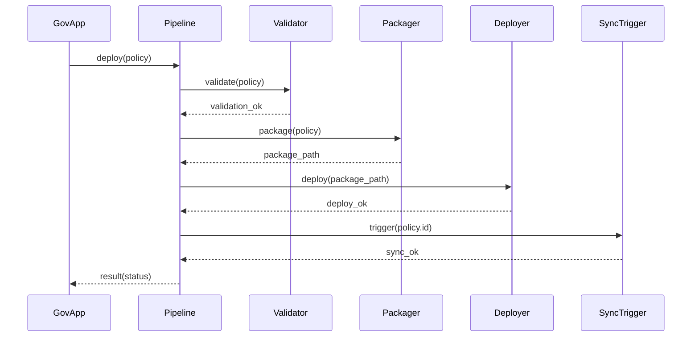

# Chapter 5: Policy Deployment Pipeline

Welcome back! In [Chapter 4: Human-in-the-Loop (HITL) Governance](04_human_in_the_loop__hitl__governance_.md), we saw how a human reviewer approves or rejects AI-generated policy drafts. Now it’s time to **push approved policies into live systems**—and that’s exactly what our **Policy Deployment Pipeline** does.

---

## 1. Why We Need a Policy Deployment Pipeline

Imagine the U.S. Department of Health and Human Services (HHS) finalizes a new vaccination rule. Once the rule is approved:

1. It needs to pass final validations (no typos, correct format).  
2. It must be packaged in a standard format (JSON or XML).  
3. It’s delivered to the scheduling backend (so clinics update their appointment systems).  
4. It triggers record-keeping tools to log the change for audit and reporting.  

Our **Policy Deployment Pipeline** automates this “production line” so every new regulation flows seamlessly from “approved draft” to “live rule,” with zero downtime.

---

## 2. Key Concepts

1. **Validator**  
   Checks that the approved policy meets format rules and contains required metadata (IDs, dates).

2. **Packager**  
   Wraps the policy into a deployable artifact (e.g., `.zip`, JSON package).

3. **Deployer**  
   Calls backend APIs to upload the package to live servers.

4. **Sync Trigger**  
   Notifies external systems (scheduling, record-keeping) to refresh their data.

5. **Audit Log**  
   Records each step for accountability—what was deployed, when, and by whom.

---

## 3. Using the Policy Deployment Pipeline

Here’s a minimal example showing how a government app might deploy a policy:

```python
# file: deploy_policy.py
from hms_utl.deployment.pipeline import PolicyDeploymentPipeline

pipeline = PolicyDeploymentPipeline()
policy = {
    "id": "policy-2023-vax",
    "title": "COVID-19 Booster Guidelines",
    "content": "All adults may receive a booster every 6 months."
}

result = pipeline.deploy(policy)
print("Deployment status:", result.status)
```

What happens:

- `deploy()` runs validation, packaging, actual deployment, and sync.  
- On success, `result.status` will be `"success"`.  
- If any step fails, you get `"failure"` plus an error message.

---

## 4. Under the Hood: Step-by-Step Flow



1. **GovApp** calls `deploy()`.  
2. **Validator** ensures the policy is well-formed.  
3. **Packager** creates a deployable bundle.  
4. **Deployer** uploads it to the live API.  
5. **SyncTrigger** notifies external systems to refresh.  
6. Pipeline returns a success or failure result.

---

## 5. Internal Implementation Highlights

### 5.1 pipeline.py

```python
# file: hms_utl/deployment/pipeline.py
from .validator import Validator
from .packager import Packager
from .deployer import Deployer
from .sync_trigger import SyncTrigger

class PolicyDeploymentPipeline:
    def __init__(self):
        self.validator = Validator()
        self.packager = Packager()
        self.deployer = Deployer()
        self.sync = SyncTrigger()

    def deploy(self, policy):
        if not self.validator.validate(policy):
            return type("R", (), {"status": "failure", "error": "Validation failed"})()
        pkg = self.packager.package(policy)
        if not self.deployer.deploy(pkg):
            return type("R", (), {"status": "failure", "error": "Deploy failed"})()
        self.sync.trigger(policy["id"])
        return type("R", (), {"status": "success"})()
```

Explanation:  
- We wire up each component in `__init__`.  
- `deploy()` runs them in order and returns a simple result object.

### 5.2 validator.py

```python
# file: hms_utl/deployment/validator.py
class Validator:
    def validate(self, policy):
        # Check required fields
        required = ["id", "title", "content"]
        ok = all(field in policy for field in required)
        print("Validator:", "OK" if ok else "Missing fields")
        return ok
```

Explanation:  
- A basic check for `id`, `title`, and `content`.  
- In real life, we'd check JSON schema and digital signatures.

### 5.3 packager.py

```python
# file: hms_utl/deployment/packager.py
import json, os

class Packager:
    def package(self, policy):
        path = f"{policy['id']}.json"
        with open(path, "w") as f:
            json.dump(policy, f)
        print("Packager: created", path)
        return path
```

Explanation:  
- Turns the policy into a JSON file named after its ID.

### 5.4 deployer.py

```python
# file: hms_utl/deployment/deployer.py
class Deployer:
    def deploy(self, package_path):
        # Imagine a HTTP POST to a live API here
        print("Deployer: uploading", package_path)
        return True  # simulate success
```

Explanation:  
- In production, this would call a secure backend endpoint.

### 5.5 sync_trigger.py

```python
# file: hms_utl/deployment/sync_trigger.py
class SyncTrigger:
    def trigger(self, policy_id):
        # Notify external tools (scheduling, reporting)
        print(f"SyncTrigger: refreshed systems for {policy_id}")
```

Explanation:  
- Sends a message or webhook so all connected systems pull the new rule.

---

## Conclusion

You’ve now learned how the **Policy Deployment Pipeline** takes an approved policy—validates it, packages it, deploys it to live servers, and synchronizes external systems—all with a simple Python call. Next, we’ll dive into the heart of our platform in [Chapter 6: Core System Platform (HMS-GOV)](06_core_system_platform__hms_gov__.md).

---

Generated by [AI Codebase Knowledge Builder](https://github.com/The-Pocket/Tutorial-Codebase-Knowledge)