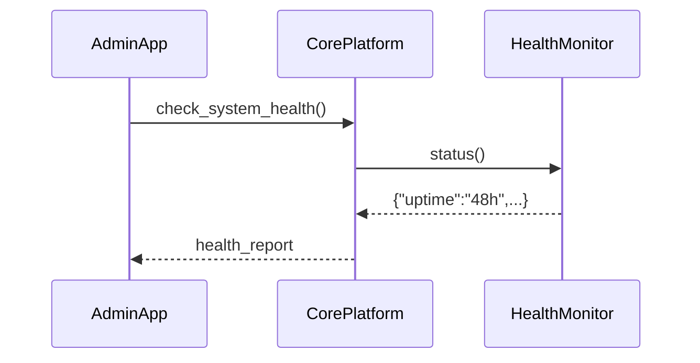

# Chapter 6: Core System Platform (HMS-GOV)

Welcome back! In [Chapter 5: Policy Deployment Pipeline](05_policy_deployment_pipeline_.md) we learned how approved policies get packaged and pushed live. Now we’ll zoom out to the **administrative gateway** where policy-makers and system administrators manage the entire AI & policy workflow—just like a city hall control room. This is the **Core System Platform**, also known as **HMS-GOV**.

---

## 1. Why We Need HMS-GOV

Imagine the Department of Minority Health runs dozens of AI agents, policy audits, and user accounts. They need a **single dashboard** to:

  • Create or deactivate users  
  • Assign roles (e.g., “Policy Auditor,” “System Admin”)  
  • Review all pending AI proposals  
  • Watch live system health (CPU load, uptime, queue lengths)  

Without HMS-GOV, admins would juggle multiple tools—risking misconfiguration or missed alerts. HMS-GOV brings it all together in one friendly command center.

---

## 2. Key Concepts

1. **User Management**  
   Like the clerk’s registry: add, list, or remove staff accounts.

2. **Role Assignment**  
   Grant permissions (e.g., only “Policy Auditor” can sign off on proposals).

3. **Policy Auditing**  
   Fetch and filter AI-generated proposals or governance logs for review.

4. **Real-time System Health**  
   Monitor uptime, CPU/memory, and queue backlogs at a glance.

---

## 3. Using the HMS-GOV Abstraction

Here’s a minimal Python example showing how an admin might interact with HMS-GOV:

```python
# file: admin_console.py
from hms_utl.gov_platform import HMSGovPlatform

platform = HMSGovPlatform()

# 1. List all users
users = platform.list_users()
print("Staff accounts:", users)

# 2. Assign a new role
platform.assign_role(user_id="u123", role="policy_auditor")

# 3. Pull pending AI proposals for audit
reports = platform.audit_policies()
print("Pending audits:", reports)

# 4. Check live system health
health = platform.check_system_health()
print("System health:", health)
```

Beginner-friendly breakdown:
- We import and instantiate `HMSGovPlatform`.  
- Call simple methods to manage users, roles, audits, and health.  
- Behind the scenes, HMS-GOV routes these calls to specialized modules.

---

## 4. Under the Hood: Step-by-Step Flow

Below is a simplified sequence when an admin asks for system health:



1. **AdminApp** calls `check_system_health()`.  
2. **CorePlatform** delegates to **HealthMonitor**.  
3. HealthMonitor returns metrics.  
4. CorePlatform returns the final report.

The same pattern applies for user management, policy auditing, and role assignments.

---

## 5. Internal Implementation Highlights

### 5.1 Core Gateway: gov_platform.py

```python
# file: hms_utl/gov_platform.py
from .user_manager import UserManager
from .policy_auditor import PolicyAuditor
from .role_manager import RoleManager
from .health_monitor import HealthMonitor

class HMSGovPlatform:
    def __init__(self):
        self.users   = UserManager()
        self.auditor = PolicyAuditor()
        self.roles   = RoleManager()
        self.health  = HealthMonitor()

    def list_users(self):
        return self.users.get_all()

    def assign_role(self, user_id, role):
        return self.roles.set_role(user_id, role)

    def audit_policies(self):
        return self.auditor.fetch_reports()

    def check_system_health(self):
        return self.health.status()
```

- The constructor wires four sub-modules.  
- Each public method simply forwards the call.

### 5.2 User Manager: user_manager.py

```python
# file: hms_utl/user_manager.py
class UserManager:
    def __init__(self):
        self._store = {}  # pretend database

    def get_all(self):
        return list(self._store.values())

    def create(self, user):
        self._store[user["id"]] = user
        return True
```

- Stores users in a simple dict.  
- `get_all()` returns all account records.

### 5.3 Policy Auditor: policy_auditor.py

```python
# file: hms_utl/policy_auditor.py
class PolicyAuditor:
    def fetch_reports(self):
        # Imagine fetching pending AI proposals from a database
        return [{"policy_id":"p1","status":"pending"}]
```

- Returns a list of proposals waiting human review.

### 5.4 Role Manager: role_manager.py

```python
# file: hms_utl/role_manager.py
class RoleManager:
    def set_role(self, user_id, role):
        # In real life, update user permissions in a secure store
        return f"Assigned role {role} to {user_id}"
```

- Simulates granting a permission label to a user.

### 5.5 Health Monitor: health_monitor.py

```python
# file: hms_utl/health_monitor.py
class HealthMonitor:
    def status(self):
        return {
            "uptime": "48h",
            "cpu_load": 0.35,
            "queue_depth": {"requests": 5, "audits": 2}
        }
```

- Returns mock metrics. Real versions would poll servers, databases, and queues.

---

## Conclusion

In this chapter, you met the **Core System Platform (HMS-GOV)**—your city-hall style control room for user accounts, policy audits, role assignments, and live health monitoring. You saw how simple Python calls route to specialized modules under the hood. Next, we’ll explore how HMS-GOV can keep external systems in sync in [Chapter 7: External System Synchronization](07_external_system_synchronization_.md).

---

Generated by [AI Codebase Knowledge Builder](https://github.com/The-Pocket/Tutorial-Codebase-Knowledge)