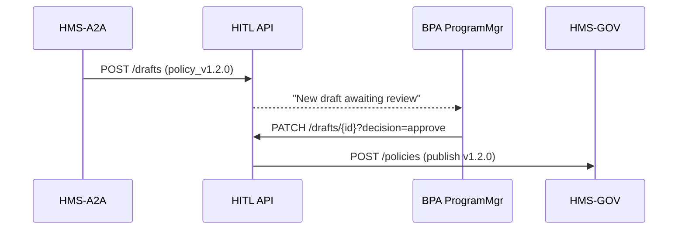
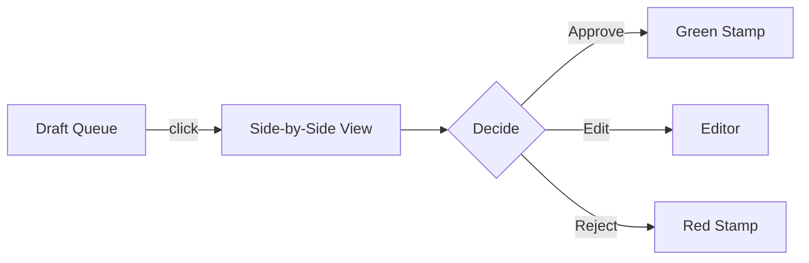

# Chapter 6: Human-in-the-Loop (HITL) Oversight  
*A friendly continuation from* [AI Representative Agent (HMS-A2A)](05_ai_representative_agent__hms_a2a__.md)

---

## 1 Why Put a Human in the Loop?

Picture the **Bonneville Power Administration (BPA)**.  
Its new AI aide (HMS-A2A) just drafted a policy tweak:

*“Automatically reduce review thresholds for small hydro-grant requests.”*

Great idea—or huge legal risk?  
OMB Circular A-123 says every internal control change must be **approved by an accountable official**.  
HITL Oversight is the digital **congressional review committee** that:

1. Receives every AI-generated (or staff-generated) draft.  
2. Routes it to an authorized reviewer (e.g., BPA Program Manager).  
3. Records the final decision + signature.  
4. Stores an *auditable* chain of custody—so auditors can later ask *“Who approved v1.2.0?”* and get a one-click answer.

Result: AI innovation *with* accountability, not rogue automation.

---

## 2 Key Ideas in Plain English

| Term | Think of it as… | Why it matters |
|------|-----------------|----------------|
| Draft | First cut of a rule | Created by AI or staff |
| Reviewer | Committee chair | Must approve or edit draft |
| Decision | “Yea / Nay / Edit” vote | Final outcome stored forever |
| Signature | Digital autograph | Proves *who* made the call |
| Audit Trail | C-SPAN archive | Anyone can replay the history |

---

## 3 Quick Walk-Through (End-to-End in 2 Minutes)



1. AI sends the draft to HITL.  
2. HITL pings the human reviewer (email/SMS/UI).  
3. Reviewer clicks **Approve** (or **Edit** / **Reject**).  
4. Approved version moves to [Governance Layer](01_governance_layer__hms_gov__.md) for official publication.  
5. Every step is logged.

---

## 4 Hands-On: Approve a Draft in <20 Lines of Code

### 4.1 Reviewer Pulls the Queue

```python
import requests, os
JWT = os.getenv("REVIEWER_JWT")

drafts = requests.get(
    "https://hitl.api/drafts?status=pending",
    headers={"Authorization": JWT}
).json()

draft = drafts[0]          # take first pending item
print(draft["id"], draft["proposal"][:80])
```

Explanation:  
• Auth token proves you have the `POLICY_REVIEWER` role.  
• API returns a list; we display the first one.

### 4.2 Approve the Draft

```python
decision = {
  "status": "approved",
  "comment": "Looks good. Threshold aligns with BPA statute."
}

resp = requests.patch(
    f"https://hitl.api/drafts/{draft['id']}",
    json=decision,
    headers={"Authorization": JWT}
)
print(resp.status_code)  # 200 means recorded!
```

What happens next?  
• HITL stamps your digital signature.  
• Automatically forwards the final YAML to HMS-GOV.  
• Inserts an *immutable* ledger entry (see [Policy Versioning & Audit Ledger](02_policy_versioning___audit_ledger_.md)).

---

## 5 Beginner-Friendly UI Snapshot

(You’ll see the full UI in [Admin / Gov Portal (Decision-Maker UI)](07_admin___gov_portal__decision_maker_ui__.md), but here’s a sneak peek.)



No code needed—reviewers can work purely in the browser.

---

## 6 What Happens Under the Hood?

### 6.1 Step-By-Step Flow

1. **Receive**: HITL stores the draft in `DraftStore` with `status=pending`.  
2. **Notify**: Sends an email/WebSocket to all reviewers for that agency.  
3. **Decide**: Reviewer’s action triggers signature verifications.  
4. **Publish or Discard**:  
   • If “approved” → POST to HMS-GOV.  
   • If “edited” → updated draft is resubmitted under same ID.  
   • If “rejected” → finalize with reason, no further action.  
5. **Ledger**: Every state transition is appended to the audit ledger.

### 6.2 Mini Implementation (≤18 Lines)

_File: `hitl/patch_draft.py`_

```python
from fastapi import FastAPI, HTTPException
import httpx, datetime, uuid, json, os

app = FastAPI()
GOV_URL = os.getenv("HMS_GOV")

@app.patch("/drafts/{draft_id}")
def decide(draft_id: str, body: dict, user=...):      # auth stub
    draft = db.get(draft_id)
    if draft["status"] != "pending":
        raise HTTPException(409, "Already decided")

    draft.update({
        "status": body["status"],
        "comment": body.get("comment",""),
        "decider": user.email,
        "decided_at": datetime.datetime.utcnow().isoformat()
    })
    db.save(draft)                         # 1. Persist decision
    ledger.append(json.dumps(draft)+"\n")  # 2. Audit line

    if body["status"] == "approved":
        httpx.post(f"{GOV_URL}/policies", json=draft["policy"])
    return {"ok": True}
```

Line-by-line:

1. Guard against double decisions.  
2. Update status + capture who signed and when.  
3. Append to flat-file ledger (tamper-evident hash optional).  
4. Forward to HMS-GOV *only* on approval.

---

## 7 Granular Permissions (Ties into RBAC)

| Role | What they can do in HITL |
|------|--------------------------|
| `POLICY_DRAFTER` | Submit drafts, view own |
| `POLICY_REVIEWER` | Approve/Edit/Reject for assigned agency |
| `AUDITOR` | Read-only access to all decisions |
| `ADMIN` | Manage roles & routing rules |

Full role map lives in [Role-Based Access & Permissions (RBAC)](08_role_based_access___permissions__rbac__.md).

---

## 8 Routing Rules in 1 YAML File

```yaml
# hitl_routing.yaml
routes:
  - agency: BPA
    policy_prefix: "bpa-"
    reviewers:
      - "jane.doe@bpa.gov"
      - "steve.lee@bpa.gov"
  - agency: NHIC
    policy_prefix: "nhic-"
    reviewers:
      - "nhic.policy@hhs.gov"
```

Load once at startup; no code changes needed when agencies reshuffle reviewers.

---

## 9 Frequently Asked Questions

**Q: Can a reviewer *edit* a draft before approving?**  
Yes. The side-by-side UI shows a markdown editor. On *Save*, HITL stamps the new hash so the audit trail knows what changed.

**Q: What if two reviewers approve simultaneously?**  
First write wins; the second sees a 409 Conflict.

**Q: How long are decisions kept?**  
Forever, by default—meeting federal records retention schedules.

**Q: Does HITL work for non-AI drafts?**  
Absolutely. Staff can POST their own drafts to the same `/drafts` endpoint, gaining the same audit benefits.

---

## 10 What You Learned

• HITL Oversight guarantees a *human* signs off every AI or staff suggestion.  
• The feature captures a tamper-evident signature trail that satisfies OMB A-123.  
• Simple APIs or a browser UI let reviewers approve, edit, or reject in seconds.  
• Approved drafts flow automatically to [Governance Layer](01_governance_layer__hms_gov__.md); rejections improve the AI.  
• Roles and routing are configurable via YAML, tying into system-wide RBAC.

Ready to explore the full-featured UI where these reviews happen?  
Jump to [Admin / Gov Portal (Decision-Maker UI)](07_admin___gov_portal__decision_maker_ui__.md).

---

Generated by [AI Codebase Knowledge Builder](https://github.com/The-Pocket/Tutorial-Codebase-Knowledge)