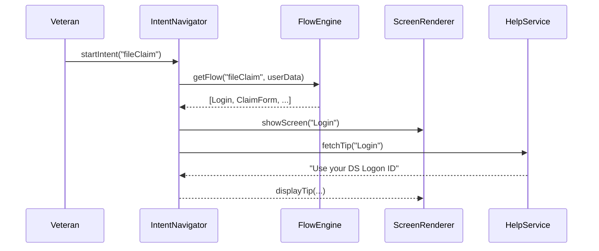

# Chapter 6: Intent-Driven Navigation

Building on our UI components from [Chapter 5: User Interface Components (HMS-MFE)](05_user_interface_components__hms_mfe__.md), we now introduce **Intent-Driven Navigation**—the smart “GPS” for guiding citizens through complex web journeys.

## Why Intent-Driven Navigation?

Imagine a veteran logging into a benefits portal. Instead of hunting through menus, they simply say, “I want to file a medical claim,” and the system takes them step-by-step: login → claim form → supporting documents → review → submit. Intent-Driven Navigation:

- Interprets user goals (intents)  
- Maps them to an optimal screen sequence  
- Minimizes clicks and confusion  
- Surfaces context-relevant tips  
- Updates flows dynamically (e.g., skip steps if info already on file)

This makes even complex processes feel guided and efficient.

### Central Use Case: Filing a Benefits Claim

1. Veteran clicks “File a Claim.”  
2. The navigator loads the “claim” workflow.  
3. The portal shows only the screens needed.  
4. If the veteran’s address is on file, the address step is skipped.  
5. Helpful hints appear in-line (“You can upload PDFs or images.”)  

All powered by the same Intent-Driven Navigation engine.

## Key Concepts

1. Intent Recognition  
   Translate a high-level user goal (e.g., `fileClaim`) into an internal “intent” object.

2. Flow Orchestration  
   Define a sequence of screens/actions for each intent.

3. Contextual Help  
   Attach help snippets to each screen, surfaced when needed.

4. Dynamic Adjustment  
   Use real-time data (e.g., user profile) to skip or reorder steps.

## Getting Started: Using the Intent Navigator

Below is a minimal example showing how to wire up an intent and render its flow.

```javascript
// File: src/claim-wizard.js
import React from 'react'
import { IntentNavigator } from 'hms-mfe'

const flows = {
  fileClaim: [
    { screen: 'Login' },
    { screen: 'ClaimForm' },
    { screen: 'UploadDocs' },
    { screen: 'ReviewSubmit' }
  ]
}

IntentNavigator.init({ flows, helpServiceUrl: '/help' })

export function ClaimWizard() {
  return <IntentNavigator intent="fileClaim" />
}
```

Explanation:  
1. Define a `flows` object mapping the intent name to an array of screen IDs.  
2. Initialize the navigator with `flows` and a help service endpoint.  
3. Render `<IntentNavigator intent="fileClaim" />` in your app.

## What Happens Under the Hood?

When the user starts an intent:



1. **startIntent**: User triggers an intent.  
2. **FlowEngine**: Resolves the screen sequence, skipping or reordering based on `userData`.  
3. **ScreenRenderer**: Shows the first screen.  
4. **HelpService**: Returns context-relevant tips.  

As the user completes each screen, `IntentNavigator` asks the engine for the next step.

## Inside the Engine: A Peek at Code

Below is a simplified `FlowEngine` implementation.

```javascript
// File: hms-mfe/flow-engine.js
const flows = {}
export function registerIntent(name, sequence) {
  flows[name] = sequence
}
export function getFlow(name, userData) {
  let seq = flows[name] || []
  // Example dynamic skip
  if (userData.addressOnFile)
    seq = seq.filter(s => s.screen !== 'AddressForm')
  return seq
}
```

Explanation:  
- `registerIntent` stores the mapping of intent names to screen sequences.  
- `getFlow` returns the flow, adjusting it if the user already has data (e.g., skip address step).

## Putting It All Together

1. **Initialize**: Call `IntentNavigator.init()`, which under the hood registers flows in the `FlowEngine`.  
2. **Render**: `<IntentNavigator intent="fileClaim" />` kicks off the process.  
3. **Navigate**: Each completed screen triggers the engine for the next one.  
4. **Help**: Before each screen loads, a call to the help service fetches tips.

## Summary

In this chapter you learned how **Intent-Driven Navigation**:

- Interprets a user’s high-level goal into a guided flow  
- Orchestrates screens, minimizing clicks and confusion  
- Surfaces contextual help inline  
- Dynamically adjusts steps based on real-time data  

Next up, we’ll empower these flows with smarter decision-making using the  
[AI Agent Framework (HMS-A2A)](07_ai_agent_framework__hms_a2a__.md).

---

Generated by [AI Codebase Knowledge Builder](https://github.com/The-Pocket/Tutorial-Codebase-Knowledge)