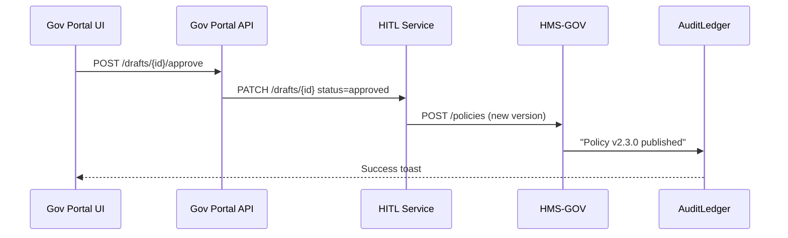

# Chapter 7: Admin / Gov Portal (Decision-Maker UI)

*A friendly continuation from* [Human-in-the-Loop (HITL) Oversight](06_human_in_the_loop__hitl__oversight_.md)

---

## 1  Why Do Policy Makers Need Their Own “Mission-Control” Screen?

Picture Lieutenant-Colonel Briggs at the Department of Defense.  
Yesterday an AI draft (via HMS-A2A) suggested **moving a training exercise one week earlier** to save fuel costs.  
Briggs must quickly decide:

1. Does this clash with troop-readiness rules?  
2. What will it do to the current deployment schedule?  
3. If things go wrong, can I instantly roll back?

The **Admin / Gov Portal** is his NASA-style console:

* One glass wall shows every incoming draft, live metric, and audit entry.  
* Large, color-coded buttons let him **Approve**, **Tweak**, or **Rollback**—with the confidence that only an authorized officer can touch the switches.

---

## 2  Key Ideas in Plain English

| Concept | Think of it as… | Why you care |
|---------|-----------------|--------------|
| Dashboard | Mission-control monitors | Shows open drafts, live KPIs, last 5 rollbacks |
| Proposal Drawer | Inbox tray | Each draft from HITL, ready for action |
| Action Pad | Green/Yellow/Red buttons | Approve, Tweak, or Rollback a policy |
| Metrics Panel | Fuel gauge | Real-time numbers the draft hopes to improve |
| Audit Trail Tab | Flight recorder | Auto updates after every click |
| Role Switcher | Security badge | Lets the same user act as *Viewer* or *Approver* (tied to RBAC) |

---

## 3  Step-By-Step Use Case: Approve a Training-Schedule Change

1. Briggs opens `/dashboard`.  
2. Sees Draft **`draf-2024-07-training`** flagged *High Impact*.  
3. Clicks *View Metrics* → notices projected 8 % fuel savings, 0 % readiness drop.  
4. Presses **Approve**.  
5. Dashboard shows a green toast: *“Published as Policy v2.3.0”* and the Audit Trail logs the signature.

That’s it—five clicks, all recorded forever.

---

## 4  Hands-On: Build a Mini Dashboard (≤ 19 Lines)

```javascript
// File: Dashboard.jsx  (React-lite, 19 lines)
import { useEffect, useState } from "react";
import { getDrafts, actOnDraft } from "./govApi";

export default function Dashboard(){
  const [drafts,setDrafts]=useState([]);
  useEffect(()=>{ getDrafts().then(setDrafts); }, []);

  function approve(id){
    actOnDraft(id,"approve").then(()=> alert("Approved!"));
  }
  return (
    <table>
      <thead><tr><th>ID</th><th>Summary</th><th></th></tr></thead>
      <tbody>
        {drafts.map(d=>(
          <tr key={d.id}>
            <td>{d.id}</td><td>{d.title}</td>
            <td><button onClick={()=>approve(d.id)}>Approve</button></td>
          </tr>
        ))}
      </tbody>
    </table>
  );
}
```

Explanation for beginners  
• `getDrafts()` calls the portal backend, which proxies HITL’s `/drafts?status=pending`.  
• `actOnDraft(id,"approve")` makes a **single POST**; the rest of the workflow is automatic.  
• Fewer than 20 lines give us a working approval button.

---

## 5  What Happens After You Click “Approve”?



Notes  
1. The Portal never touches policy storage directly—HITL + HMS-GOV keep the chain of custody.  
2. The Audit Ledger you met in [Policy Versioning & Audit Ledger](02_policy_versioning___audit_ledger_.md) records the final step.

---

## 6  Inside the Portal Backend (≤ 18 Lines)

```python
# File: gov_portal/api.py
from fastapi import FastAPI, HTTPException
import httpx, os

app = FastAPI()
HITL_URL = os.getenv("HITL_URL")

@app.post("/drafts/{did}/approve")
def approve(did:str, user=...):             # auth stub
    if "APPROVER" not in user.roles:
        raise HTTPException(403, "Forbidden")

    # 1. Forward decision to HITL
    httpx.patch(f"{HITL_URL}/drafts/{did}",
                json={"status":"approved",
                      "comment":"OK"}, timeout=5)

    # 2. Return minimal payload for UI toast
    return {"ok":True,"draft_id":did}
```

Line-by-line  
1. Verify the caller has the `APPROVER` role (full table in next chapter).  
2. One `PATCH` to HITL (`/drafts/{id}`) does the heavy lifting.  
3. No database code here—the Portal is a **thin proxy** so you can rebuild the UI without breaking workflows.

---

## 7  Rolling Back a Bad Policy (Emergency!)

Sometimes the approved change hurts readiness.  
Briggs can click **Rollback** next to Policy v2.3.0.

```bash
curl -X POST https://gov-portal.api/rollback \
     -d '{"policy_id":"dod-training","target_version":"2.2.0"}' \
     -H "Authorization: Bearer <jwt>"
```

What happens?  
• Portal API forwards the command to HMS-GOV’s `/rollback` endpoint.  
• All dependent microservices immediately use v2.2.0.  
• Audit Trail logs “Rollback by briggs@dod.mil”.

One command, full traceability.

---

## 8  Relationship to Other HMS-UTL Layers

• **Draft Sources**: Every line in the Proposal Drawer comes from [HITL Oversight](06_human_in_the_loop__hitl__oversight_.md).  
• **Publishing & Rollback**: The heavy back-end work is done by [Governance Layer (HMS-GOV)](01_governance_layer__hms_gov__.md).  
• **Security**: Who sees the Action Pad is enforced by system-wide [Role-Based Access & Permissions (RBAC)](08_role_based_access___permissions__rbac__.md).  
• **Metrics Panel**: Numbers are streamed from the [Metrics & Monitoring Dashboard](15_metrics___monitoring_dashboard_.md).

---

## 9  Frequently Asked Questions

**Q: Can I partially approve (edit) a draft?**  
Yes—click *Tweak*, edit the YAML in the side-by-side editor, then press **Save + Approve**. HITL records the diff.

**Q: Who gets access to Rollback?**  
Rollback requires the `POLICY_ADMIN` role; see next chapter’s RBAC matrix.

**Q: How long are dashboard metrics kept?**  
Live panel shows 30 days by default; older data lives in the Metrics service for audit.

**Q: Can agencies customize the skin?**  
Yes. The Portal shell loads a CSS theme per agency domain (e.g., `@energy.gov` vs `@dod.mil`).

---

## 10  What You Learned

• The Admin / Gov Portal is a mission-control UI for decision-makers.  
• Drafts flow in from HITL, metrics from monitoring, and every click is logged.  
• Approve, Tweak, and Rollback are one-click actions that trigger deeper services without exposing complexity to the user.  
• Role enforcement is critical—handled by the upcoming RBAC layer.

Ready to learn **how** those roles and permissions are defined?  
Jump to [Role-Based Access & Permissions (RBAC)](08_role_based_access___permissions__rbac__.md).

---

Generated by [AI Codebase Knowledge Builder](https://github.com/The-Pocket/Tutorial-Codebase-Knowledge)