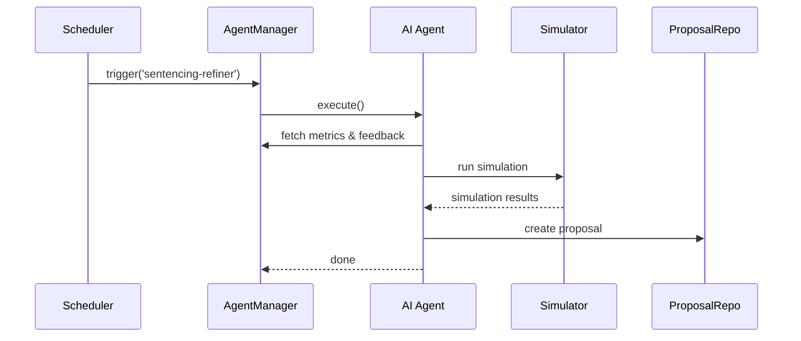

# Chapter 7: AI Agent Framework (HMS-A2A)

In [Chapter 6: Intent-Driven Navigation](06_intent_driven_navigation_.md), we learned how to guide users through complex workflows. Now it’s time to give our platform a team of smart “consultants” that continuously analyze data, suggest improvements, and package those suggestions in a governance-ready format. Welcome to the **AI Agent Framework (HMS-A2A)**!

## Why an AI Agent Framework?

Imagine the U.S. Sentencing Commission wants to refine its sentencing guidelines automatically based on:
- Usage metrics (how often policies are applied)  
- Citizen feedback (suggestions or complaints)  
- External signals (new laws, crime statistics)  

Or the Postal Service needs to optimize its supply-chain workflows using delivery data, weather alerts, and staffing levels. Instead of manual analysis, HMS-A2A spins up specialized “agents” to ingest these inputs, generate rationale, simulate outcomes, and propose policy or process updates. Think of each agent like a little study group embedded in your platform.

## Central Use Case: Sentencing Policy Refinement

1. An agent collects monthly usage metrics from the U.S. Sentencing portal.  
2. It reviews user feedback on confusing policy sections.  
3. It simulates changing a guideline (e.g., sentence length) against historical data.  
4. It packages a proposal—with rationale and risk assessment—in a governance-compliant format.  
5. Human reviewers inspect, version, and approve before deployment.

## Key Concepts

- **Agent**  
  A self-contained unit that performs a specific analysis task.

- **Signals**  
  Inputs: usage data, feedback, external events (new legislation, crime stats).

- **Rationale & Simulation**  
  Agents explain “why” and show “what if” using simulated outcomes.

- **Proposal Package**  
  A structured document ready for review, with versioning metadata.

- **Human-in-the-Loop**  
  Reviewers can accept, reject, or edit proposals before they go live.

- **Performance Monitoring**  
  Track each agent’s impact and refine its behavior over time.

## Getting Started: Define and Run an Agent

Below is a minimal example showing how to register an agent that refines sentencing ranges.

```javascript
// file: sentencingAgent.js
class SentencingAgent {
  constructor(services) {
    this.metrics = services.metrics;      // e.g., usage API
    this.simulator = services.simulator;  // e.g., outcome simulator
    this.proposalRepo = services.proposals;
  }

  async execute() {
    const data = await this.metrics.fetch('sentencing-usage');
    const feedback = await this.metrics.fetch('user-feedback');
    // 1. Analyze data & feedback
    const suggestion = `Increase range by 5% for Category A`;
    // 2. Simulate outcomes
    const simulation = await this.simulator.run(suggestion);
    // 3. Package proposal
    await this.proposalRepo.create({
      agent: 'SentencingAgent',
      suggestion,
      simulation,
      timestamp: new Date(),
    });
  }
}

module.exports = SentencingAgent;
```

Explanation:
1. We define a class with three injected services.  
2. In `execute()`, the agent fetches usage and feedback.  
3. It drafts a suggestion, simulates changes, and stores a proposal.

Next, register and run the agent:

```javascript
// file: main.js
const { AgentManager } = require('hms-a2a');
const SentencingAgent = require('./sentencingAgent');

// Initialize core infra (see [Core Infrastructure](01_core_infrastructure__hms_sys__.md))
const manager = new AgentManager();
manager.register('sentencing-refiner', SentencingAgent);
manager.schedule('sentencing-refiner', { cron: '0 0 1 * *' }); // run monthly
```

Explanation:
- `AgentManager` handles lifecycle, scheduling, and monitoring.  
- We register our `SentencingAgent` under a name.  
- We schedule it to run on the 1st of every month.

## Under the Hood: What Happens When an Agent Runs?



1. **Scheduler** fires based on cron rules.  
2. **AgentManager** invokes `execute()` on the agent.  
3. **Agent** pulls signals, runs simulations, and writes a proposal.  
4. **AgentManager** logs success or errors for monitoring.

## Inside HMS-A2A: Core Files

### manager.js

```javascript
// File: hms-a2a/manager.js
class AgentManager {
  constructor() {
    this.agents = {};
  }
  register(name, AgentClass) {
    this.agents[name] = new AgentClass(this._getServices());
  }
  schedule(name, { cron }) {
    // Use a cron lib to call this.run(name)
  }
  async run(name) {
    await this.agents[name].execute();
    // Log success/failure
  }
  _getServices() {
    return {
      metrics: require('hms-metrics'),
      simulator: require('hms-sim'),
      proposals: require('hms-proposals')
    };
  }
}
module.exports = { AgentManager };
```

Explanation:
- Stores agent instances and schedules them.  
- Provides common service clients (metrics, simulator, proposal store).

### proposalRepo.js

```javascript
// File: hms-a2a/proposalRepo.js
const db = require('hms-sys').config.get('dbClient');
async function create(doc) {
  await db.collection('proposals').insertOne(doc);
}
module.exports = { create };
```

Explanation:
- A very simple wrapper to store proposals in a database.

## Summary

In this chapter you learned how **HMS-A2A**:

- Creates specialized AI agents to analyze data and draft proposals  
- Ingests metrics, feedback, and external signals  
- Simulates outcomes and packages governance-compliant recommendations  
- Supports scheduling, versioning, and performance monitoring  
- Integrates with human-in-the-loop review

Next up: dive deeper into checks, approvals, and audit trails in  
[Chapter 8: AI Governance Layer](08_ai_governance_layer_.md).

---

Generated by [AI Codebase Knowledge Builder](https://github.com/The-Pocket/Tutorial-Codebase-Knowledge)