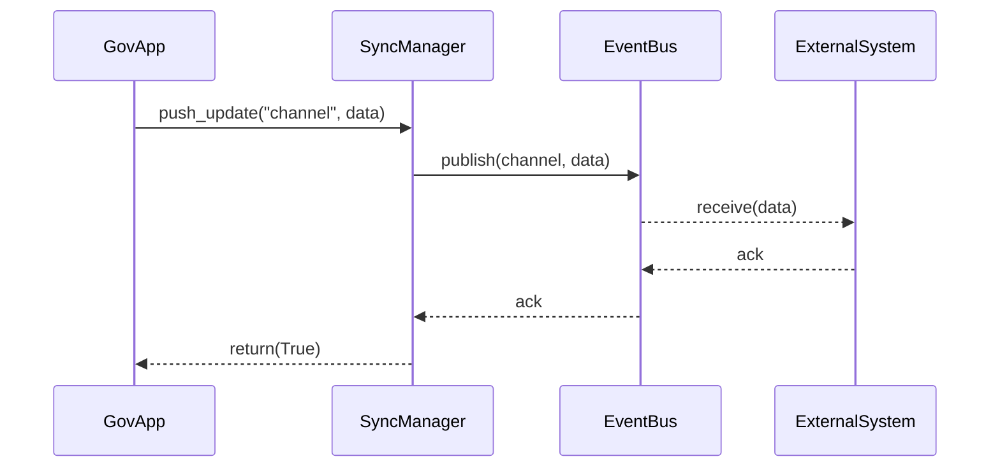

# Chapter 7: External System Synchronization

In [Chapter 6: Core System Platform (HMS-GOV)](06_core_system_platform__hms_gov__.md), we saw how administrators manage users, roles, and policies. Now, imagine you finalize a rule on HMS-GOV—how do you instantly relay that change to external systems like appointment calendars, ERP databases, or partner agency portals? That’s the job of **External System Synchronization**.

---

## 1. Why We Need External System Synchronization

Consider the U.S. Patent and Trademark Office updating an applicant’s status in its core system. Patent attorneys, state IP offices, and third-party tracking tools all need to see that change immediately. Without a sync mechanism, they’d work off old data—leading to conflicting versions, missed deadlines, or duplicate work. 

**External System Synchronization** acts like a rail network:

- **Stations**: Core Platform & every external system  
- **Rails**: Sync channels carrying updates in real time  
- **Trains**: Data packets—“trains” that depart as soon as something changes  

This ensures all “stations” stay aligned and prevents version conflicts across organizational boundaries.

---

## 2. Key Concepts

1. **Sync Channel**  
   A named “rail line” connecting the platform to a specific external system.

2. **Event Bus**  
   The dispatcher that publishes updates on channels so subscribers can receive them.

3. **External Connector**  
   The “train” that delivers data—e.g., an HTTP client or database writer.

4. **Version Tagging**  
   Every update carries a version number or timestamp to detect conflicts.

5. **Acknowledgment**  
   External systems send back an “ack” so the platform knows delivery succeeded.

---

## 3. Using External System Synchronization

Here’s a minimal example where a government app pushes a policy update to two systems:

```python
# file: example_sync_usage.py
from hms_utl.sync_manager import SyncManager

manager = SyncManager()

# 1. Register two channels
manager.register_channel(
    "appointment_calendar",
    connector_type="http",
    endpoint="https://api.calendar.gov/appointments"
)
manager.register_channel(
    "erp_db",
    connector_type="db",
    connection_string="server=erp.gov;db=appointments"
)

# 2. Push an update
update = { "policy_id": "p-2023-vax", "version": 7, "content": "Booster every 6 months" }
success = manager.push_update("appointment_calendar", update)
print("Sync success:", success)
```

Explanation:  
- We create a `SyncManager`.  
- We register two sync channels with basic configs.  
- We call `push_update(channel, data)`—the update travels via the event bus and arrives at the external system.

---

## 4. Under the Hood: Flow Diagram



1. **GovApp** calls `SyncManager.push_update()`.  
2. **SyncManager** tells the **EventBus** to publish on that channel.  
3. **EventBus** invokes each registered **ExternalConnector**.  
4. The external system receives data and returns an acknowledgment.  
5. The result propagates back to `push_update()`.

---

## 5. Internal Implementation Highlights

### 5.1 hms_utl/sync_manager.py

```python
# file: hms_utl/sync_manager.py
from .event_bus import EventBus
from .external_connector import ExternalConnector

class SyncManager:
    def __init__(self):
        self.bus = EventBus()
        self.channels = {}

    def register_channel(self, name, **config):
        connector = ExternalConnector(config)
        self.channels[name] = connector
        self.bus.subscribe(name, connector.send)

    def push_update(self, channel, data):
        print(f"[SyncManager] Pushing update on {channel}")
        return self.bus.publish(channel, data)
```

Explanation:  
- We create an `EventBus` and a dict of channels.  
- `register_channel()` builds an `ExternalConnector` and subscribes its `send` method to the bus.  
- `push_update()` simply publishes the data on the named channel.

### 5.2 hms_utl/event_bus.py

```python
# file: hms_utl/event_bus.py
class EventBus:
    def __init__(self):
        self.subscribers = {}

    def subscribe(self, channel, callback):
        self.subscribers.setdefault(channel, []).append(callback)

    def publish(self, channel, data):
        if channel not in self.subscribers:
            print(f"[EventBus] No subscribers for {channel}")
            return False
        for cb in self.subscribers[channel]:
            cb(data)   # triggers ExternalConnector.send
        return True
```

Explanation:  
- Maintains a list of callbacks per channel.  
- `publish()` invokes each one in turn.

### 5.3 hms_utl/external_connector.py

```python
# file: hms_utl/external_connector.py
class ExternalConnector:
    def __init__(self, config):
        self.config = config  # e.g., endpoint URL or DB creds

    def send(self, data):
        # In real life, send HTTP or write to DB
        target = self.config.get("endpoint") or self.config.get("connection_string")
        print(f"[Connector] Sending to {target}: {data}")
        # Simulate ack
        return True
```

Explanation:  
- A placeholder that prints the destination and data.  
- Real connectors would handle HTTP POSTs, DB writes, error retries, etc.

---

## Conclusion

You’ve learned how **External System Synchronization** wires up your core platform to third-party services via named channels, an event bus, and connectors—ensuring updates flow in real time and never conflict. Next, we’ll dive into RESTful communication in [Chapter 8: Backend API Integration](08_backend_api_integration_.md).

---

Generated by [AI Codebase Knowledge Builder](https://github.com/The-Pocket/Tutorial-Codebase-Knowledge)