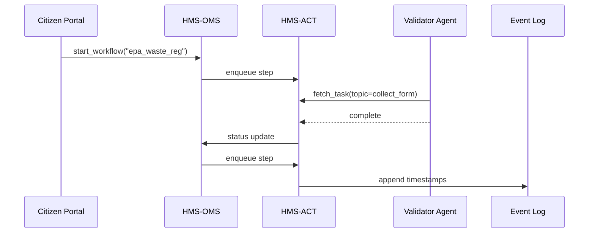
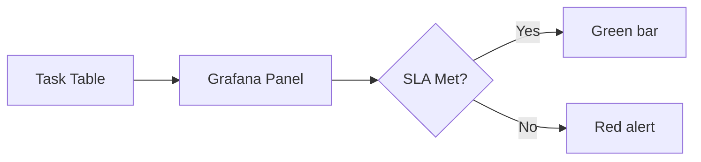

# Chapter 7: Workflow Orchestration & Task Queues (HMS-OMS / HMS-ACT)

[← Back to Chapter&nbsp;6: AI Agent Framework (HMS-AGT / HMS-AGX)](06_ai_agent_framework__hms_agt___hms_agx__.md)

---

## 1. Why Do We Need “Traffic Lights” for Code?

Picture the Environmental Protection Agency (EPA) launching **an online Hazardous-Waste Registration**:

1. Citizen fills out Form 8700-12.  
2. Credentials are validated against IRS records.  
3. A \$100 filing fee is charged.  
4. An inspector is assigned within 48 hours.  

If any step is late or out of order, the EPA violates federal service-level agreements (SLAs) and citizens get frustrated.  

**HMS-OMS** (Orchestration Management Service) + **HMS-ACT** (Action Task Queue) act like a city’s traffic-signal system:

* Green light → “next service, go!”  
* Yellow light → “almost due; hurry up.”  
* Red light → “task timed-out, escalate.”

Together they:

* Decide *who* (agent or microservice) does *what*, *when*, and under which **SLA**.  
* Record timestamps for dashboards in [Monitoring & DevSecOps (HMS-OPS)](14_monitoring__operations___devsecops__hms_ops___hms_dev__.md).

---

## 2. Key Concepts (Beginner Friendly)

| Term              | Everyday Analogy                   | One-line Meaning |
|-------------------|------------------------------------|------------------|
| Workflow          | A recipe card                      | Ordered list of steps. |
| Task              | One line on the recipe             | “Bake 20 min at 350 °F.” |
| Queue (HMS-ACT)   | Kitchen counter with tickets       | Pending tasks waiting for a cook/agent. |
| Orchestrator (HMS-OMS) | Head chef with a stopwatch   | Decides which ticket goes to which cook and checks timing. |
| SLA               | “Serve within 30 min or it’s free” | Max allowed duration for a task. |
| Event Log         | Kitchen diary                     | Timestamped record of every step. |

Keep these six ideas in mind—nothing else is magic.

---

## 3. A 3-Step Walkthrough: EPA Waste Registration

### 3.1 Define the Workflow (recipe)

```python
# file: workflows/epa_waste_registration.py
from hms_oms import Workflow

epa_waste_registration = Workflow(
    id="epa_waste_reg",
    steps=[
        {"id": "collect_form",     "sla": "5m"},
        {"id": "validate_tax_id",  "sla": "2m"},
        {"id": "charge_fee",       "sla": "1m"},
        {"id": "assign_inspector", "sla": "48h"}
    ]
)
epa_waste_registration.save()
```

Explanation  
1. Four steps with friendly IDs.  
2. Each step gets an SLA (`"5m"` means five minutes).  
3. `.save()` stores the JSON in the OMS database.

### 3.2 Kick Off a New Instance

```python
from hms_oms import start_workflow

instance_id = start_workflow("epa_waste_reg", payload={"form_id": "F8700-12-42"})
print(instance_id)   # → "wf-9b2f..."
```

• `payload` travels with every task so later steps know which record to touch.

### 3.3 A Worker Picks Up & Completes a Task

```python
# file: workers/tax_validator.py
from hms_act import fetch_task, complete_task, fail_task

while True:
    task = fetch_task(topic="validate_tax_id", max_wait="10s")
    if not task:
        continue                        # no work, loop again

    ok = external_irs_api(task.payload["form_id"])
    if ok:
        complete_task(task.id)          # timestamps success
    else:
        fail_task(task.id, reason="IRS mismatch")
```

Explanation  
1. `fetch_task` blocks up to 10 s waiting for a ticket of type `validate_tax_id`.  
2. On success it calls the IRS API.  
3. It then signals **complete** or **fail**—OMS routes the next step or escalation.

---

## 4. What Happens Behind the Curtain?



*Only five actors* keep the picture simple.  
OMS decides, ACT queues, agents work, the Event Log remembers.

---

## 5. Under-the-Hood Code Nuggets

### 5.1 Task Table (simplified)

```sql
CREATE TABLE tasks (
  id          UUID PRIMARY KEY,
  workflow_id TEXT,
  step_id     TEXT,
  status      TEXT,          -- pending | running | done | failed
  payload     JSONB,
  expires_at  TIMESTAMP,
  created_at  TIMESTAMP
);
```

• `expires_at = created_at + SLA` enables easy “red-light” detection (`SELECT … WHERE expires_at < now()`).

### 5.2 Mini-Orchestrator Loop (19 lines)

```python
# file: hms_oms/loop.py
from db import next_ready_step, push_task

def tick():
    step = next_ready_step()          # SQL finds workflows waiting for a step
    if not step:
        return

    task = {
        "workflow_id": step.workflow_id,
        "step_id": step.step_id,
        "payload": step.payload,
        "expires_at": utcnow() + step.sla
    }
    push_task(task)                   # inserts into tasks table
    mark_running(step)                # flip workflow pointer
```

Runs every few seconds via a cron or Kubernetes `CronJob`.

### 5.3 SLA Monitor (12 lines)

```python
# file: hms_oms/sla_watch.py
from db import overdue_tasks
from hms_gov import submit   # Chapter 3

def check_overdue():
    for task in overdue_tasks(limit=100):
        submit({
            "action": "sla_violation",
            "task_id": task.id,
            "workflow": task.workflow_id,
            "step": task.step_id
        })
```

Late tasks are *automatically* pushed to the [Governance Layer & HITL](03_governance_layer___human_in_the_loop__hitl__.md).

---

## 6. Using OMS + ACT with AI Agents

Agents created in [Chapter 6](06_ai_agent_framework__hms_agt___hms_agx__.md) can subscribe to queue topics:

```python
from hms_agt import Agent
from hms_act import subscribe

agent = Agent("payment_bot")

@subscribe("charge_fee")
def handle_payment(task):
    ok = stripe.charge(task.payload["form_id"])
    return "success" if ok else "fail"
```

The decorator wires the agent to the `"charge_fee"` topic—zero boiler-plate.

---

## 7. Monitoring & Dashboards (One-Minute Peek)



HMS-OMS ships a pre-built Grafana dashboard reading directly from the **Task Table**—you see green/red bars without writing SQL.

---

## 8. Hands-On Lab (90 Seconds)

```bash
git clone hms-utl
cd hms-utl/demo
docker compose up oms act grafana

# 1. Load the workflow
python workflows/epa_waste_registration.py

# 2. Start a worker
python workers/tax_validator.py   # in a second terminal

# 3. Kick off an instance
python kick_off_instance.py       # pre-written helper

# 4. Open dashboard
open http://localhost:3000        # user/pass: admin/admin
```

Watch tasks move from **pending** → **running** → **done** in real time.

---

## 9. Recap

You learned:

✔ The difference between **HMS-OMS** (head chef) and **HMS-ACT** (order counter).  
✔ How to define a workflow, start an instance, and complete a task.  
✔ How SLAs turn into **red-light** escalations.  
✔ How agents and microservices plug into the queue with one decorator.  
✔ Where the Event Log feeds operations dashboards.

Next, we’ll zoom in on the plumbing that keeps multiple services *consistent*—even when they don’t share a database.  
Onward to [Process Synchronization & Backend API Layer](08_process_synchronization___backend_api_layer_.md)!

---

Generated by [AI Codebase Knowledge Builder](https://github.com/The-Pocket/Tutorial-Codebase-Knowledge)