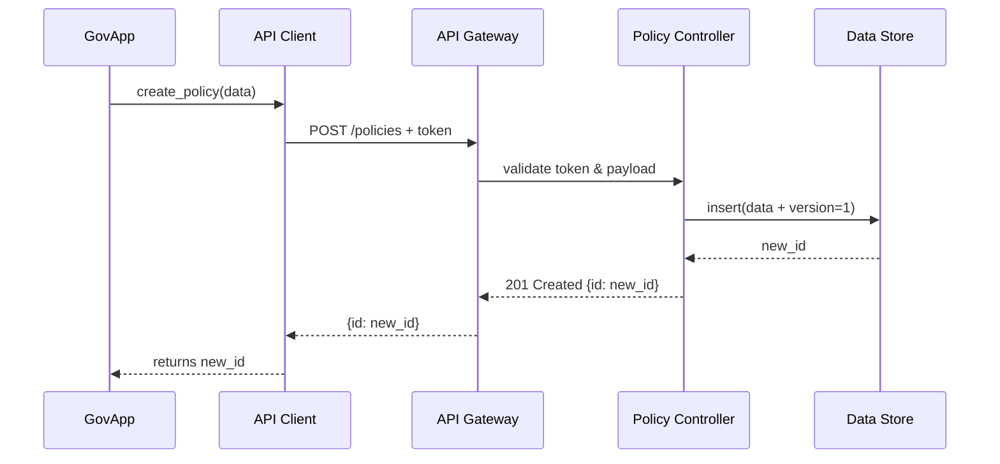

# Chapter 8: Backend API Integration

In the previous chapter on [External System Synchronization](07_external_system_synchronization_.md), we learned how policy updates flow out to other services. Now let’s build the **highway network** that connects all our microservices: the **Backend API Integration** layer. This is where clients—whether an AI agent, a GOV platform, or an external portal—call secure, versioned endpoints to create, read, update, and delete policies or data.

## 1. Why We Need Backend API Integration

Imagine the Office of the Pardon Attorney builds a web portal where staff can draft, review, and publish clemency policies. When an AI or admin pushes a policy change, it should:

- Travel securely through an API gateway  
- Be versioned so editors can roll back mistakes  
- Require authentication so only authorized users change official rules  
- Leave an audit trail of every request  

The **Backend API Integration** layer is that programmable endpoint highway. It ensures every request is safe, traceable, and follows our CRUD/version rules.

## 2. Key Concepts

1. **API Endpoints**  
   Named URLs like `/policies` or `/policies/{id}` that accept HTTP requests.

2. **CRUD Operations**  
   - Create (`POST`)  
   - Read (`GET`)  
   - Update (`PUT` or `PATCH`)  
   - Delete (`DELETE`)

3. **Versioning**  
   Each policy carries a `version` number. Updates bump the version.

4. **Authentication & Authorization**  
   Every call includes a token. The API gateway validates who can do what.

5. **Auditable Requests**  
   Logs metadata (user ID, timestamp, endpoint) so auditors can trace changes.

## 3. Using the Backend API

Here’s a minimal example showing how a government app calls our Backend API to manage a “COVID-19 Booster Guidelines” policy.

```python
# file: example_backend_api_usage.py
from hms_utl.api_client import BackendAPIClient

# 1. Instantiate the client with base URL and auth token
client = BackendAPIClient(
    base_url="https://api.hms-gov.gov",
    token="eyJhbGci..."
)

# 2. Create a new policy
policy_data = {
    "title": "COVID-19 Booster Guidelines",
    "content": "Adults may receive a booster every 6 months."
}
new_id = client.create_policy(policy_data)
print("Created policy ID:", new_id)

# 3. Fetch the policy
policy = client.get_policy(new_id)
print("Policy version:", policy["version"], "content:", policy["content"])
```

Beginner-friendly explanation:  
- We build a `BackendAPIClient` with the server address and our access token.  
- `create_policy()` sends a `POST` and returns the new policy’s ID.  
- `get_policy()` fetches that policy and shows its version and content.

## 4. Under the Hood: Step-by-Step Flow

Below is a simplified sequence when `create_policy()` is called:



1. **GovApp** calls the client wrapper.  
2. The **API Gateway** checks the token and hands off to the **Controller**.  
3. The controller writes to the **DB** with `version=1`.  
4. The new ID is returned all the way back to the app.

## 5. Internal Implementation Highlights

### 5.1 Client Wrapper (hms_utl/api_client.py)

```python
# file: hms_utl/api_client.py
import requests

class BackendAPIClient:
    def __init__(self, base_url, token):
        self.base = base_url
        self.headers = {"Authorization": f"Bearer {token}"}

    def create_policy(self, data):
        r = requests.post(f"{self.base}/policies",
                          json=data, headers=self.headers)
        return r.json()["id"]

    def get_policy(self, policy_id):
        r = requests.get(f"{self.base}/policies/{policy_id}",
                         headers=self.headers)
        return r.json()
```

Explanation:  
- We keep the `base_url` and `Authorization` header in the client.  
- `create_policy()` and `get_policy()` wrap simple HTTP calls and return JSON.

### 5.2 Server Endpoints (hms_utl/api_server.py)

```python
# file: hms_utl/api_server.py
from flask import Flask, request, jsonify

app = Flask(__name__)
_store = {}  # in-memory policy store

@app.route("/policies", methods=["POST"])
def create_policy():
    token = request.headers.get("Authorization")
    # (Imagine token validation here)
    data = request.json
    new_id = str(len(_store) + 1)
    data["version"] = 1
    _store[new_id] = data
    return jsonify({"id": new_id}), 201

@app.route("/policies/<pid>", methods=["GET"])
def get_policy(pid):
    # (Auth check skipped for brevity)
    policy = _store.get(pid)
    return jsonify(policy), 200
```

Explanation:  
- A tiny Flask app defines two endpoints.  
- `create_policy` assigns `version=1` and stores the data.  
- `get_policy` looks up and returns the policy JSON.

## Conclusion

You’ve seen how **Backend API Integration** provides a secure, versioned, and auditable highway for your microservices—wrapping HTTP calls in a client library and wiring up server endpoints under the hood. Next, we’ll explore how to build user-facing dashboards that call these APIs in [Chapter 9: Frontend Interface Components](09_frontend_interface_components_.md).

---

Generated by [AI Codebase Knowledge Builder](https://github.com/The-Pocket/Tutorial-Codebase-Knowledge)