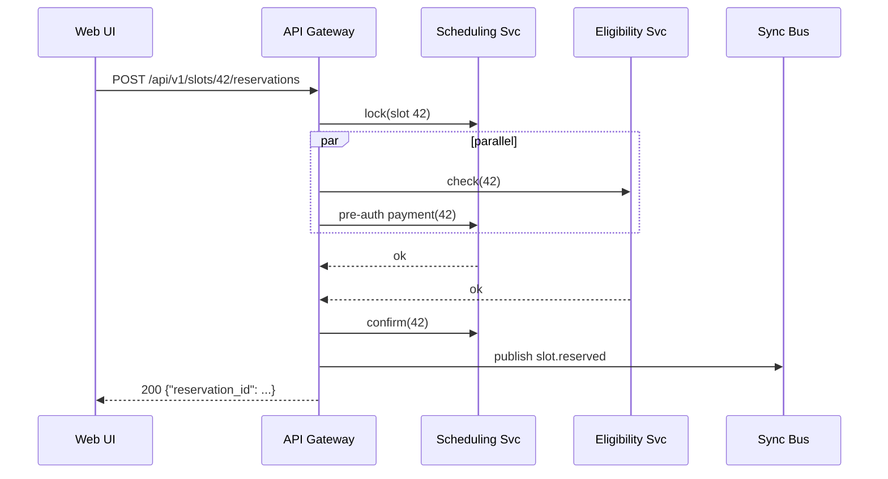

# Chapter 8: Process Synchronization & Backend API Layer  
*(a.k.a. “The Air-Traffic Tower for Every HMS Service”)*  

[← Back to Chapter&nbsp;7: Workflow Orchestration & Task Queues (HMS-OMS / HMS-ACT)](07_workflow_orchestration___task_queues__hms_oms___hms_act__.md)

---

## 1. Why Do We Need an “Air-Traffic Tower”?

Picture the **Centers for Disease Control (CDC)** opening a national COVID/Flu **Vaccine-Finder Portal**.  
When a citizen books a shot, four things must happen ‑ in the right order, with no collisions:

1. Reserve a slot in the **Scheduling Service**.  
2. Check insurance in the **Eligibility Service**.  
3. Notify the **Payment Clearinghouse** for a \$0 co-pay.  
4. Update the **Public Dashboard** so the slot disappears.

If two users click “Confirm” at the same millisecond—or if the Eligibility Service is on v1 while Scheduling is already on v2—**double bookings** or **broken calls** will explode the help-desk.

The **Process Synchronization & Backend API Layer** is the control tower that:

* Routes every “take-off” (POST) and “landing” (GET) between services.  
* Hands out **versioned runways** (`/api/v1/*`, `/api/v2/*`) so new planes don’t crash into old ones.  
* Uses real-time beacons (webhooks / pub-sub) so all dashboards show the same truth within seconds.

---

## 2. Key Concepts (Only Five!)

| Concept | Airport Analogy | 1-Sentence Definition |
|---------|-----------------|-----------------------|
| Gateway Router | Tower dispatcher | Single URL that hands each call to the right micro-service. |
| Versioned Endpoint | Runway label “18-L” vs “18-R” | `/api/v1/…` and `/api/v2/…` live side-by-side. |
| Sync Token (ETag) | Boarding pass timestamp | “Last change I saw was at 12:01 PM.” |
| Idempotency Key | Flight number | Same POST with same key can safely re-run without duplication. |
| Real-Time Fan-Out | Radio broadcast to all pilots | Webhook/pub-sub event that tells every subscriber “slot 42 is booked.” |

Keep these five stickers in your mental notebook—nothing else is magic.

---

## 3. Walk-Through Use Case: Reserving a Vaccine Slot

### 3.1 What We Want

1. **Web UI** calls `POST /api/v1/slots/42/reservations`.  
2. API Layer locks slot 42 for 30 sec while it…  
3. Runs **Eligibility** and **Payment** in parallel.  
4. Emits `slot.reserved` event to all dashboards.  
5. If *anything* fails, lock is released; UI shows “Try another slot.”

### 3.2 Minimal Public Endpoint (18 Lines)

```python
# file: api/v1/slots.py
from fastapi import APIRouter, Header, HTTPException
from svc import scheduler, eligibility, payment, sync_bus

router = APIRouter(prefix="/api/v1")

@router.post("/slots/{slot_id}/reservations")
async def reserve(slot_id: int,
                  idemp: str = Header(...)):      # Idempotency-Key
    # 1️⃣ double-submit guard
    if scheduler.already_done(idemp):
        return {"status": "ok", "reservation_id": scheduler.by_key(idemp)}

    # 2️⃣ lock the slot (30-sec soft lock)
    if not scheduler.lock(slot_id, ttl=30):
        raise HTTPException(409, "Slot taken")

    # 3️⃣ parallel checks
    eli_ok = await eligibility.check(slot_id)
    pay_ok = await payment.auth(slot_id)
    if not (eli_ok and pay_ok):
        scheduler.release(slot_id)
        raise HTTPException(400, "Eligibility or payment failed")

    # 4️⃣ commit + broadcast
    rid = scheduler.confirm(slot_id, idemp)
    sync_bus.publish("slot.reserved", {"slot": slot_id})
    return {"status": "ok", "reservation_id": rid}
```

**What this does**

* Uses the `Idempotency-Key` header to ignore accidental double clicks.  
* `scheduler.lock()` is an **optimistic lock**; expires automatically.  
* On success, an event is pushed to the **Real-Time Fan-Out bus**.

### 3.3 Upgrading to `/api/v2` Without Downtime (8 Lines)

```python
# api/v2/slots.py – only the delta!
@router.post("/api/v2/slots/{slot_id}/reservations")
async def reserve_v2(slot_id: int, body: ReservationIn, idemp: str = Header(...)):
    # New: citizen can pick vaccine brand in request body
    brand = body.preferred_brand         # Pfizer / Moderna / ...
    return await reserve(slot_id, idemp=idemp) | {"brand": brand}
```

Old apps keep using v1; new apps can pass the `preferred_brand` field.  
Because **both routes run the same internal function**, data stays in sync.

---

## 4. What Happens Under the Hood?



Only **five actors** keep the picture digestible for newcomers.

---

## 5. Under-the-Hood Code Nuggets

### 5.1 Lock Table (6 Lines)

```sql
CREATE TABLE slot_locks (
  slot_id     INT PRIMARY KEY,
  locked_by   TEXT,
  expires_at  TIMESTAMP
);
```

*Delete rows with `expires_at < NOW()` every minute → stale locks vanish.*

### 5.2 Middleware for Version Routing (14 Lines)

```python
# file: api/_middleware.py
from starlette.middleware.base import BaseHTTPMiddleware

class VersionRouter(BaseHTTPMiddleware):
    async def dispatch(self, req, call_next):
        version = req.url.path.split("/")[2]   # "v1" or "v2"
        req.state.api_version = version
        res = await call_next(req)
        # Tag the response so front-end can warn about deprecations
        res.headers["API-Version"] = version
        return res
```

One **tiny** class injects `req.state.api_version` for downstream checks.

### 5.3 Fan-Out Bus Adapter (9 Lines)

```python
# file: common/bus.py
import asyncio, json, aio_pika    # RabbitMQ

connection = await aio_pika.connect_robust("amqp://bus")

async def publish(event, payload):
    ch = await connection.channel()
    await ch.default_exchange.publish(
        aio_pika.Message(body=json.dumps(payload).encode()),
        routing_key=event
    )
```

Every service (dashboards, analytics, auditors) can `subscribe("slot.*")`.

---

## 6. How Other HMS Layers Plug In

| Layer | Why It Cares | Example |
|-------|-------------|---------|
| [HMS-OMS / HMS-ACT](07_workflow_orchestration___task_queues__hms_oms___hms_act__.md) | Uses the same lock & event bus to avoid race conditions between tasks. | Step “assign_inspector” waits for `slot.reserved` event. |
| [HMS-AGT / HMS-AGX](06_ai_agent_framework__hms_agt___hms_agx__.md) | Agents call backend APIs instead of DBs, honoring version & idempotency rules. | `agent.fetch("/api/v1/slots?available=true")`. |
| [HMS-DTA](05_data___privacy_management_hub__hms_dta__.md) | Tickets are checked inside each API before returning sensitive payloads. | `/api/v1/records/123` returns `403` if ticket missing. |

---

## 7. Hands-On Lab (2 Minutes)

```bash
git clone hms-utl
cd hms-utl/demo
docker compose up api sched eligibility payment bus        # start stack

# 1. Make a reservation
curl -H "Idempotency-Key: abc123" -X POST \
  http://localhost:8080/api/v1/slots/42/reservations

# 2. Repeat the same call → still “ok”, no duplicate
curl -H "Idempotency-Key: abc123" -X POST \
  http://localhost:8080/api/v1/slots/42/reservations

# 3. Watch events
docker logs bus | grep slot.reserved
```

Expected:

```
{"event":"slot.reserved","data":{"slot":42}}
```

---

## 8. Recap

You learned:

✔ Why a **central API layer** prevents double-booking, stale data, and version chaos.  
✔ Five key concepts: Gateway Router, Versioned Endpoint, Sync Token, Idempotency Key, Real-Time Fan-Out.  
✔ How to add v2 features without grounding v1 clients.  
✔ How locks + events keep every micro-service on the same page.  
✔ Where this tower connects to task queues, agents, and data tickets.

Ready to let **different agencies** (Commerce, State, Treasury…) talk to each other using the same safe patterns?  
Fly over to [Inter-Agency Communication Bus (HMS-A2A)](09_inter_agency_communication_bus__hms_a2a__.md)!

---

---

Generated by [AI Codebase Knowledge Builder](https://github.com/The-Pocket/Tutorial-Codebase-Knowledge)