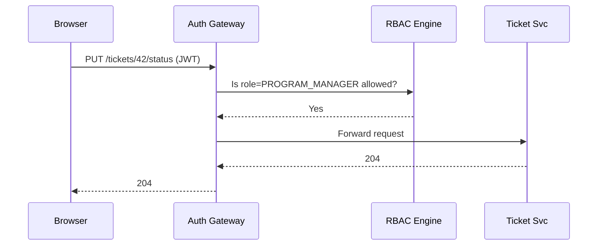

# Chapter 8: Role-Based Access & Permissions (RBAC)

*A friendly continuation from* [Admin / Gov Portal (Decision-Maker UI)](07_admin___gov_portal__decision_maker_ui__.md)  

---

## 1  Why Do We Need Digital “Badges & Turnstiles”?

Imagine the **U.S. Mint** opens its new “Coin Design Submission” portal.  
Four very different people will touch the same ticket:

| Person | What they must do |
|--------|------------------|
| Citizen Artist | Upload a design |
| Program Manager | Move ticket to *In Review* |
| Contracting Officer | Approve payment |
| External Auditor | Read-only access to history |

Without a gatekeeper, the artist could click “Approve Payment” or the auditor might accidentally overwrite a file.  
**RBAC** is the invisible guard that checks every action:

> “Show me your badge.  
>  OK, you’re a *Program Manager* — you may change status but not edit artwork.”

Even better, the guard understands federal smart cards (PIV/CAC) **and** the White House Zero-Trust mandate, so every microservice enforces least-privilege rules automatically.

---

## 2  Big Ideas in Plain English

| Term | Think of it as… | Why it matters |
|------|-----------------|----------------|
| Role | Your badge label (e.g., *Program Manager*) | Groups permissions so we don’t manage users one-by-one |
| Permission | A door in the building (e.g., “/tickets/approve”) | Grants or denies a single action |
| Policy Store | Master key cabinet | Holds the YAML file that maps roles → permissions |
| Auth Gateway | Security turnstile | Reads your badge, checks the cabinet, lets you through (or not) |
| Least Privilege | “Need-to-enter only” | Reduces blast-radius if an account is hacked |

---

## 3  Quick Use Case: “Change Ticket Status” in the U.S. Mint Portal

Desired rule set:

* Citizen Artist → **cannot** change status  
* Program Manager → **can** change status  
* Auditor → **read-only**

We will:

1. Declare roles in a YAML file.  
2. Log in with a smart card (simulated).  
3. Call a protected endpoint.  
4. Watch the gateway reject or allow the call.

---

### 3.1  Declare Roles (`roles.yaml` – 16 lines)

```yaml
roles:
  PROGRAM_MANAGER:
    can:
      - "PUT /tickets/*/status"
      - "GET /tickets/**"
  CITIZEN_ARTIST:
    can:
      - "POST /tickets"
      - "GET  /tickets/self/*"
  AUDITOR:
    can:
      - "GET /tickets/**"
```

Explanation for beginners  
• `PUT /tickets/*/status` means “change status on any ticket.”  
• Double `**` means “any nested path.”  
• We keep the file in the shared Policy Store managed by [Governance Layer](01_governance_layer__hms_gov__.md).

---

### 3.2  Simulate Smart-Card Login (`login.py` – 13 lines)

```python
import jwt, datetime, os
PIV_SERIAL = "1234567890"        # pretend this came from the card reader

def issue_token(role):
    now = datetime.datetime.utcnow()
    claims = {
      "sub": PIV_SERIAL,
      "role": role,
      "iat": now,
      "exp": now + datetime.timedelta(hours=1)
    }
    return jwt.encode(claims, os.getenv("JWT_SECRET"), algorithm="HS256")

print(issue_token("PROGRAM_MANAGER"))
```

What happens?  
1. The PIV reader gives us a hardware-verified serial number.  
2. We mint (pun intended) a short-lived JWT that carries the `role` claim.

---

### 3.3  Call a Protected Endpoint (`demo.sh` – 5 lines)

```bash
TOKEN=$(python login.py)
curl -X PUT https://mint.api/tickets/42/status \
     -H "Authorization: Bearer $TOKEN" \
     -d '{"new_status":"In Review"}'
```

Expected outcomes:

| Role | HTTP result | Reason |
|------|-------------|--------|
| `PROGRAM_MANAGER` | 204 No Content | Allowed |
| `CITIZEN_ARTIST` | 403 Forbidden | Missing permission |
| `AUDITOR` | 403 Forbidden | Read-only |

---

## 4  What Happens Behind the Curtain?



1. Gateway checks the **signature & expiry** of the JWT (Zero-Trust step).  
2. Sends the role + verb + path to the RBAC engine (a fast in-memory checker).  
3. If *yes*, the request is proxied to the real microservice; otherwise returns 403.

---

## 5  Inside the RBAC Engine (Python, 18 Lines)

```python
# file: rbac/checker.py
import yaml, fnmatch

POLICY = yaml.safe_load(open("roles.yaml"))

def allowed(role, verb, path):
    perms = POLICY["roles"].get(role, {}).get("can", [])
    for rule in perms:
        v, p = rule.split(maxsplit=1)
        if v == verb and fnmatch.fnmatch(path, p):
            return True
    return False
```

Line-by-line  
1. Load the YAML once at startup.  
2. Split each rule into HTTP verb & glob pattern.  
3. Use `fnmatch` (built-in) for wildcards like `*` or `**`.  
4. Return `True` on the first match.

---

### Plugging the Checker into FastAPI (11 Lines)

```python
from fastapi import FastAPI, Request, HTTPException
from rbac.checker import allowed
import jwt

app = FastAPI()

@app.middleware("http")
async def guard(request: Request, call_next):
    token = request.headers.get("authorization", "").split()[-1]
    role = jwt.decode(token, "secret", algorithms=["HS256"])["role"]
    if not allowed(role, request.method, request.url.path):
        raise HTTPException(403, "Forbidden")
    return await call_next(request)
```

Every endpoint beneath this middleware now respects the same YAML file—no copy-pasted `if` statements!

---

## 6  Integrating PIV/CAC Smart Cards

1. **Card Reader** → extracts a serial number and X.509 cert.  
2. **Auth Gateway** → validates the cert against federal PKI, then issues the JWT you saw earlier.  
3. **RBAC Engine** → only cares about the `role` claim, keeping the design modular.

---

## 7  Link-Ups to Other HMS-UTL Layers

• **HITL Oversight** uses `POLICY_REVIEWER` & `POLICY_ADMIN` roles you saw in [Human-in-the-Loop Oversight](06_human_in_the_loop__hitl__oversight_.md).  
• **Admin / Gov Portal** buttons (Approve, Rollback) are visible only when `role ∈ {APPROVER, POLICY_ADMIN}`.  
• **Audit Ledger** records every denied access attempt, contributing to the [Metrics & Monitoring Dashboard](15_metrics___monitoring_dashboard_.md).  
• **Governance Layer** stores versioned `roles.yaml`, so role changes are audited just like other policies.

---

## 8  Frequently Asked Questions

**Q: How do I add a new role?**  
Add it to `roles.yaml`, bump the version in HMS-GOV, and redeploy the Auth Gateway (hot-reload supported).

**Q: Can one user have multiple roles?**  
Yes. Encode `role: ["PROGRAM_MANAGER","AUDITOR"]` in the JWT; modify `allowed()` to loop over the list.

**Q: Does RBAC slow things down?**  
Not noticeably. The checker is an in-process table lookup—≈ 50 µs per request in tests.

**Q: What if the YAML is misconfigured?**  
The Gateway falls back to *deny-by-default* and logs an alert to the Metrics service.

---

## 9  What You Learned

• Roles act like digital badges; permissions are the doors they unlock.  
• A short YAML file plus a 18-line checker enforces Zero-Trust least-privilege across every microservice.  
• PIV/CAC smart cards integrate seamlessly by wrapping their identity info in a short-lived JWT.  
• RBAC is referenced by almost every other layer—HITL, Portals, Metrics, and more.

Ready to see how microservices talk to each other once the guards are in place?  
Jump to [Backend Services Mesh (HMS-SVC)](09_backend_services_mesh__hms_svc__.md).

---

Generated by [AI Codebase Knowledge Builder](https://github.com/The-Pocket/Tutorial-Codebase-Knowledge)