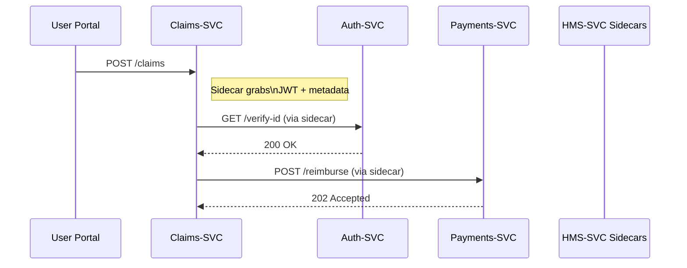
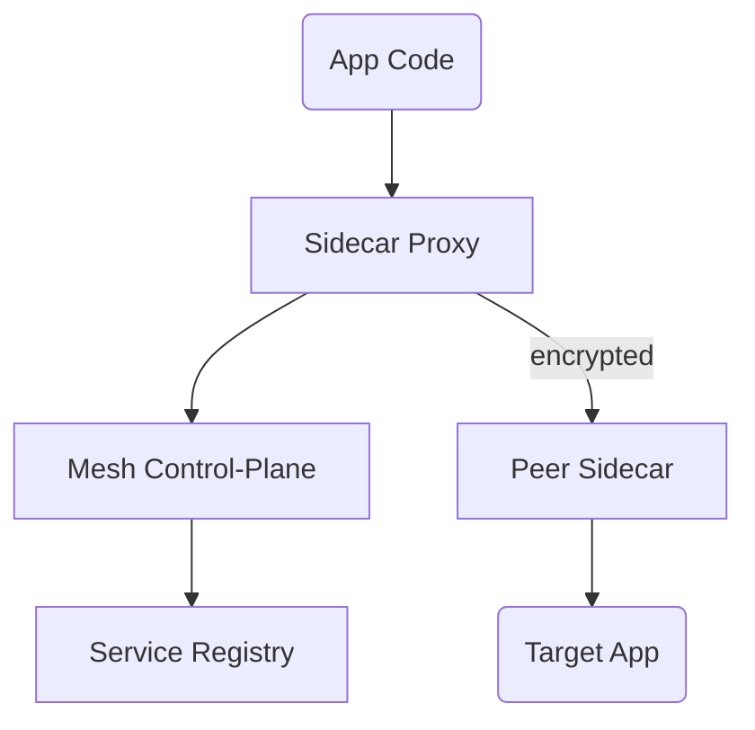

# Chapter 9: Backend Services Mesh (HMS-SVC)

*A friendly continuation from* [Role-Based Access & Permissions (RBAC)](08_role_based_access___permissions__rbac__.md)  

---

## 1 Why Do We Need a “Service Highway System”?

Picture the **Military Postal Service Agency (MPSA)**.  
When a soldier files a “Lost Package” claim in Germany, _three_ backend microservices must quietly cooperate:

1. **Auth-SVC** – confirm the soldier’s identity.  
2. **Claims-SVC** – open a ticket & calculate reimbursement.  
3. **Payments-SVC** – push the refund to her U.S. bank.

If any one call is slow, mis-routed, or insecure, the whole process stalls and the soldier waits **weeks**.  
**HMS-SVC** is the interstate highway system for these calls:

* routes traffic to the correct lane (service),  
* enforces speed limits & toll booths (security / quotas),  
* auto-detours around accidents (failover).

With the mesh in place, dev teams focus on **business logic**, not on reinventing traffic lights.

---

## 2 Big Ideas in Plain English

| Term | Think of it as… | Why you care |
|------|-----------------|--------------|
| Sidecar | Mini traffic cop on every corner | Intercepts all in- and out-going packets for one service |
| mTLS | Armored truck convoy | Encrypts & authenticates service-to-service calls |
| Traffic Policy | Road sign | e.g., “90 % to v1, 10 % to v2” for canary releases |
| Circuit Breaker | Ramp meter | Stops calls to a sick service before pile-ups form |
| Policy Filter | Customs checkpoint | Injects [HMS-GOV](01_governance_layer__hms_gov__.md) rules into every request |

---

## 3 3-Minute Tour: From Claim to Payment



The developer for **Claims-SVC** wrote **zero** code about TLS, retries, or load-balancing—sidecars handled it all.

---

## 4 Hands-On: “Hello Mesh” in 18 Lines

We’ll call `Auth-SVC` from `Claims-SVC` using **Plain Python**.  
No TLS code—sidecars do the heavy lifting.

### 4.1 Caller (`claims.py` – 18 lines)

```python
import requests, os, json

SIDE_CAR = "http://localhost:15001"   # sidecar’s inbound port

def soldier_is_valid(jwtoken):
    hdrs = {"Authorization": jwtoken}
    # The mesh rewrites host 'auth-svc.svc' to real IP
    r = requests.get(f"{SIDE_CAR}/verify-id",
                     headers=hdrs,
                     params={"host":"auth-svc.svc"})
    return r.status_code == 200

if __name__ == "__main__":
    jwt = os.getenv("SOLDIER_JWT")
    ok  = soldier_is_valid(jwt)
    print("✅ verified" if ok else "❌ invalid")
```

Explanation  
1. The app talks **only** to its own sidecar (`localhost:15001`).  
2. A special query header `host` tells the sidecar which service to reach.  
3. Sidecar adds mTLS, retries, time-outs, and RBAC headers automatically.

---

### 4.2 What You Didn’t Have to Code

* `openssl` calls for certificates  
* Retry loops / exponential back-off  
* Audit headers (`X-Policy-Version`) injected from [HMS-GOV](01_governance_layer__hms_gov__.md)  
* Load-balancing across 5 replicas of **Auth-SVC**

All were handled by HMS-SVC.

---

## 5 Under the Hood: Step-By-Step



1. **Startup** – the control-plane pushes routing tables into every sidecar.  
2. **Request** – app sends HTTP to `localhost`.  
3. **Security** – sidecar attaches a short-lived client cert (mTLS).  
4. **Policy** – sidecar calls HMS-GOV’s `/policy-header` once per TTL and caches `X-Policy-Version`.  
5. **Response** – circuit-breaker or retry if needed, then return to app.

---

## 6 Tiny Control-Plane Snippet (envoy-like YAML – 14 lines)

```yaml
# file: routes.yaml
listeners:
  - name: inbound_http
    port: 15001
    routes:
      - match: { prefix: "/verify-id" }
        action:
          cluster: auth-svc
          timeout: 1s
          retries: 2
          circuit_breakers: { max_connections: 100 }
clusters:
  - name: auth-svc
    connect_timeout: 0.25s
    tls_context: { sds: "mesh_certs" }   # mTLS auto-rotate
```

Explanation  
• Maps any call for `/verify-id` to the `auth-svc` cluster.  
• Two retries + 1 s time-out shield the app from hangs.  
• `tls_context` pulls fresh certs every hour—no PEM files in your repo.

Sidecars hot-reload this file when the control-plane updates traffic rules.

---

## 7 Injecting Governance & RBAC Headers

Sidecars attach two standard headers _on every hop_:

```
X-Policy-Version : 1.3.4   <- from HMS-GOV
X-Caller-Role    : PROGRAM_MANAGER  <- from JWT via RBAC
```

Downstream services can blindly trust these headers—because the mesh already verified the JWT and encrypted the channel.

---

## 8 Link-Ups With Other HMS-UTL Layers

• **Policy Enforcement** – Sidecars call [Governance Layer (HMS-GOV)](01_governance_layer__hms_gov__.md) once to cache the active policy version.  
• **Security** – Caller roles come from the JWT validated in [RBAC](08_role_based_access___permissions__rbac__.md).  
• **Service Discovery** – Endpoint `auth-svc.svc` is registered in the upcoming [Microservice Registry & Discovery](11_microservice_registry___discovery_.md).  
• **Metrics** – Latency, error rates, and retry counts flow to the [Metrics & Monitoring Dashboard](15_metrics___monitoring_dashboard_.md).

---

## 9 Frequently Asked Questions

**Q: Do I have to rewrite my apps to use the mesh?**  
A: Nope. Point your code at `localhost:<sidecar-port>` (or use DNS rewriting) and keep coding as usual.

**Q: What happens if `Auth-SVC` is down?**  
A: Circuit-breaker trips; sidecar returns `503`, optional fallback logic kicks in.

**Q: How often do certificates rotate?**  
A: Default 24 h with zero downtime; mesh renews in-place.

**Q: Can I do canary releases?**  
A: Yes. Add `trafficPolicy: weight=10` for `auth-svc-v2` in the control-plane YAML—no app restarts.

---

## 10 What You Learned

• HMS-SVC is the traffic system that moves data safely between hundreds of microservices.  
• Sidecars give you mTLS, retries, load-balancing, and policy headers **for free**.  
• Apps stay blissfully simple—standard HTTP calls to `localhost`.  
• The mesh stitches together governance, RBAC, discovery, and monitoring layers.

Ready to see how we protect the data flowing through this highway system?  
Continue to [Data Privacy & Compliance Guardrails](10_data_privacy___compliance_guardrails_.md).

---

Generated by [AI Codebase Knowledge Builder](https://github.com/The-Pocket/Tutorial-Codebase-Knowledge)