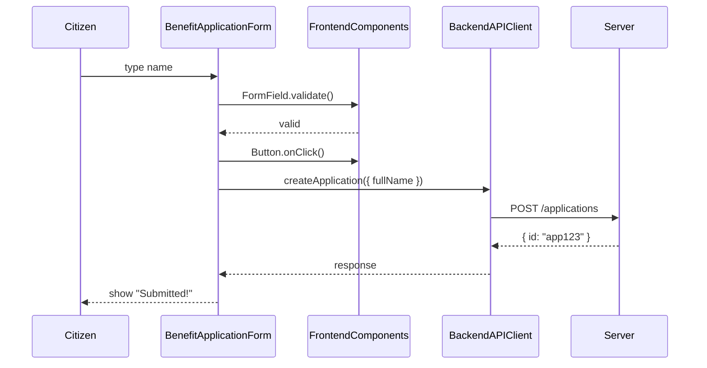

# Chapter 9: Frontend Interface Components

Continuing from [Chapter 8: Backend API Integration](08_backend_api_integration_.md), we now build the shared UI “toolbox” that both the user‐facing portal (HMS-MFE) and the admin dashboard (HMS-GOV) use. Think of it as a library of pre-made form fields, buttons, wizards, and dashboard widgets—so every screen looks and feels familiar, whether you’re a citizen applying for benefits or an official reviewing cases.

---

## 1. Why We Need Frontend Interface Components

Imagine a citizen logging into the public benefits portal to submit an application. They see:

1. A step-by-step wizard guiding them through eligibility questions  
2. Consistent form fields (text inputs, date pickers) with clear labels  
3. A friendly “Next” button that only becomes active when entries are valid  
4. A status tracker showing “Application received”, “Under review”, “Approved”

Meanwhile, an admin uses a separate HMS-GOV dashboard that re-uses those same buttons, fields, and widgets—so training is faster and updates roll out everywhere at once. Rather than each team reinventing the wheel, **Frontend Interface Components** give us one consistent set of building blocks.

---

## 2. Key Concepts

1. **Component Library**  
   A central package (e.g., `@hms-utl/frontend`) that holds all shared UI pieces.

2. **FormField**  
   Standard input + label + validation message.

3. **Button**  
   Primary, secondary, disabled, loading states—same colors and sizes everywhere.

4. **Wizard & Steps**  
   A container that walks users through a multi-page form.

5. **Dashboard Widgets**  
   Cards, tables, status trackers that show application counts or processing stages.

---

## 3. Using the Abstraction

Below is a minimal React example showing how to build a simple benefits form with our shared components.

```jsx
// file: BenefitApplicationForm.jsx
import React, { useState } from 'react'
import { FormField, Button } from '@hms-utl/frontend'

export function BenefitApplicationForm() {
  const [name, setName] = useState('')
  const isValid = name.trim().length > 0

  return (
    <form onSubmit={e => e.preventDefault()}>
      <FormField
        label="Full Name"
        name="fullName"
        value={name}
        onChange={e => setName(e.target.value)}
        required
      />
      <Button type="submit" disabled={!isValid}>
        Submit Application
      </Button>
    </form>
  )
}
```

Explanation:
- We import reusable `FormField` and `Button`.  
- `FormField` wraps a text input with label and “required” validation.  
- `Button` auto-disables until `isValid` is `true`.  

Under the hood, the same `FormField` and `Button` code gets used in both citizen and admin portals—so look, feel, and UX are identical.

---

## 4. Under the Hood: Step-by-Step Flow



1. The user types into `FormField`.  
2. The component library runs built-in validation.  
3. The “Submit” button, wired to the library’s disabled logic, activates.  
4. On click, the form calls our [Backend API Integration](08_backend_api_integration_.md) client to `POST` the data.  
5. A server-generated application ID returns, and the UI shows a confirmation.

---

## 5. Internal Implementation Highlights

### 5.1 FormField Component

```jsx
// file: hms_utl/frontend/components/form_field.js
import React from 'react'

export function FormField({ label, name, value, onChange, required }) {
  return (
    <div className="form-field">
      <label htmlFor={name}>{label}{required && '*'}</label>
      <input id={name} name={name}
             value={value} onChange={onChange}
             required={required} />
      {/* built-in browser validation message */}
    </div>
  )
}
```

This simple component:
- Renders a `<label>` and `<input>`  
- Applies `required` so the browser shows a validation hint  
- Uses shared CSS for consistent spacing and fonts

### 5.2 Button Component

```jsx
// file: hms_utl/frontend/components/button.js
import React from 'react'

export function Button({ children, disabled, type = 'button' }) {
  return (
    <button className={`btn ${disabled ? 'btn--disabled' : 'btn--primary'}`}
            disabled={disabled} type={type}>
      {children}
    </button>
  )
}
```

Features:
- Applies consistent styles (`.btn--primary`, `.btn--disabled`)  
- Automatically dims and prevents clicks when `disabled` is true

### 5.3 Dashboard Widget (StatusTracker)

```jsx
// file: hms_utl/frontend/components/status_tracker.js
import React from 'react'

export function StatusTracker({ steps, current }) {
  return (
    <ul className="status-tracker">
      {steps.map((s,i) => (
        <li key={i} className={i<=current ? 'done' : ''}>{s}</li>
      ))}
    </ul>
  )
}
```

- Takes an array of `steps` (e.g., `["Received","Review","Approved"]`)  
- Highlights steps up to `current` index

---

## Conclusion

You’ve learned how **Frontend Interface Components** offer a shared library of form fields, buttons, wizards, and widgets—ensuring a consistent, user-friendly experience across HMS-MFE and HMS-GOV. Next, we’ll secure these interfaces by controlling who can see and click what in [Chapter 10: Authorization & Access Control](10_authorization___access_control_.md).

---

Generated by [AI Codebase Knowledge Builder](https://github.com/The-Pocket/Tutorial-Codebase-Knowledge)