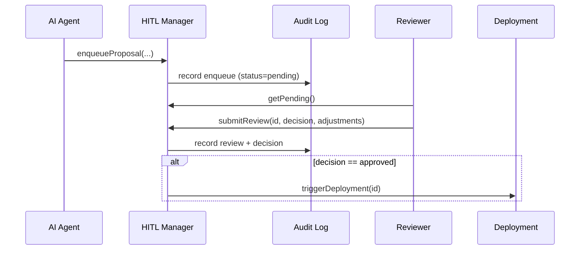

# Chapter 9: Human-in-the-Loop Oversight

In [Chapter 8: AI Governance Layer](08_ai_governance_layer_.md) we built policy checks that automatically flag or approve AI proposals. In this chapter, we add the final safeguard: **Human-in-the-Loop (HITL) Oversight**. Even when AI Agents propose updates, a real person reviews, tweaks, and officially signs off before anything goes live.

---

## Why Human-in-the-Loop Oversight?

Imagine the Patent and Trademark Office uses an AI Agent to suggest new routing rules for patent applications to speed up backlog. We want agility—but we also need accountability. HITL Oversight:

- Stores AI proposals in a review queue  
- Alerts a responsible official (e.g., a patent examiner)  
- Lets them adjust parameters or add comments  
- Records the final approve/reject decision  
- Only then deploys changes to production  

It’s like an editorial review: AI drafts the changes, humans refine and validate, then publish.

### Central Use Case: Patent Routing Update

1. An AI Agent analyzes application times and suggests “Route Class A patents to Team X, not Team Y.”  
2. That proposal is enqueued for review.  
3. A senior examiner compares it to policy, tweaks the threshold, and approves.  
4. The new routing rule goes live—both fast and accountable.

---

## Key Concepts

- **Proposal Queue**  
  Where all AI-generated proposals wait for human review.

- **Reviewer Role**  
  A named user or team with permission to inspect, comment, and decide.

- **Review Interface**  
  The UI or API through which humans fetch, annotate, and approve proposals.

- **Parameter Adjustment**  
  Reviewers can tweak numeric thresholds or rule details before approval.

- **Audit Trail**  
  Every step—enqueue, review, comment, decision—is logged for compliance.

- **Deployment Trigger**  
  Once approved, a controlled process applies the changes to production.

---

## Using Human-in-the-Loop Oversight

Below is a minimal code example showing how an AI Agent hands off its proposal, and how a human reviewer picks it up and approves it.

### 1. Enqueue a Proposal

```javascript
// File: ai-agent.js
const hitl = require('hms-utl-hitl');

// After generating a proposal object
await hitl.enqueueProposal({
  id: proposal.id,
  type: proposal.type,
  details: proposal.details
});
// Now it lives in the review queue
```

_Explanation:_  
Calling `enqueueProposal` stores your proposal in a shared database with status `pending`.  

### 2. Reviewer Fetches and Approves

```javascript
// File: review-handler.js
const hitl = require('hms-utl-hitl');

// Fetch all pending AI proposals
const pending = await hitl.getPending();

// Reviewer inspects pending[0], then submits a decision
await hitl.submitReview(pending[0].id, {
  decision: 'approved',           // or 'rejected'
  comments: 'Threshold looks good.',
  adjustments: { threshold: 0.25 } // tweak if needed
});
```

_Explanation:_  
`getPending()` returns all proposals needing review.  
`submitReview()` updates the record, logs comments, and—if approved—triggers deployment.

---

## What Happens Under the Hood?



1. **Agent** calls `enqueueProposal`.  
2. **HITL Manager** logs the pending proposal.  
3. A **Reviewer** fetches and inspects pending work.  
4. **Reviewer** calls `submitReview` with decision and any parameter tweaks.  
5. The decision is logged; if approved, deployment kicks off.

---

## Inside the HITL Manager

Here’s a simplified implementation of the core functions in `hms-utl-hitl`. It uses the same database client from [Core Infrastructure (HMS-SYS)](01_core_infrastructure__hms_sys__.md).

```javascript
// File: hms-utl-hitl/manager.js
const db = require('hms-sys').config.get('dbClient');

async function enqueueProposal(prop) {
  await db.collection('hitl').insertOne({ ...prop, status: 'pending' });
}

async function getPending() {
  return db.collection('hitl').find({ status: 'pending' }).toArray();
}

async function submitReview(id, { decision, comments, adjustments }) {
  await db.collection('hitl').updateOne(
    { id },
    { $set: { status: decision, comments, adjustments, reviewedAt: new Date() } }
  );
  if (decision === 'approved') {
    // triggerDeployment is your custom hook to apply changes
    await triggerDeployment(id);
  }
}

module.exports = { enqueueProposal, getPending, submitReview };
```

_Explanation:_  
- **enqueueProposal** adds a new document with `status: 'pending'`.  
- **getPending** queries for pending proposals.  
- **submitReview** updates status, logs comments, and if approved, calls your deployment hook.

---

## Conclusion

In this chapter you learned how **Human-in-the-Loop Oversight**:

- Queues AI proposals for a human reviewer  
- Provides simple APIs to fetch, inspect, adjust, and decide  
- Logs every action for an audit trail  
- Ensures that no AI-driven change goes live without official sign-off  

Next up: discover how these review workflows tie into a user-friendly portal in  
[Chapter 10: Admin/Gov Portal (HMS-GOV)](10_admin_gov_portal__hms_gov__.md).

---

Generated by [AI Codebase Knowledge Builder](https://github.com/The-Pocket/Tutorial-Codebase-Knowledge)