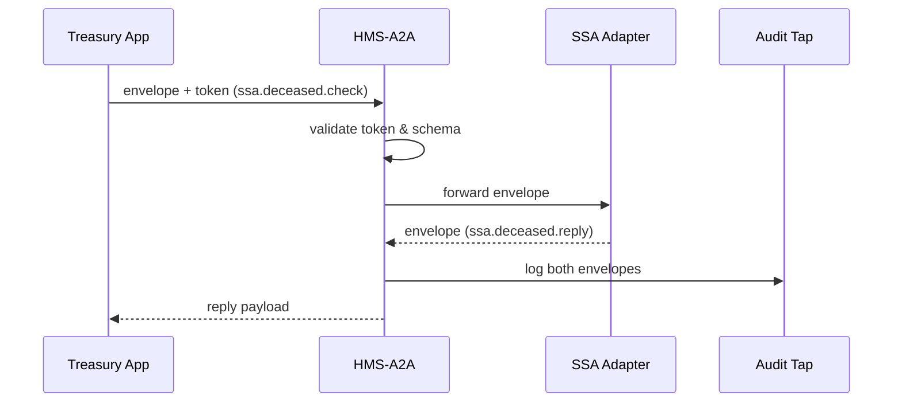

# Chapter 9: Inter-Agency Communication Bus (HMS-A2A)


[← Back to Chapter&nbsp;8: Process Synchronization & Backend API Layer](08_process_synchronization___backend_api_layer_.md)

---

## 1. Why Do Agencies Need a “Data Highway”?

Imagine the **Department of the Treasury** wants to confirm whether a stimulus-check applicant is truly alive before sending money.  
The only agency that owns that answer is the **Social Security Administration (SSA)**.  
Today the Treasury analyst might:

1. Export a CSV with 10 000 SSNs.  
2. Email it to an SSA contact (risk #1: leak).  
3. Wait three weeks for a reply (risk #2: stale data).  
4. Manually reconcile mismatches (risk #3: typos).

**HMS-A2A** eliminates all three risks by acting as a **secure, standardized communication bus**.  
Think of it as an **inter-state expressway** where every truck (message) must:

* Use a standard trailer size (data schema).  
* Show a badge at each toll (permission token).  
* Stay on its lane—no “U-turns” into private citizen data.

With HMS-A2A, Treasury can fire a *single* query:

```
“Does SSN 123-45-6789 appear as deceased?”
```

…and get an authoritative “yes / no” in seconds—without ever seeing the person’s medical history.

---

## 2. Five Core Concepts (Sticker Notes)

| Concept | Highway Analogy | Beginner Definition |
|---------|-----------------|---------------------|
| Channel | A specific lane | Named topic for one kind of request/response (“ssa.deceased.check”). |
| Envelope | The truck trailer | JSON wrapper holding payload + headers. |
| Access Token | Toll-booth badge | JWT proving the sender may use this lane. |
| Adapter | On-ramp | Tiny module that converts an agency’s internal format to the common envelope. |
| Audit Tap | Highway camera | Append-only log of every envelope for IG or FOIA reviews. |

Keep these five ideas in your back pocket—nothing else is magic.

---

## 3. Walk-Through Use Case: Treasury Checks Deceased Status

### 3.1 High-Level Steps

1. Treasury’s payment system sends an envelope on channel `ssa.deceased.check`.  
2. HMS-A2A validates the token → forwards to SSA.  
3. SSA responds on `ssa.deceased.reply`.  
4. HMS-A2A returns the reply to Treasury **and** writes both envelopes to the Audit Tap.

### 3.2 Treasury-Side Code (17 lines)

```python
# file: treasury/check_deceased.py
from hms_a2a import Bus, JWT   # pip install hms-a2a

bus = Bus("amqps://a2a")       # TLS RabbitMQ under the hood
token = JWT.issue(
    agency="Treasury",
    scopes=["ssa.deceased.check"]
)

envelope = {
    "ssn": "123-45-6789",
    "requested_by": "treasury.stimulus.2024"
}

reply = bus.rpc(
    channel="ssa.deceased.check",
    payload=envelope,
    token=token,
    timeout=5      # seconds
)

print(reply)       # {'ssn':'123-45-6789', 'is_deceased': False}
```

What happened?

* `.rpc()` does a **request/response** round-trip over HMS-A2A.  
* If the token lacks the right scope, the bus returns `403 Forbidden` automatically—no code change needed.

### 3.3 SSA Adapter (18 lines)

```python
# file: ssa/adapter.py
from hms_a2a import listen
from ssa.core import master_death_file

@listen("ssa.deceased.check")   # decorator wires us to the channel
def handle(request):
    ssn = request["ssn"]
    deceased = master_death_file.contains(ssn)
    return { "ssn": ssn, "is_deceased": deceased }
```

Explanation:

* The decorator subscribes to the right channel.  
* Returning a dict automatically sends an envelope on `ssa.deceased.reply`.

---

## 4. What Happens Under the Hood?



Just **four participants** keep the mental load low.

---

## 5. Under-the-Hood Code Nuggets

### 5.1 Envelope Schema (8 lines)

```python
class Envelope(BaseModel):
    id: UUID = Field(default_factory=uuid4)
    channel: str
    payload: dict
    issued_at: datetime = Field(default_factory=datetime.utcnow)
    issuer: str         # agency name
    signature: str      # JWT or HMAC
```

*Every* message—request or reply—looks like this.

### 5.2 Tiny Token Validator (12 lines)

```python
def validate(token: str, channel: str):
    claims = jwt.decode(token, PUB_KEY, algorithms=["RS256"])
    if channel not in claims["scopes"]:
        raise HTTPError(403, "scope_missing")
    if claims["exp"] < time.time():
        raise HTTPError(401, "token_expired")
    return claims["agency"]
```

No token → no lane.

### 5.3 Audit Tap Writer (9 lines)

```python
async def tap(envelope):
    await db.execute(
        "INSERT INTO audit_log (id, channel, issuer, ts) VALUES ($1,$2,$3,$4)",
        envelope.id, envelope.channel, envelope.issuer, envelope.issued_at
    )
```

A nightly job copies `audit_log` to cold storage—immutable forever.

---

## 6. How HMS-A2A Plays with Other HMS Layers

| Other Layer | Interaction Example |
|-------------|---------------------|
| [HMS-DTA](05_data___privacy_management_hub__hms_dta__.md) | A2A envelope may include a **Data Ticket** ID; DTA validates before allowing data transfer. |
| [HMS-OMS / HMS-ACT](07_workflow_orchestration___task_queues__hms_oms___hms_act__.md) | Long-running cross-agency workflows use A2A channels as *service tasks* in the workflow graph. |
| [HMS-ESQ](04_compliance___legal_reasoning_engine__hms_esq__.md) | Before forwarding, HMS-A2A can ask ESQ: “Is sharing field X with Treasury legally allowed?” |

Everything still obeys the **three-floor** rule from [Chapter&nbsp;1](01_multi_layered_system_architecture_.md):  
agents and services talk **via A2A**, never straight into another agency’s database.

---

## 7. Hands-On Lab (90 Seconds)

```bash
git clone hms-utl
cd hms-utl/demo
docker compose up a2a ssa treasury   # starts RabbitMQ + two adapters

# Treasury sends a check request
python treasury/check_deceased.py
# -> {'ssn':'123-45-6789', 'is_deceased': False}

# View the audit log
psql a2a -c "SELECT channel, issuer, issued_at FROM audit_log LIMIT 5;"
```

Notice both `ssa.deceased.check` and `ssa.deceased.reply` entries appear—transparency by default.

---

## 8. Recap & What’s Next

In this chapter you learned:

✔ Why inter-agency data sharing needs a **secure, audited highway**.  
✔ Five core concepts: Channel, Envelope, Access Token, Adapter, Audit Tap.  
✔ How Treasury queried SSA in <20 lines of code—no CSVs, no emails.  
✔ The tiny internals that validate tokens and write an immutable log.  
✔ How HMS-A2A plugs into legal, data, and workflow layers.

Ready to connect **non-federal** partners—like state health departments or real-time IoT sensors?  
Continue to [Chapter&nbsp;10: External System Integrations & Real-Time Sync](10_external_system_integrations___real_time_sync_.md).

---

---

Generated by [AI Codebase Knowledge Builder](https://github.com/The-Pocket/Tutorial-Codebase-Knowledge)