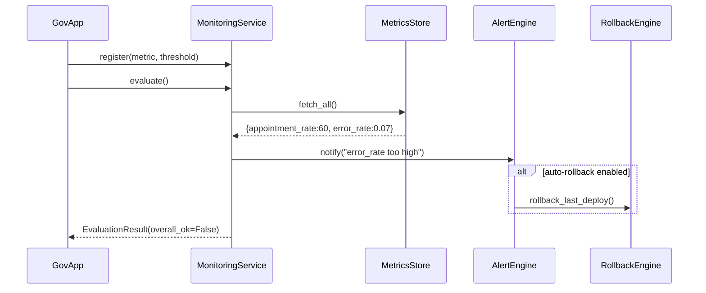

# Chapter 11: Monitoring & Outcome Verification

Welcome back! In [Chapter 10: Authorization & Access Control](10_authorization___access_control_.md), we locked down who can do what. Now it’s time to watch how your policies and services behave in the real world—and make sure they’re doing their job. That’s **Monitoring & Outcome Verification**: our mission control center for performance, error rates, and citizen satisfaction.

---

## 1. Why We Need Monitoring & Outcome Verification

Imagine the Department of Health rolls out a new online vaccine scheduling policy. After go-live, they need to know:

- How many appointments per hour?  
- Are errors spiking on the booking form?  
- Did citizen satisfaction surveys drop?  

Without a dashboard, they’d be flying blind. With **Monitoring & Outcome Verification**, we track key metrics, watch for dips or conflicts, and—if something goes wrong—trigger alerts, rollbacks, or deeper AI analyses. It closes the loop so we continuously optimize our public-sector services.

---

## 2. Key Concepts

1. **Metric**  
   A measurable value (throughput, error rate, survey score).

2. **Dashboard**  
   Visual display of live metric trends—like a flight deck’s gauges.

3. **Alert**  
   Automated notification when a metric crosses a warning or failure threshold.

4. **Rollback Trigger**  
   Mechanism to reverse a policy or code change if outcomes degrade.

5. **Feedback Loop**  
   Chain of monitoring → alerting → action → re-monitoring for continuous improvement.

---

## 3. Using the Abstraction

Below is a minimal example showing how a government app might set up monitoring for two metrics and run a check:

```python
# file: example_monitoring_usage.py
from hms_utl.monitoring import MonitoringService

service = MonitoringService()
# Register metrics: name, threshold, callback on breach
service.register("appointment_rate", min_value=50)
service.register("error_rate", max_value=0.05)

# Later, periodically:
results = service.evaluate()
print("Metrics OK?", results.overall_ok)
if not results.overall_ok:
    print("Alerts sent:", results.alerts)
```

Explanation:
- We create `MonitoringService`.  
- We register two metrics with acceptable ranges.  
- On `evaluate()`, the service fetches current values, compares against thresholds, and sends alerts if needed.

---

## 4. Under the Hood: Step-by-Step Flow



1. The app registers metrics with thresholds.  
2. When `evaluate()` runs:  
   - **MetricsStore** returns current values.  
   - **MonitoringService** compares values to thresholds.  
   - If a breach occurs, **AlertEngine** sends notifications.  
   - Optionally, **RollbackEngine** reverses the last bad change.  
3. An `EvaluationResult` with details goes back to the caller.

---

## 5. Internal Implementation Highlights

### 5.1 hms_utl/monitoring/monitoring_service.py

```python
# file: hms_utl/monitoring/monitoring_service.py
from .metrics_store import MetricsStore
from .alert_engine import AlertEngine

class MonitoringService:
    def __init__(self):
        self.store = MetricsStore()
        self.alert = AlertEngine()
        self.registrations = []

    def register(self, name, min_value=None, max_value=None):
        self.registrations.append((name, min_value, max_value))

    def evaluate(self):
        data = self.store.fetch_all()
        alerts = []
        overall_ok = True
        for name, lo, hi in self.registrations:
            val = data.get(name, 0)
            if (lo is not None and val < lo) or (hi is not None and val > hi):
                alerts.append(f"{name}={val}")
                self.alert.notify(name, val, lo, hi)
                overall_ok = False
        return type("R", (), {"overall_ok": overall_ok, "alerts": alerts})()
```

- We keep a list of metric registrations.  
- `evaluate()` gets all current metric values, checks each against its thresholds, fires alerts when needed, and builds a simple result object.

### 5.2 hms_utl/monitoring/metrics_store.py

```python
# file: hms_utl/monitoring/metrics_store.py
class MetricsStore:
    def fetch_all(self):
        # In real life, query Prometheus or CloudWatch
        return {
            "appointment_rate": 60,  # e.g. 60 bookings/hour
            "error_rate": 0.07       # 7% form errors
        }
```

- A stub that returns mock metrics. Replace with real time-series calls.

### 5.3 hms_utl/monitoring/alert_engine.py

```python
# file: hms_utl/monitoring/alert_engine.py
class AlertEngine:
    def notify(self, name, value, lo, hi):
        # Send email/SMS or create a Jira ticket
        print(f"[ALERT] {name}={value}, expected [{lo or '-∞'}, {hi or '∞'}]")
```

- Prints or routes alerts. In production, integrate with PagerDuty, Slack, or SMS.

### 5.4 (Optional) hms_utl/monitoring/rollback_engine.py

```python
# file: hms_utl/monitoring/rollback_engine.py
class RollbackEngine:
    def rollback_last_deploy(self):
        # Call your CI/CD pipeline to revert to previous version
        print("↩️ Rolling back last deployment")
```

- If auto-rollback is enabled, MonitoringService can invoke this to undo a bad release.

---

## Conclusion

In this chapter you learned how **Monitoring & Outcome Verification** tracks key performance metrics, fires alerts when things go off-course, and even triggers rollbacks to keep services healthy. You’ve seen both the simple usage and what happens under the hood. Next up, we’ll look at how to automatically replace failing components in [Chapter 12: Replacement Trigger Mechanism](12_replacement_trigger_mechanism_.md).

---

Generated by [AI Codebase Knowledge Builder](https://github.com/The-Pocket/Tutorial-Codebase-Knowledge)