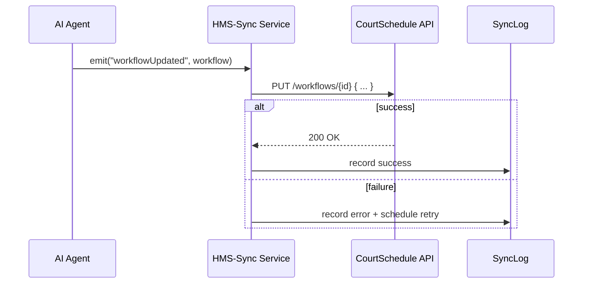

# Chapter 12: External System Synchronization

In [Chapter 11: Policy & Process Module](11_policy___process_module_.md) we learned how to define and version policies and workflows. Now we’ll make sure any change—whether it’s a new approval threshold or a revised routing step—gets pushed out to the tools you already use. That’s **External System Synchronization**.

## Why External System Synchronization?

Imagine the Federal Judicial Center updates its attorney‐assignment workflow in HMS-UTL. Without a sync mechanism, court scheduling software would still use the old rules, leading to mismatches, manual fixes, and frustrated clerks. External System Synchronization acts like an embassy liaison, ensuring that any process or policy change propagates to third-party systems—scheduling tools, document repositories, or legacy databases—automatically, reliably, and in real time.

Central Use Case:  
A clerk approves a new “Attorney Rotation” workflow. Instantly, the state court’s scheduling system receives the update, resolves any conflicts (e.g., overlapping assignments), and confirms the change—so court calendars stay coherent everywhere.

## Key Concepts

1. **Connectors**  
   Small adapters that know how to talk to each external system (HTTP API, SFTP, legacy DB).

2. **Event Dispatch**  
   When something changes (workflow, policy, user assignment), we emit an event like `workflowUpdated`.

3. **Conflict Reconciliation**  
   If the external system has pending edits, the sync logic can merge or retry based on configurable rules.

4. **Acknowledgment & Retry**  
   Ensure delivery by waiting for success responses and retrying on failures (e.g., network hiccups).

5. **Real-Time vs Batch**  
   You can sync immediately on change (real-time) or aggregate updates and sync every hour (batch).

## How to Use External System Synchronization

Below is a minimal example showing:

- Initializing the sync service  
- Registering a connector for a court scheduling system  
- Listening for workflow changes and syncing in real time

```javascript
// File: sync-init.js
const hmsSync = require('hms-utl-extsync');

// 1. Initialize core infra and sync
hmsSync.init({ env: 'production', configServer: 'https://config.gov' });

// 2. Register the Court Schedule connector
hmsSync.registerConnector('CourtSchedule', {
  endpoint: 'https://courtsched.example.gov/api/v1',
  authToken: 'Bearer abc123'
});

// 3. Listen for workflow changes and sync
hmsSync.on('workflowUpdated', async (workflow) => {
  await hmsSync.sync('CourtSchedule', workflow);
  console.log('CourtSchedule updated:', workflow.id);
});
```

Explanation:  
1. `init(...)` bootstraps [HMS-SYS](01_core_infrastructure__hms_sys__.md).  
2. `registerConnector` tells the sync service how to contact the court scheduling API.  
3. When a `workflowUpdated` event fires, we call `sync(...)`, passing the updated object. The service handles HTTP calls, conflict checks, retries, and logs success or errors.

## Under the Hood: Sequence Diagram



1. The AI Agent emits a `workflowUpdated` event.  
2. HMS-Sync calls the external API to update the workflow.  
3. On success, it logs a successful sync; on failure, it records the error and retries later.

## Inside HMS-UTL External Sync

Here’s a peek at two core modules that make this work.

### connectorRegistry.js

```javascript
// File: hms-utl-extsync/connectorRegistry.js
const connectors = {};

function registerConnector(name, config) {
  connectors[name] = config; // store endpoint, auth, etc.
}

function getConnector(name) {
  const conn = connectors[name];
  if (!conn) throw new Error(`Connector ${name} not found`);
  return conn;
}

module.exports = { registerConnector, getConnector };
```

Explanation:  
- `registerConnector` saves the external system’s details under a name (e.g., `CourtSchedule`).  
- `getConnector` retrieves that config when it’s time to sync.

### syncService.js

```javascript
// File: hms-utl-extsync/syncService.js
const { getConnector } = require('./connectorRegistry');
const axios = require('axios');

async function sync(connectorName, payload) {
  const { endpoint, authToken } = getConnector(connectorName);
  try {
    await axios.put(
      `${endpoint}/workflows/${payload.id}`,
      payload,
      { headers: { Authorization: authToken } }
    );
  } catch (err) {
    scheduleRetry(connectorName, payload);
    throw err;
  }
}

function scheduleRetry(name, payload) {
  // enqueue for later—details omitted for brevity
}

module.exports = { sync };
```

Explanation:  
- Fetches connector config, makes an HTTP PUT to update the external system.  
- On failure, calls `scheduleRetry` to try again later.

## Conclusion

In this chapter you learned how **External System Synchronization** in HMS-UTL:

- Registers connectors for third-party tools  
- Listens for changes (workflows, policies, assignments)  
- Dispatches updates in real time, with conflict reconciliation and retries  
- Keeps court schedules, document repositories, and legacy databases in sync  

You’re now ready to integrate HMS-UTL’s processes and policies across your entire ecosystem—keeping every system coherent and up to date!

---

Generated by [AI Codebase Knowledge Builder](https://github.com/The-Pocket/Tutorial-Codebase-Knowledge)