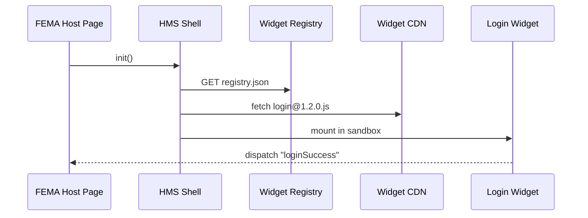

# Chapter 12: Micro-Frontend Interface Library (HMS-MFE)

[← Back to Chapter 11: Financial Transaction & Clearinghouse (HMS-ACH)](11_financial_transaction___clearinghouse__hms_ach__.md)

---

## 1. Why Do We Need “Government-Grade LEGOs” for the UI?

Imagine FEMA has **48 hours** to open a *Disaster-Relief Claim* portal after a hurricane.  
The portal must:

1. Let survivors **log in** (with MFA).  
2. Provide a **multi-page form** that auto-saves.  
3. Show **claim status** as the case moves through [HMS-OMS](07_workflow_orchestration___task_queues__hms_oms___hms_act__.md).  
4. Collect **analytics** for Congress in an accessible dashboard.

Re-coding those screens every disaster is like rebuilding the Capitol each session.  
**HMS-MFE** ships reuse-able “LEGO bricks” (micro-frontends) so any agency can *snap* together a polished UI in hours—not months.

---

## 2. Five Key Concepts (Sticker-Note Simple)

| Concept          | LEGO Analogy     | One-Line Meaning |
|------------------|------------------|------------------|
| Widget           | A single brick   | Stand-alone UI component (e.g., `LoginWidget`). |
| Design Tokens    | Brick color set  | Shared CSS variables for fonts, spacing, colors. |
| Shell (Host App) | LEGO baseplate   | The agency’s site that *hosts* the widgets. |
| Registry         | Builder’s manual | JSON list telling the shell *where* to fetch each widget. |
| Sandbox          | Safety goggles   | Iframe or Shadow DOM that prevents CSS/JS clashes. |

Keep these five in mind—nothing else is magic.

---

## 3. Quick Tour: Building the FEMA Portal in 15 Lines

Below we create a bare-bones **host page** that loads three ready-made widgets.

```html
<!-- file: fema_portal.html -->
<!DOCTYPE html>
<html lang="en">
<head>
  <script src="https://cdn.hms.gov/mfe-shell@1.0.0.js"></script>
  <link rel="stylesheet" href="https://cdn.hms.gov/tokens/federal.css">
</head>
<body>
  <mfe-login></mfe-login>
  <mfe-form src="/schemas/disaster_claim.json"></mfe-form>
  <mfe-status-track claim-id="42"></mfe-status-track>
  
  <script>
    HMSShell.init({
      registry: "https://cdn.hms.gov/registry.json"
    });
  </script>
</body>
</html>
```

**What just happened?**

1. We import the **Shell** script + **Design Tokens**.  
2. We drop three **custom elements** (`<mfe-login>`, `<mfe-form>`, `<mfe-status-track>`).  
3. `HMSShell.init()` reads the **Registry** and swaps each tag for the actual widget code, loaded on-demand. No build tooling needed!

---

## 4. Under the Hood (Non-Code Walk-through)



Only **five actors**, easy to digest.

---

## 5. Writing Your First Widget (React, <20 Lines)

```tsx
// file: widgets/LoginWidget.tsx
export default function LoginWidget() {
  const [email, setEmail]   = useState("");
  const [otp, setOtp]       = useState("");

  function sendOtp() {
    fetch("/api/v1/auth/otp", {method:"POST",body:email});
  }
  function verify() {
    fetch("/api/v1/auth/verify",{
      method:"POST", body: JSON.stringify({email, otp})
    }).then(()=> window.dispatchEvent(new Event("loginSuccess")));
  }

  return (
    <form>
      <input value={email} onChange={e=>setEmail(e.target.value)}
             placeholder="you@gov.us"/>
      <input value={otp} onChange={e=>setOtp(e.target.value)}
             placeholder="One-time code"/>
      <button type="button" onClick={sendOtp}>Send Code</button>
      <button type="button" onClick={verify}>Login</button>
    </form>
  );
}
```

Explanation:

* Less than 20 lines deliver email + OTP login.  
* `window.dispatchEvent("loginSuccess")` notifies other widgets (e.g., the Status Tracker).

---

## 6. Publishing the Widget (CLI, 6 Lines)

```bash
# CLI installs with:  npm i -g hms-mfe
hms-mfe build LoginWidget.tsx
hms-mfe publish dist/login@1.0.0.js \
      --registry https://cdn.hms.gov/registry.json
```

The CLI:

1. Bundles the code (Rollup under the hood).  
2. Uploads it to the agency-wide CDN.  
3. Updates `registry.json` with the semver tag.

---

## 7. Speaking With Back-End Layers

Your widget never reaches into a database. It always talks to **Middle-Floor services** covered in earlier chapters:

| Needed Data | Call This API | Chapter Reference |
|-------------|---------------|-------------------|
| Login       | `/api/v1/auth/*` | [Process Sync & Backend API Layer](08_process_synchronization___backend_api_layer_.md) |
| Claim CRUD  | `/api/v1/claims/*` | Same as above |
| Real-Time Updates | `claim.*` events on WebSocket | [External Integrations & Real-Time Sync](10_external_system_integrations___real_time_sync_.md) |
| Payment Status | `/ach/status/{id}` | [Financial Transaction & Clearinghouse](11_financial_transaction___clearinghouse__hms_ach__.md) |

This keeps the **three-floor building** intact—widgets stay on the top floor.

---

## 8. Inside the Shell (Mini Code Peek)

### 8.1 Widget Loader (12 Lines)

```javascript
// file: shell/loader.js
export async function load(tag) {
  const url = registry[tag].url;          // e.g., cdn/login@1.2.0.js
  if (!url) throw `Unknown widget ${tag}`;
  await import(/* webpackIgnore: true */ url);
}
```

* One dynamic `import()` pulls the correct version, then the widget’s module registers its custom element (e.g., `<mfe-login>`).  
* The **Sandbox** is a native Shadow DOM, so CSS from one widget never bleeds into another.

### 8.2 Accessibility Linter (14 Lines)

```javascript
// file: shell/a11y.js
export function check(node) {
  const imgs = node.querySelectorAll("img:not([alt])");
  if (imgs.length) console.warn("🚨 IMG missing alt text!", imgs);
  // more checks here …
}
```

The Shell runs `check()` after each widget mounts, nudging devs toward Section 508 compliance without extra tooling.

---

## 9. Styling With Design Tokens

```css
/* file: my-banner.css */
.banner {
  color: var(--hms-color-primary);
  padding: var(--hms-space-md);
  border-radius: var(--hms-radius-sm);
}
```

Tokens (`--hms-*`) ensure your banner **matches** another agency’s.  
Update the token file once → every portal gets the new federal blue.

---

## 10. Testing Widgets in Isolation (Storybook-Lite)

```bash
hms-mfe dev widgets/LoginWidget.tsx
# Opens http://localhost:6006 with auto-reload
```

*Zero* config; a mini Storybook spins up so designers & 508 testers can play without a back-end.

---

## 11. Security & Versioning Guardrails

1. **Integrity Hashes** (Subresource Integrity) ensure the CDN file isn’t tampered with.  
2. The Shell enforces **SemVer ranges**: a host that declares `^1.2.0` will never auto-load a breaking `2.x` widget.  
3. Widgets run in a **Content-Security-Policy** sandbox: no inline scripts, only fetches to whitelisted domains.

---

## 12. Hands-On Lab (90 Seconds)

```bash
git clone hms-utl
cd hms-utl/demo
# 1. Run local API stubs
docker compose up api
# 2. Open the sample host page
open fema_portal.html
# 3. Submit the form → watch POST /api/v1/claims in browser dev-tools
```

You just deployed a disaster-relief portal in **under two minutes**!

---

## 13. Recap

You learned:

✔ Why HMS-MFE is the **LEGO box** for government UIs.  
✔ Five key concepts: Widget, Design Tokens, Shell, Registry, Sandbox.  
✔ How to assemble a real portal with three HTML lines.  
✔ How internal loaders, linters, and sandboxes keep you safe & consistent.  
✔ Where widgets fetch data from other HMS layers—but never break the three-floor rule.

Up next, discover how these widgets become **discoverable and shareable** across *all* agencies via a public store:  
[Marketplace & Discovery Platform (HMS-MKT)](13_marketplace___discovery_platform__hms_mkt__.md)

---

---

Generated by [AI Codebase Knowledge Builder](https://github.com/The-Pocket/Tutorial-Codebase-Knowledge)