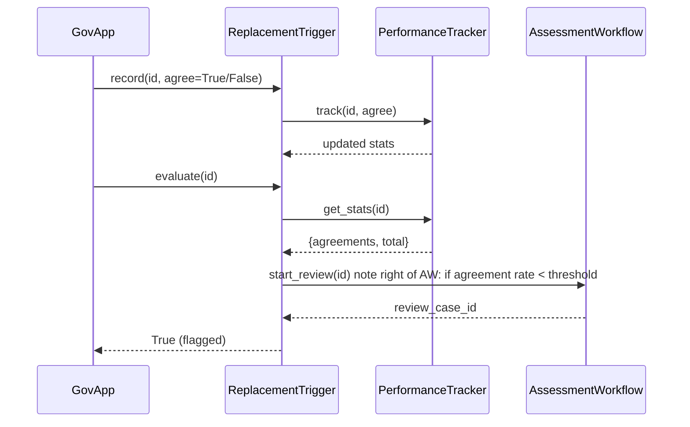

# Chapter 12: Replacement Trigger Mechanism

Continuing from our [Monitoring & Outcome Verification](11_monitoring___outcome_verification_.md) chapter, we now look at how to automatically spot and respond when a human decision-maker chronically under-performs compared to AI guidance. This is the **Replacement Trigger Mechanism**—like an ongoing performance review that raises a flag and kicks off a formal assessment when targets aren’t met.

---

## 1. Why We Need a Replacement Trigger Mechanism

Imagine the U.S. Patent and Trademark Office has both human examiners and an AI recommender reviewing patent applications. Over time, leadership notices some examiners reject valid AI-suggested patents at a much higher rate than their peers—delaying innovation and wasting staff time.

We need a component that:

1. Tracks each human’s agreement rate with AI recommendations  
2. Compares that rate against a configurable threshold (say, 90% agreement)  
3. Flags decision-makers who fall below the threshold over a sustained window  
4. Automatically starts an **Assessment Workflow** to review whether to retrain, reassign, or augment the role

This ensures every department stays on target and that struggling staff get timely support—or are replaced by AI when needed.

---

## 2. Key Concepts

1. **PerformanceTracker**  
   Collects stats on how often a human’s decision matches the AI’s suggestion.

2. **UnderperformanceThreshold**  
   A percentage (e.g., 90%) below which we consider performance problematic.

3. **TriggerChecker**  
   Periodically evaluates each tracker’s stats against the threshold and time window.

4. **AssessmentWorkflow**  
   A process that creates a formal review case—perhaps notifying HR or leadership.

5. **ReplacementTrigger**  
   Orchestrates tracking, checking, and kicking off the assessment when needed.

---

## 3. Using the Replacement Trigger

Below is a minimal Python example demonstrating how an agency app might use this abstraction:

```python
# file: example_replacement_trigger.py
from hms_utl.replacement_trigger import ReplacementTrigger

trigger = ReplacementTrigger(threshold=0.9, window=100)

# Register a human decision-maker
trigger.register("examiner_42")

# Simulate recording decisions: AI vs human
# 80 agreements, 20 disagreements
for _ in range(80):
    trigger.record("examiner_42", agree=True)
for _ in range(20):
    trigger.record("examiner_42", agree=False)

# Check performance—returns True if underperformance detected
if trigger.evaluate("examiner_42"):
    print("⚠️ Examiner_42 under-performed: assessment initiated")
```

What happens:

- We instantiate `ReplacementTrigger` with a 90% agreement threshold over the last 100 calls.  
- We register a decision-maker ID.  
- We record each decision outcome (agree/disagree).  
- Calling `evaluate()` checks the ratio, flags under-performers, and starts an assessment.

---

## 4. Under the Hood: Step-by-Step Flow



1. **record()** calls `PerformanceTracker` to update stats.  
2. **evaluate()** fetches stats, checks against the threshold and window size.  
3. If under-threshold, `AssessmentWorkflow` creates a review case.  
4. The trigger returns `True`, indicating leadership action is underway.

---

## 5. Internal Implementation Highlights

### 5.1 hms_utl/replacement_trigger.py

```python
# file: hms_utl/replacement_trigger.py
from .performance_tracker import PerformanceTracker
from .assessment_workflow import AssessmentWorkflow

class ReplacementTrigger:
    def __init__(self, threshold=0.9, window=50):
        self.tracker = PerformanceTracker(window)
        self.workflow = AssessmentWorkflow()
        self.threshold = threshold

    def register(self, dm_id):
        self.tracker.register(dm_id)

    def record(self, dm_id, agree):
        self.tracker.record(dm_id, agree)

    def evaluate(self, dm_id):
        agree, total = self.tracker.stats(dm_id)
        rate = agree / total if total else 1.0
        if rate < self.threshold:
            self.workflow.start_review(dm_id, rate)
            return True
        return False
```

- **`register()`** sets up tracking for a decision-maker.  
- **`record()`** updates their agree/disagree counts.  
- **`evaluate()`** computes the agreement rate, compares to threshold, and kicks off a review if needed.

### 5.2 hms_utl/performance_tracker.py

```python
# file: hms_utl/performance_tracker.py
from collections import deque

class PerformanceTracker:
    def __init__(self, window):
        self.window = window
        self.data = {}  # dm_id → deque of booleans

    def register(self, dm_id):
        self.data[dm_id] = deque(maxlen=self.window)

    def record(self, dm_id, agree):
        self.data[dm_id].append(1 if agree else 0)

    def stats(self, dm_id):
        history = self.data.get(dm_id, deque())
        total = len(history)
        return sum(history), total
```

- Uses a fixed-size queue (`deque`) per decision-maker to keep only the last *window* results.  
- `stats()` returns `(agreeCount, totalCount)`.

### 5.3 hms_utl/assessment_workflow.py

```python
# file: hms_utl/assessment_workflow.py
class AssessmentWorkflow:
    def start_review(self, dm_id, rate):
        # In real life, create a ticket or notify HR/leaders
        print(f"🔍 Starting performance review for {dm_id}: rate={rate:.2%}")
        # Return a case ID if needed
```

- In production, this would integrate with HR systems or create an official review case.

---

## Conclusion

In this chapter, you learned how the **Replacement Trigger Mechanism** continuously monitors human decision-makers against AI recommendations, flags those who fall behind sustained targets, and automatically initiates an **Assessment Workflow**. This keeps public-sector services efficient, accountable, and supported by timely leadership action.

---

Generated by [AI Codebase Knowledge Builder](https://github.com/The-Pocket/Tutorial-Codebase-Knowledge)