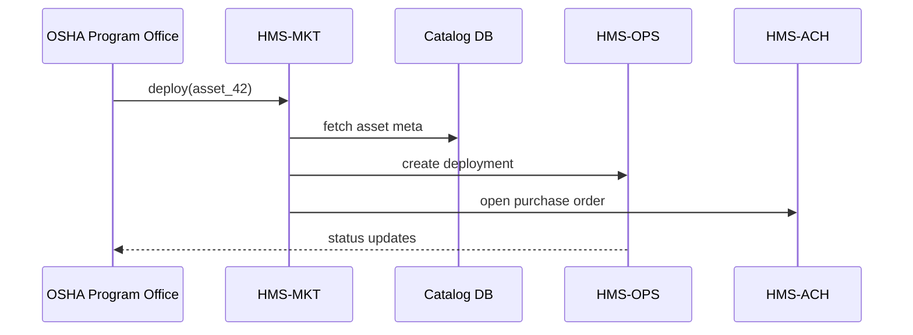

# Chapter 13: Marketplace & Discovery Platform (HMS-MKT)

[← Back to Chapter 12: Micro-Frontend Interface Library (HMS-MFE)](12_micro_frontend_interface_library__hms_mfe__.md)

---

## 1. Why Do We Need a Marketplace?

Picture the **Occupational Safety & Health Administration (OSHA)** right after a major warehouse fire.  
They urgently need a **“Building-Inspection Bot”** that can:

1. Crawl existing floor plans  
2. Overlay sprinkler-rule violations from [HMS-CDF](02_policy_lifecycle_engine__hms_cdf__.md)  
3. File a preliminary report into [HMS-OMS](07_workflow_orchestration___task_queues__hms_oms___hms_act__.md)

Historically, OSHA would:

* Spend **4-6 months** writing a Statement of Work  
* Wait on multiple bids  
* Hope the winning vendor delivers something secure

With **HMS-MKT** they can log in, search *“sprinkler inspection bot”*, see one already certified by GSA, and click **“Add to Project.”**  
Procurement drops from *months* to *minutes*—while still meeting federal acquisition rules.

---

## 2. Five Key Concepts (Sticker-Note Simple)

| Concept | App-Store Analogy | One-Line Meaning |
|---------|------------------|------------------|
| Asset Card | App icon | Listing that represents a data feed, AI skill, widget, or service. |
| Certification Badge | Blue check mark | Shows that security, Section 508, & legal reviews are complete. |
| Contract Vehicle ID | “Buy Now” price | Pre-negotiated schedule number (e.g., GSA SIN 132-52). |
| Usage Metrics | Download count | Live stats: installs, agency count, error rate. |
| Quick-Add (One-Click Deploy) | “Install” button | Pushes the asset into your HMS environment and creates the PO in the background. |

---

## 3. 60-Second Tour: Grabbing That Inspection Bot

### 3.1 Browse & Pick

```bash
curl "https://mkt.hms.gov/api/v1/search?q=sprinkler"
```

Returns:

```json
[
  {
    "id": "asset_42",
    "name": "Sprinkler Inspection Bot",
    "badge": "certified",
    "vehicle": "GSA-132-52",
    "price": "0.04 USD/run"
  }
]
```

### 3.2 One-Click Deploy

```bash
curl -X POST \
     -H "Authorization: Bearer <token>" \
     -d '{"asset_id":"asset_42","env":"osha-prod"}' \
     https://mkt.hms.gov/api/v1/deploy
```

Output:

```json
{
  "deployment_id": "dep_f9c3",
  "status": "in_progress"
}
```

**What happens next?**

1. HMS-MKT pushes the Docker image into your cluster  
2. Creates a **Data Ticket** (see [HMS-DTA](05_data___privacy_management_hub__hms_dta__.md))  
3. Generates the **purchase record** under the listed Contract Vehicle  
4. Emits `asset.deployed` so dashboards light up

---

## 4. Under the Hood – No-Code Walk-Through



Only **five actors** keep the mental load beginner-friendly.

---

## 5. Publishing to the Marketplace (for Developers)

### 5.1 Create the Asset Card

```yaml
# file: sprinkler_bot.yaml
id: asset_42
name: Sprinkler Inspection Bot
type: ai_skill
version: "1.0.3"
container: ghcr.io/acme/sprinkler-bot:1.0.3
vehicle: GSA-132-52
price: "0.04 USD/run"
contact: dev@acme.com
```

### 5.2 Submit for Certification (CLI, 2 commands)

```bash
hms-mkt submit sprinkler_bot.yaml
hms-mkt attach-docs asset_42 ssae18.pdf fedramp.xlsx
```

### 5.3 Reviewer Workflow (≤20 Lines)

```python
# file: reviewers/checklist.py
from hms_mkt import next_pending, certify, reject

for asset in next_pending():
    if asset.has_docs(["ssae18", "fedramp"]):
        certify(asset.id, badge="certified")
    else:
        reject(asset.id, "Missing compliance docs")
```

If **certified**, the badge appears automatically in search results.

---

## 6. Peeking Inside HMS-MKT

### 6.1 Catalog Table (8 Lines)

```sql
CREATE TABLE assets (
  id            TEXT PRIMARY KEY,
  name          TEXT,
  type          TEXT,
  version       TEXT,
  badge         TEXT,
  vehicle       TEXT,
  price         TEXT,
  meta          JSONB
);
```

### 6.2 Tiny Search Endpoint (14 Lines)

```python
# file: api/search.py
from fastapi import APIRouter, Query
router = APIRouter()

@router.get("/search")
def search(q: str = Query("")):
    rows = db.fetch(
      "SELECT id,name,badge,vehicle,price FROM assets "
      "WHERE to_tsvector(name||meta::text) @@ plainto_tsquery($1)",
      q
    )
    return [dict(r) for r in rows]
```

*PostgreSQL full-text search keeps it blazing fast.*

### 6.3 Deployment Orchestrator (18 Lines)

```python
# file: tasks/deploy.py
def deploy(asset_id, env):
    asset = db.get("assets", asset_id)
    dep_id = uuid4().hex

    # 1️⃣ Provision infra
    kube.run(image=asset.meta["container"], env=env)

    # 2️⃣ Finance tie-in
    ach.create_entry({
       "payee": asset.meta["contact"],
       "amount_cents": 0,          # billed per run later
       "purpose": f"DEPLOY-{asset_id}"
    })

    # 3️⃣ Emit event
    bus.publish("asset.deployed", {"asset": asset_id, "dep": dep_id})
    return dep_id
```

---

## 7. Talking to Other HMS Layers

| Layer | Why It Connects | Example |
|-------|-----------------|---------|
| [HMS-OPS](14_monitoring__operations___devsecops__hms_ops___hms_dev__.md) | Shows health of every deployed marketplace asset | Ops dashboard auto-creates a panel |
| [HMS-ACH](11_financial_transaction___clearinghouse__hms_ach__.md) | Handles payment or chargeback per run | `price_per_invocation` billed nightly |
| [HMS-DTA](05_data___privacy_management_hub__hms_dta__.md) | Issues Data Tickets at deploy time | Ensures bot only sees allowed datasets |
| [HMS-MFE](12_micro_frontend_interface_library__hms_mfe__.md) | Widgets listed in MKT appear in `<mfe-store>` gallery | Drop-in UI shopping cart |

Everything still respects the **three-floor** blueprint from [Chapter 1](01_multi_layered_system_architecture_.md)  
(the Marketplace itself lives on the middle floor).

---

## 8. Hands-On Lab (2 Minutes)

```bash
git clone hms-utl
cd hms-utl/demo
docker compose up mkt ops ach  # minimal stack

# 1. Import a sample asset
hms-mkt submit samples/hello_widget.yaml --approve

# 2. Search & deploy
curl "http://localhost:8090/api/v1/search?q=hello"
curl -X POST -d '{"asset_id":"asset_hello","env":"demo"}' \
     http://localhost:8090/api/v1/deploy
```

Check `logs/asset_events.log`—you’ll see `asset.deployed` in real time.

---

## 9. Recap

You now know:

✔ Why HMS-MKT slashes procurement time with **certified, one-click assets**  
✔ Five core concepts: Asset Card, Certification Badge, Contract Vehicle, Usage Metrics, Quick-Add  
✔ How to **browse, deploy, and bill** an AI skill in <20 lines of code  
✔ What happens internally—catalog lookup → ops deploy → ledger entry  
✔ How HMS-MKT plugs into Ops, Finance, Data, and UI layers

Ready to keep those deployed assets running, patched, and monitored?  
Jump ahead to [Chapter 14: Monitoring, Operations & DevSecOps (HMS-OPS / HMS-DEV)](14_monitoring__operations___devsecops__hms_ops___hms_dev__.md)

---

---

Generated by [AI Codebase Knowledge Builder](https://github.com/The-Pocket/Tutorial-Codebase-Knowledge)