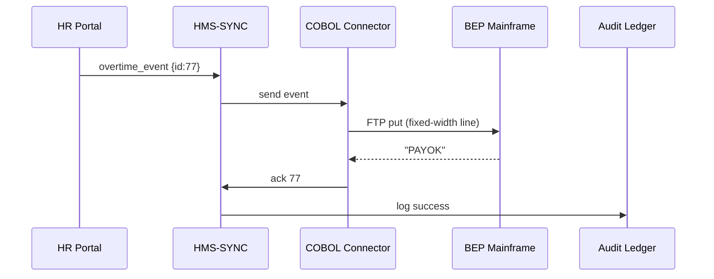

# Chapter 14: External System Integration Layer  
*A friendly continuation from* [Real-Time Sync Engine](13_real_time_sync_engine_.md)  

---

## 1 Why Invent a “Universal Translator”?

Meet the Bureau of Engraving and Printing (BEP).  
Every night BEP’s **COBOL payroll mainframe (built 1987)** must receive:

* new overtime hours (entered in the modern HMS portal),  
* current policy limits (published through [Governance Layer](01_governance_layer__hms_gov__.md)),  
* audit stamps (so IG reviewers can later prove nothing was tampered with).

The mainframe speaks **flat-file FTP**, the portal speaks **JSON over HTTPS**, and auditors prefer **message queues**.  
If a single hand-copy is missed, paychecks are wrong and the Washington Post finds out by breakfast.  

**External System Integration Layer (HMS-EXT)** is the *universal translator* that:

1. Listens to **modern events** (from [Real-Time Sync Engine](13_real_time_sync_engine_.md)).  
2. Converts them into **whatever dialect** the legacy or vendor system speaks—COBOL copybooks, SAP IDoc, Salesforce REST, even screen-scraping via RPA.  
3. Sends acknowledgements back so the platform knows the job is done (or needs a retry).

Result: No more midnight CSV exports or swivel-chair data entry.

---

## 2 Key Ideas in Plain English

| Term | Think of it as… | Why it matters |
|------|-----------------|----------------|
| Connector | A bilingual clerk | Knows *both* HMS JSON **and** the legacy dialect |
| Mapping File | Phrasebook | How to translate `employee_id` → `EMPL-NUM` (COBOL) |
| Transport Adapter | Shipping method | FTP, MQ, HTTPS, RPA bot, etc. |
| Ack Ticket | Certified return receipt | Proves the legacy side took the update |
| Connector Registry | Rolodex | Lists every active connector & what system it talks to |

---

## 3 Core Use Case: “Push Overtime to COBOL Payroll”

We’ll walk through the **end-to-end flow**:

1. BEP HR portal records *8 overtime hours* for employee **#12345**.  
2. [Real-Time Sync Engine](13_real_time_sync_engine_.md) emits an event.  
3. HMS-EXT’s **COBOL connector** converts JSON → fixed-width line.  
4. Sends the line via **FTP** to the mainframe.  
5. Mainframe responds with a `PAYOK` code.  
6. Connector returns an **Ack Ticket** so auditors sleep well.

---

## 4 Hands-On (Yes, Under 20 Lines!)

### 4.1 Step 1: Define the Mapping (12 lines)

```yaml
# cobol_payroll_mapping.yaml
fields:
  - json: "employee_id"   cobol: "EMPL-NUM"   width: 5
  - json: "overtime_hrs"  cobol: "OT-HRS"     width: 2
  - json: "policy_ver"    cobol: "POL-VER"    width: 5
footer: "\r\n"            # COBOL likes CRLF
transport:
  type: "ftp"
  host: "10.0.0.77"
  user: "paybot"
  dir:  "/inbound"
```

*Beginner note:* `width` means *pad with spaces* if the value is shorter.

---

### 4.2 Step 2: Minimal Connector (18 lines)

```python
# cobol_connector.py
import ftpplib, json, datetime, os, yaml

MAP = yaml.safe_load(open("cobol_payroll_mapping.yaml"))
FTP = ftpplib.FTP(MAP["transport"]["host"])

def json_to_cobol(row):
    out = ""
    for f in MAP["fields"]:
        val = str(row[f["json"]]).ljust(f["width"])
        out += val
    return out + MAP["footer"]

def deliver(evt):
    line = json_to_cobol(evt)
    FTP.login(MAP["transport"]["user"], os.getenv("FTP_PW"))
    FTP.storbinary(f"STOR {MAP['transport']['dir']}/pay_{evt['id']}.txt",
                   line.encode())
    return {"ack":"PAYOK",
            "ts": datetime.datetime.utcnow().isoformat()}
```

Explanation in plain English:  
1. Load the mapping once.  
2. Convert each JSON field into a left-padded fixed-width chunk.  
3. Login to FTP and `STOR` the file.  
4. Return a tiny Ack dict.

---

### 4.3 Step 3: Glue It to HMS-SYNC (7 lines)

```python
from cobol_connector import deliver
from hms_sync_sdk import subscribe   # imaginary helper

subscribe(topic="payroll.overtime", handler=deliver)
```

Whenever the Sync Engine publishes to `payroll.overtime`, `deliver()` runs automatically. *Zero additional scaffolding.*

---

## 5 What Happens Behind the Curtain?



Only **five** moving parts—all already familiar:

* *Portal* published → *SYNC* fanned out → *Connector* translated → *Mainframe* accepted → *Ledger* kept the receipt.

---

## 6 Under-the-Hood Walkthrough  

1. **Event Reception** – Connector framework (`hms_sync_sdk`) delivers raw JSON.  
2. **Field Mapping** – Loads YAML once, applies widths & ordering.  
3. **Transport Adapter** – Chooses `ftp` plugin; for SAP use `idoc`, for Salesforce use `rest`.  
4. **Ack Handling** – Waits for legacy system confirmation; if none, emits a *retry request* back to SYNC (DLQ).  
5. **Security** – Re-uses mesh mTLS certs plus per-connector creds stored in *Secrets Manager*.  
6. **Audit Trail** – Each successful Ack is `POST`ed to [Policy Versioning & Audit Ledger](02_policy_versioning___audit_ledger_.md) with fields: `event_id`, `connector_id`, `timestamp`.

---

## 7 Adding a Connector in 3 Clicks

1. Drop a new mapping YAML in `/connectors`.  
2. Register it:

```bash
curl -X POST https://hms-ext/api/connectors \
     -d '{"id":"sap-grants","mapping":"sap_grants.yaml"}'
```

3. The framework hot-loads the file; the next matching event triggers the connector. **No code deploy needed**.

---

## 8 Relationship to Other HMS-UTL Layers

* **Real-Time Sync Engine** – This layer’s *only* input source. (It never polls databases directly.)  
* **Governance Layer** – `policy_ver` field comes from the signed version stored in [Chapter 1](01_governance_layer__hms_gov__.md).  
* **RBAC** – Connectors run under a service account with `CONNECTOR_AGENT` role (see [RBAC](08_role_based_access___permissions__rbac__.md)).  
* **Metrics Dashboard** – Delivery latency & retry counts flow to [Metrics & Monitoring Dashboard](15_metrics___monitoring_dashboard_.md).  
* **Guardrails** – PII masking from [Data Privacy & Compliance Guardrails](10_data_privacy___compliance_guardrails_.md) happens *before* events reach HMS-EXT, so connectors never see sensitive data they don’t need.

---

## 9 Frequently Asked Questions

**Q: What if the legacy system has *no* API?**  
Use the built-in **RPA adapter**—it launches a headless browser, types into the green-screen, and still returns an Ack.

**Q: Can one connector handle multiple policies?**  
Yes—specify `topics: ["payroll.*","benefits.*"]` in its registration JSON.

**Q: How are connector crashes handled?**  
The framework runs each connector in a supervised container; failed runs auto-restart and un-acked events are retried from SYNC’s DLQ.

**Q: Do I have to write Python?**  
No. Connectors are simple **containers**. Write them in Java, Go, .NET—just emit an Ack JSON on stdout.

---

## 10 What You Learned

• HMS-EXT is the bilingual clerk that lets 2024 microservices talk to 1987 mainframes, SAP, or Salesforce.  
• A tiny YAML mapping + <20 lines of code is enough to push data reliably.  
• Connectors receive events from HMS-SYNC, translate, send, and Ack—keeping the audit trail intact.  
• Security, retries, and monitoring are handled by the wider HMS-UTL ecosystem.

Ready to see *how well* all these moving parts behave in production?  
Jump to [Metrics & Monitoring Dashboard](15_metrics___monitoring_dashboard_.md).

---

Generated by [AI Codebase Knowledge Builder](https://github.com/The-Pocket/Tutorial-Codebase-Knowledge)