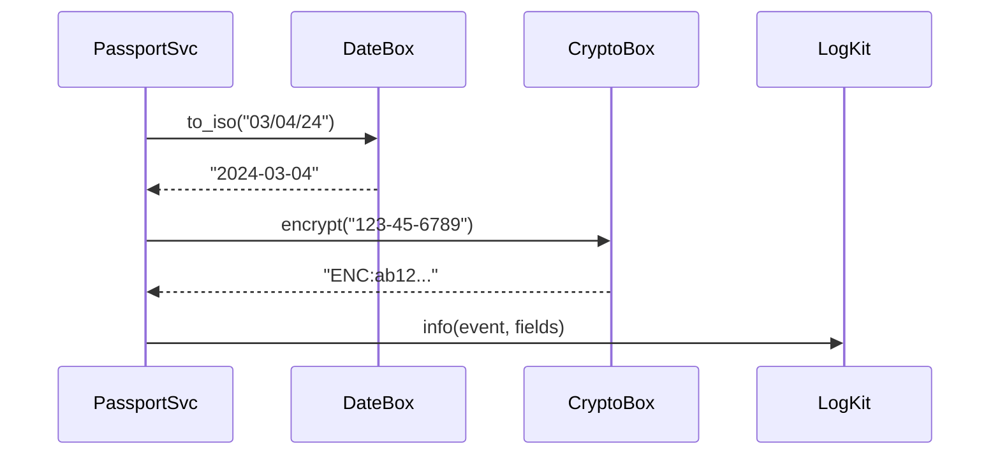

# Chapter 18: Utility & Shared Library Layer (HMS-UTL)

*(coming from [Simulation & Behavior Lab (HMS-ESR)](17_simulation___behavior_lab__hms_esr__.md))*  

---

## 1 · Why Does Every Agency Need a “Swiss-Army Knife”?

> Use-Case — The **Passport Renewal** flow  
> 1. A citizen uploads a photo and enters `03/04/24` as their travel date.  
> 2. The backend must:  
>    • turn that ambiguous date into *2024-03-04* (ISO),  
>    • encrypt the SSN before saving, and  
>    • write an audit log line **exactly** like every other service.  
> 3. **Five** micro-services touch that data; if *each* one ships its own date regex and crypto wrapper, mistakes creep in and auditors throw flags.

**HMS-UTL** is the shared **tool belt**.  
One library—imported the same way everywhere—gives you:

* battle-tested **date parsers**,  
* **encryption wrappers** that already meet FedRAMP rules, and  
* opinionated **logging adapters** that write in the HMS standard format.  

No more wheel-reinventing, no more “works on my service” bugs.

---

## 2 · Key Concepts (Plain Words)

| Tool | Beginner Analogy | Why You Care |
|------|------------------|--------------|
| `DateBox` | A universal calendar translator | Parses 200+ date formats → ISO |
| `CryptoBox` | A safety deposit box | One-line AES-256 & key rotation |
| `LogKit` | A stamp with today’s date | Uniform JSON logs for every service |
| Semantic Version (`vX.Y.Z`) | Cookbook edition | Minor updates won’t break code |
| Compatibility Tests | Crash dummy | Run nightly to ensure nothing regresses |

---

## 3 · Solving the Passport Flow in 12 Lines

```python
# passport_utils.py
from hms_utl import DateBox, CryptoBox, LogKit

raw_date = "03/04/24"
iso_date = DateBox.to_iso(raw_date)          # '2024-03-04'

ssn      = "123-45-6789"
cipher   = CryptoBox.encrypt(ssn)            # 'ENC:...'

LogKit.info("passport.submit",
            msg="Parsed & encrypted data",
            travel_date=iso_date)
```

**What happened?**  
1. `DateBox` tried US, EU, and ISO patterns until one fit.  
2. `CryptoBox` sealed the SSN with the **current platform key**.  
3. `LogKit` wrote a JSON line that [Monitoring & Operations Center](20_monitoring___operations_center__hms_ops__.md) can search instantly.

---

## 4 · How It Works Under the Hood



Four helpers, one predictable path—every other micro-service follows the same steps.

---

## 5 · A Peek Inside Each Helper

### 5.1 `dates.py` (simplified, 10 lines)

```python
# hms_utl/dates.py
import dateutil.parser
from datetime import datetime

def to_iso(text):
    dt = dateutil.parser.parse(text, dayfirst=False, yearfirst=False)
    return dt.strftime("%Y-%m-%d")
```

*No regexes; relies on the well-maintained `python-dateutil`.*

### 5.2 `crypto.py` (12 lines)

```python
# hms_utl/crypto.py
from cryptography.fernet import Fernet
KEY = open("/keys/current.key").read().encode()
box = Fernet(KEY)

def encrypt(data: str) -> str:
    return "ENC:" + box.encrypt(data.encode()).decode()

def decrypt(blob: str) -> str:
    return box.decrypt(blob[4:].encode()).decode()
```

*Key rotation? Drop a new `current.key`; `CryptoBox` reads it on next call.*

### 5.3 `log.py` (14 lines)

```python
# hms_utl/log.py
import json, sys, time, os

def _write(level, event, **fields):
    record = {
        "ts":   time.time(),
        "lvl":  level,
        "svc":  os.getenv("HMS_SERVICE", "unknown"),
        "evt":  event,
        **fields
    }
    sys.stdout.write(json.dumps(record)+"\n")

info  = lambda event, **f: _write("INFO",  event, **f)
error = lambda event, **f: _write("ERROR", event, **f)
```

All services log in **one line JSON**; parsing is trivial.

---

## 6 · Everyday Recipes

| Task | One-liner |
|------|-----------|
| Convert “4th of July 2025” → ISO | `DateBox.to_iso("4th of July 2025")` |
| Decrypt a field from DB | `CryptoBox.decrypt(row["ssn_enc"])` |
| Log an error with stacktrace | `LogKit.error("db.fail", err=str(e))` |

Copy-paste the same calls in any language that HMS-UTL supports (Python, Node, Go).

---

## 7 · Compatibility & Versioning

1. **Semantic versioning**  
   • Breaking change → bump **major** (`v3.0.0`).  
   • New function   → bump **minor** (`v2.3.0`).  
2. **Auto-tests** run every night against all supported runtimes.  
3. **Deprecation warnings**—`LogKit.warn` shouts 90 days before removal.

---

## 8 · Frequently Asked Beginner Questions

**Q: Can I swap AES-256 for a hardware HSM?**  
A: Yes—set env `HMS_UTL_CRYPTO_BACKEND=hsm` and supply the driver; the API stays the same.

**Q: Do I need to memorise date formats?**  
A: No. `DateBox` knows 200+ patterns and locale quirks.

**Q: How big is the library?**  
A: < 100 KB wheel; small enough for AWS Lambda cold starts.

**Q: Where are the logs stored?**  
A: [Central Data Repository (HMS-DTA)](19_central_data_repository__hms_dta__.md) ingests stdout automatically.

---

## 9 · How HMS-UTL Shows Up Across HMS-NFO

| Layer Using It | Typical Call |
|----------------|--------------|
| [AI Agent Framework](06_ai_agent_framework__hms_agt___hms_agx__.md) | `LogKit.info("agent.step", step=idx)` |
| [Workflow Orchestrator](08_activity___workflow_orchestrator__hms_act___hms_oms__.md) | `DateBox.to_iso(task.due)` |
| [Financial Core](12_financial_transaction_core__hms_ach__.md) | `CryptoBox.encrypt(bank_acct)` |
| [Monitoring & OPS](20_monitoring___operations_center__hms_ops__.md) | Searches `LogKit` JSON lines |

One library → universal behavior → happier auditors.

---

## 10 · Hands-On Exercise (3 Minutes)

```bash
pip install hms-utl
python - <<'PY'
from hms_utl import DateBox, CryptoBox, LogKit
print(DateBox.to_iso("July 4th 1776"))
secret = CryptoBox.encrypt("SSN:000-00-0000")
print(secret, "->", CryptoBox.decrypt(secret))
LogKit.info("demo.done")
PY
```

You should see:

```
1776-07-04
ENC:... -> SSN:000-00-0000
{"ts":..., "lvl":"INFO", "svc":"unknown", "evt":"demo.done"}
```

---

## 11 · What You Learned

1. HMS-UTL is the **one-stop toolbox**—dates, crypto, logs.  
2. Using it takes **one import, one function call**.  
3. Under the hood it’s tiny, auditable Python—no black magic.  
4. Every other HMS layer leans on UTL for consistency.

Next up the data you just logged needs a safe, central place to live and be queried.  
Dive into [Central Data Repository (HMS-DTA)](19_central_data_repository__hms_dta__.md).

---

Generated by [AI Codebase Knowledge Builder](https://github.com/The-Pocket/Tutorial-Codebase-Knowledge)