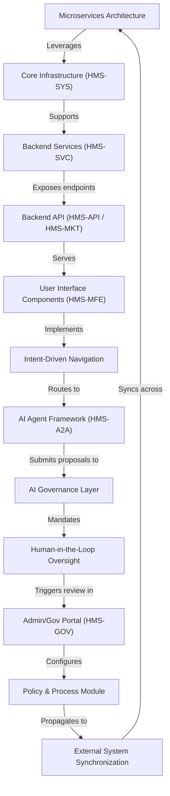

# Tutorial: HMS-UTL

HMS-UTL provides a collection of **utility services**—such as media/document processing, data transformation, and background task orchestration—that power the larger HMS ecosystem. *It ensures that citizen-facing portals, AI-driven agents, and administrative dashboards run smoothly* by offering reusable functions for file management, conversion, and reliable inter-service communication. Government agencies leverage HMS-UTL to streamline workflows, maintain consistent data formats, and automate routine operations across microservices.

**Source Repository:** [None](None)

## Chapters

1. [Core Infrastructure (HMS-SYS)
](01_core_infrastructure__hms_sys__.md)
2. [Microservices Architecture
](02_microservices_architecture_.md)
3. [Backend Services (HMS-SVC)
](03_backend_services__hms_svc__.md)
4. [Backend API (HMS-API / HMS-MKT)
](04_backend_api__hms_api___hms_mkt__.md)
5. [User Interface Components (HMS-MFE)
](05_user_interface_components__hms_mfe__.md)
6. [Intent-Driven Navigation
](06_intent_driven_navigation_.md)
7. [AI Agent Framework (HMS-A2A)
](07_ai_agent_framework__hms_a2a__.md)
8. [AI Governance Layer
](08_ai_governance_layer_.md)
9. [Human-in-the-Loop Oversight
](09_human_in_the_loop_oversight_.md)
10. [Admin/Gov Portal (HMS-GOV)
](10_admin_gov_portal__hms_gov__.md)
11. [Policy & Process Module
](11_policy___process_module_.md)
12. [External System Synchronization
](12_external_system_synchronization_.md)

---

Generated by [AI Codebase Knowledge Builder](https://github.com/The-Pocket/Tutorial-Codebase-Knowledge)