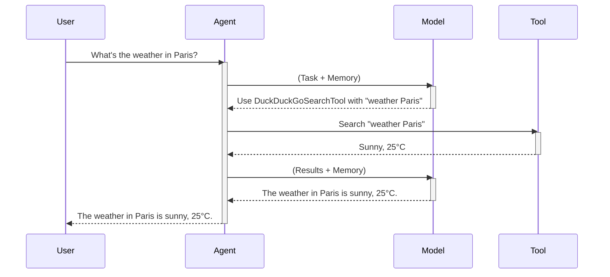

# Chapter 1: Agent

Imagine you want to ask a complex question like "What's the weather in Paris today and what's the historical average temperature for this date?".  You could open a browser, search for the current weather, then search for historical weather data, and finally combine the results yourself.  An **Agent** in `smolagents` automates this whole process for you. It's like your personal assistant that uses tools like a search engine to gather information and then gives you the final answer.

## What is an Agent?

An agent is a core concept in `smolagents`. It's like a smart assistant that can perform tasks by interacting with its environment using tools.  It receives a task, plans how to achieve it, uses tools to gather information and perform actions, and finally provides a result. Think of it as a personal chef who follows a recipe (the task), uses kitchen tools (the tools), and delivers a delicious meal (the result).

## Using an Agent

Here's a simple example of using a `CodeAgent` with a search tool:

```python
from smolagents import CodeAgent, DuckDuckGoSearchTool, InferenceClientModel

# Choose a language model
model = InferenceClientModel()

# Create an agent with a search tool
agent = CodeAgent(tools=[DuckDuckGoSearchTool()], model=model)

# Run the agent with a task
agent.run("What's the weather in Paris today?")
```

This code creates a `CodeAgent` that can use the `DuckDuckGoSearchTool` to search the web. The agent is then given the task of finding the weather in Paris. The agent will use the search tool to find the answer and return it.

## Inside an Agent

Here's a simplified sequence diagram showing how an agent works:



1. The user gives the agent a task.
2. The agent sends the task and its memory (previous interactions) to the model.
3. The model decides which tool to use and what arguments to provide.
4. The agent calls the specified tool with the arguments.
5. The tool returns the result to the agent.
6. The agent sends the result and its memory to the model.
7. The model generates a response based on the result and memory.
8. The agent returns the response to the user.

The internal implementation of the agent is handled by the `run()` method in the `agents.py` file. This method manages the interaction loop between the model and the tools, as shown in the sequence diagram.

```python
# Simplified code from agents.py
class MultiStepAgent(ABC): # Base class for all agents
    def run(self, task: str):
        # ... (Initialization and setup)
        while not finished:
            # 1. Model generates action
            action = self.model(task, memory)

            # 2. Agent executes action (using tools)
            observation = self.execute_action(action)

            # 3. Update memory with observation
            memory.add(observation)

            # 4. Check if task is finished
            finished = self.is_task_finished(memory)
        # ... (Final answer generation)
```

## Conclusion

In this chapter, we learned about the `Agent` abstraction in `smolagents` and how it acts as a smart assistant to perform tasks using tools. We saw a simple example of using a `CodeAgent` with a search tool and explored the internal workings of an agent.  Next, we'll learn more about the [Tool](02_tool.md) abstraction and how to create and use them.


---

Generated by [AI Codebase Knowledge Builder](https://github.com/The-Pocket/Tutorial-Codebase-Knowledge)