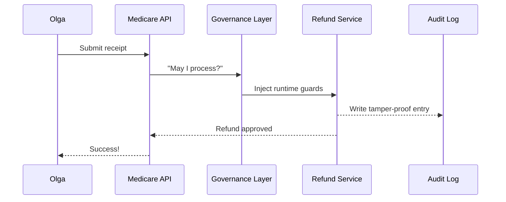

# Chapter 1: AI Governance Values (Transparency, Truth, Safety, Ethics, Privacy)

*(Transparency · Truth · Safety · Ethics · Privacy)*

Welcome to HMS-MCP!  
Before we talk about services, APIs, or fancy dashboards, we need to agree on **how we will behave**.  
These five values are the platform’s *constitution*.  
Every line of code you write, every model you deploy, and every citizen form you process must be able to say:

> “Yes, I am Transparent, Truthful, Safe, Ethical, and Private.”

---

## 1. Why Should I Care? — The Medicare Refund Story

Imagine Olga, a retiree, who uploads a medical receipt to get a Medicare refund:

1. She clicks “Submit.”  
2. An AI model reads her receipt.  
3. A microservice authorizes the payment.

Without governance, mistakes could slip through:
* A hidden fee (not Transparent).  
* Fake receipt data (not Truthful).  
* A malicious over-payment (not Safe).  
* Bias against certain clinics (not Ethical).  
* Leaked personal data (not Private).

The five values are how HMS-MCP *guarantees* Olga’s rights.

---

## 2. Meet the Five Values

| Value | What It Means (Beginner Friendly) | How We Check It |
|-------|-----------------------------------|-----------------|
| Transparency | “Show your work.” Logs, model weights, and decisions are visible to authorized auditors. | Tamper-proof logs & dashboards |
| Truth | “Facts only.” Input data is validated and cross-checked. | Hashes, digital signatures, ground-truth datasets |
| Safety | “First, do no harm.” Guardrails stop dangerous outputs. | Rate limits, anomaly detection |
| Ethics | “Fair play.” No unlawful bias or discrimination. | Bias tests, policy linting |
| Privacy | “Mind your own business.” Personal data stays protected. | Encryption, differential privacy |

Think of them as five security doors your service must pass through before it can say “Done!”

---

## 3. A 15-Second Peek at the Policy File

All HMS services keep a tiny `governance.yml` file.  
Below is a **toy** version for the Medicare Refund microservice:

```yaml
# governance.yml
transparency:
  log_level: INFO
truth:
  data_sources: [ "CMS_CLAIMS_DB" ]
safety:
  max_daily_payout: 2000
ethics:
  bias_test: MEDICARE_REFUND_BIAS_SUITE
privacy:
  pii_masking: true
```

Explanation (1-liner each):

* `transparency.log_level` — Save at least INFO-level events.  
* `truth.data_sources` — Only trust the official claims database.  
* `safety.max_daily_payout` — Prevent runaway disbursements.  
* `ethics.bias_test` — Run a predefined fairness test.  
* `privacy.pii_masking` — Remove names/SSN from logs.

---

## 4. Hands-On: Writing a Mini Governance Check

Let’s write **10 lines** of Python that load the file above and scream if any value is missing.

```python
import yaml, sys

required = ["transparency", "truth", "safety", "ethics", "privacy"]

cfg = yaml.safe_load(open("governance.yml"))

missing = [k for k in required if k not in cfg]
if missing:
    sys.exit(f"❌ Missing sections: {missing}")

print("✅  All governance values present!")
```

Run it:

```
$ python check_governance.py
✅  All governance values present!
```

In a real project this script becomes part of a **CI/CD gate**—code can’t merge until it passes.

---

## 5. What Happens Under the Hood?

A quick journey every time Olga’s request hits our system:



Key takeaway—**Governance Layer** (covered in [Governance Layer (HMS-GOV)](02_governance_layer__hms_gov__.md)) sits in the middle and enforces the five clauses automatically.

---

## 6. Tiny Glimpse at Runtime Guards

Below is a hyper-simplified guard that stops payouts above the daily limit (Safety):

```python
def guard_safety(payout_amount, limit=2000):
    if payout_amount > limit:
        raise ValueError("Safety breach: payout exceeds daily limit")
```

Add guards for each value and chain them:

```python
def check_all(values):
    guard_transparency(values)
    guard_truth(values)
    guard_safety(values)
    guard_ethics(values)
    guard_privacy(values)
```

You’ll learn how these hooks are injected in [Chapter&nbsp;2](02_governance_layer__hms_gov__.md).

---

## 7. How Federal Agencies Fit In

Suppose the **Federal Maritime Commission (FMC)** wants an AI chatbot for shipping licenses:

* Transparency → Ship-owner questions & answers are logged.  
* Truth → Vessel registration numbers verified against FMC registry.  
* Safety → Bot cannot suggest illegal shipping routes.  
* Ethics → No bias against small carriers.  
* Privacy → Proprietary shipping manifests encrypted.

Same five doors, different hallway.

---

## 8. Recap

You now know:

1. Why Olga (and every citizen) benefits from the five values.  
2. What each value stands for.  
3. How a simple file and guard checks enforce them.  
4. Where governance happens in the request flow.

These values cascade into automated tests, CI gates, and runtime guards you’ll meet again and again.

---

## 9. Up Next

Ready to see the **enforcer** in action?  
Continue to [Governance Layer (HMS-GOV)](02_governance_layer__hms_gov__.md).

---

Generated by [AI Codebase Knowledge Builder](https://github.com/The-Pocket/Tutorial-Codebase-Knowledge)