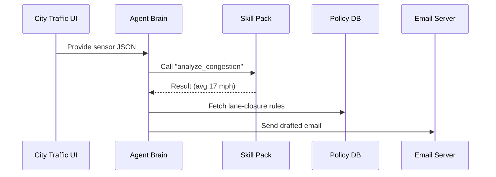

# Chapter 1: AI Representative Agent (HMS-AGT)


> “Imagine a tireless public-service assistant who already read every regulation so **you** don’t have to.”  

HMS-AGT turns that idea into code.  
Throughout this book we’ll build a miniature digital government.  
We start here, with the *brain* that powers every other piece.

---

## 1. Why Do We Need HMS-AGT?

### A concrete story

The City Transportation Bureau receives a flood of citizen complaints about morning congestion.  
Today that means:

1. An analyst pulls traffic-sensor CSV files.  
2. A policy clerk drafts a lane-closure proposal.  
3. A supervisor files forms to the regional office.  
4. Someone updates the public website.

With HMS-AGT, one autonomous agent does 90 % of this work automatically:

```
╭───────────╮           ╭────────────────╮
│ Sensors   │──data──▶  │  HMS-AGT       │──Forms/Emails▶ Agencies
╰───────────╯           ╰────────────────╯
```

Citizens still make the final call, but the grunt work disappears.

---

## 2. Key Concepts (in plain words)

| Term | What it really means |
|------|----------------------|
| Agent Brain | A large-language-model prompt + runtime that “understands” policy. |
| Personality Profile | Values & tone (e.g., *helpful and neutral*). |
| Skill Pack | Tiny plugins for tasks like “call REST API” or “summarise PDF.” |
| Context Window | The short-term memory; keeps the current case in mind. |
| Governance Guardrails | Rules from the [Governance Layer & AI Values Framework](05_governance_layer___ai_values_framework_.md) that the agent must obey. |

Think of the agent as a civil-servant who:  
• remembers the rulebook → *Brain*  
• keeps professional tone → *Personality*  
• uses office software → *Skills*  
• follows ethics policy → *Guardrails*

---

## 3. Quick Start — Your First Agent

Below we create a **TrafficAgent** that:

1. Reads live sensor JSON.  
2. Detects congestion.  
3. Drafts a closure request e-mail.  

```python
# traffic_agent.py
from hms_agt import Agent, EmailSkill, HttpSkill

agent = Agent(
    name="TrafficAgent",
    personality="Neutral, concise civil-servant.",
    skills=[EmailSkill(), HttpSkill()]   # simplified imports
)

sensor_data = HttpSkill().get("https://city.api/sensors?since=15min")
prompt = f"""
Given this JSON traffic snapshot:
{sensor_data}

If average_speed < 20 mph, draft an email to region_office@dot.gov
requesting a temporary lane closure.
"""

email_draft = agent.run(prompt)
print(email_draft)
```

Explanation (line-by-line):

1-4  Import minimal helpers shipped with HMS-AGT.  
6-10 Create an agent with a name, tone, and two skills.  
12-13 Pull 15 min of sensor readings.  
15-21 Ask the agent to *decide* and *draft* in plain English.  
23  Prints the ready-to-send e-mail.

Typical output (trimmed):

```
Subject: Lane Closure Request – I-95 NB, MP 14-16
Body:
Regional Office Team,

Average speed has fallen to 17 mph across sensors 112-118...
```

That’s it—no explicit loops, no manual CSV parsing!

---

## 4. What Happens Under the Hood?

High-level flow:



Steps in words:

1. UI (could be a chatbot later handled by the [Micro-Frontend Interface](02_micro_frontend_interface__hms_mfe__.md)) forwards data.  
2. Agent delegates math to a **Skill Pack**.  
3. Pulls policy thresholds from a small table in the [Central Data Repository](12_central_data_repository__hms_dta__.md).  
4. Crafts output and uses **EmailSkill** to deliver.  
5. All messages are logged to the [Observability & Metrics Stack](14_observability___metrics_stack__hms_ops__.md).

---

## 5. Peek at the Implementation

The public API of HMS-AGT is tiny—most magic sits inside.

### 5.1 Agent Class (abridged)

```python
# hms_agt/agent.py  (simplified)
class Agent:
    def __init__(self, name, personality, skills):
        self.name = name
        self.personality = personality
        self.skills = {s.name: s for s in skills}

    def run(self, prompt):
        enriched = self._apply_personality(prompt)
        response  = self._llm(enriched)
        return self._post_process(response)

    # private helpers -------------------------------
    def _apply_personality(self, text): ...
    def _llm(self, text):                 ...
    def _post_process(self, text):        ...
```

Key take-aways:

• `skills` is just a Python dict; you can add your own in the [Agent Extension Pack](17_agent_extension_pack__hms_agx__.md).  
• `_llm` talks to a hosted model using the [Model Context Protocol](18_model_context_protocol__hms_mcp__.md).  
• Guardrails wrap `_llm` to block disallowed content.

### 5.2 Writing a Custom Skill

```python
# skills/weather_skill.py
class WeatherSkill:
    name = "WeatherSkill"
    def get_forecast(self, lat, lon):
        # call national weather service
        return {"temp":72, "condition":"Rain"}
```

Drop the file in `skills/`, restart, and your agent can now reason about weather closures as well.

---

## 6. Frequently Asked (Beginner) Questions

**Q: Do I need to know machine-learning math?**  
A: No. Treat HMS-AGT like an SDK; the heavy AI work happens behind REST calls.

**Q: What about data privacy?**  
A: Sensitive fields are automatically masked according to the Governance Layer (see [Governance Layer & AI Values Framework](05_governance_layer___ai_values_framework_.md)).

**Q: Can a human override?**  
A: Absolutely. Every action is routed through the [Human-In-The-Loop (HITL) Control Panel](04_human_in_the_loop__hitl__control_panel_.md) before becoming official.

---

## 7. Wrap-Up

In this chapter you:

• Met HMS-AGT—the digital civil-servant brain.  
• Built and ran a tiny traffic-management agent.  
• Peeked under the hood at how prompts, skills, and guardrails interact.

Next we’ll see **how users actually talk to that agent** through a modular web UI. Continue to: [Micro-Frontend Interface (HMS-MFE)](02_micro_frontend_interface__hms_mfe__.md)

Welcome aboard!

---

Generated by [AI Codebase Knowledge Builder](https://github.com/The-Pocket/Tutorial-Codebase-Knowledge)