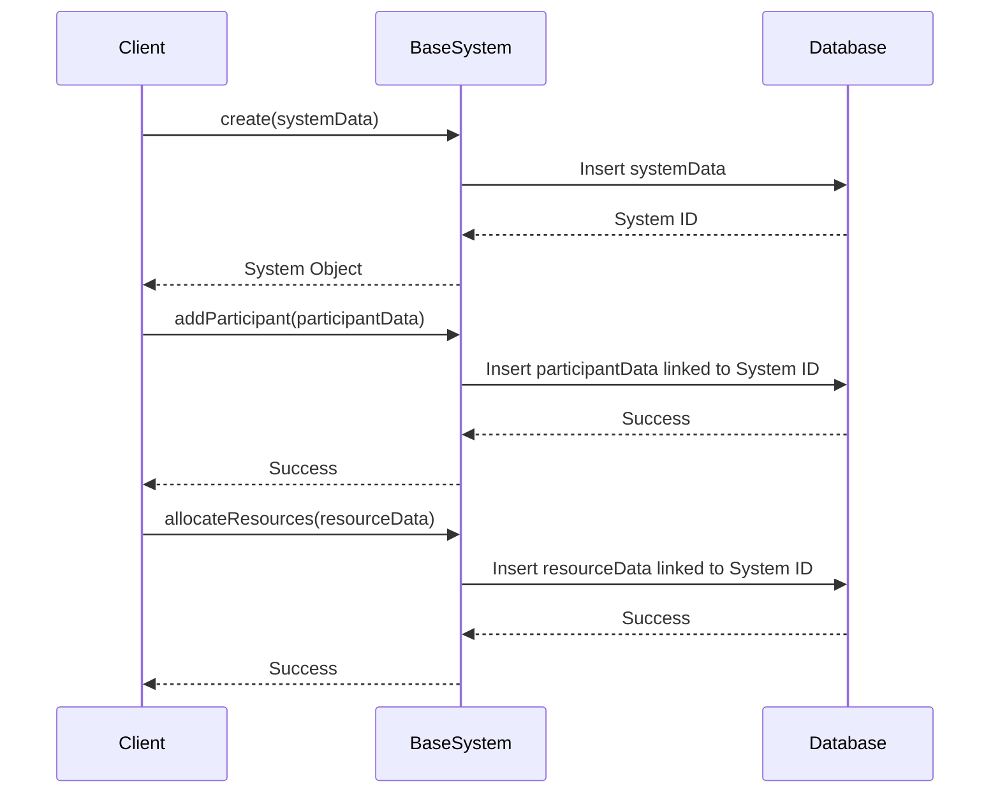

# Chapter 1: BaseSystem

Imagine you're designing a brand new school system. You'll need to think about things like the school's name, its purpose (elementary, high school, etc.), the resources it has (teachers, classrooms, books), and who participates in it (students, teachers, staff).  Instead of starting from scratch each time you design a new school system, or a healthcare system, or any other kind of system, you can use a blueprint.  That's what `BaseSystem` is! It's a foundational model for building any kind of system.

## What problem does BaseSystem solve?

`BaseSystem` helps avoid redundant work and ensures consistency when modeling different kinds of systems.  It provides a common set of properties and functionalities that all systems share.  This allows us to focus on the unique aspects of each specific system, like specialized programs for a school or patient care procedures for a hospital, without reinventing the wheel for basic functionalities.

## Key Concepts

1. **Properties:**  Just like a blueprint has details about a building, `BaseSystem` has properties that describe a system.  These include:
    - `name`: The name of the system (e.g., "Sunnyside Elementary School").
    - `purpose`: The overall goal of the system (e.g., "To provide quality elementary education").
    - `resources`:  What the system uses to function (e.g., "Teachers, classrooms, computers").
    - `participants`: Who is involved in the system (e.g., "Students, teachers, parents").

2. **Functionality:** `BaseSystem` also provides basic functions for managing these properties.  For example, you can use it to:
    - Add new participants (e.g., enroll a new student).
    - Allocate resources (e.g., assign a teacher to a classroom).
    - Define governance policies (e.g., school rules).

## Using BaseSystem: Building our School

Let's use `BaseSystem` to model Sunnyside Elementary School.

```php
// Simplified example - see BaseSystem.php for full implementation
use App\Models\BaseSystem;

$school = BaseSystem::create([
    'name' => 'Sunnyside Elementary School',
    'purpose' => 'To provide quality elementary education',
    'system_type' => 'Education' // Example - see SystemType enum
]);

// Add a teacher (participant)
$school->addParticipant(123, 'Teaching', 'Educate students'); // User ID 123

// Allocate a classroom (resource)
$school->allocateResources([
    'name' => 'Classroom A',
    'resource_type' => 'physical'
]);
```

This code creates a new `BaseSystem` representing Sunnyside Elementary. We then add a teacher as a participant and allocate a classroom as a resource.

## Internal Implementation

When you call `create` on `BaseSystem`, it creates a new entry in the database representing the system.  Similarly, `addParticipant` and `allocateResources` create new entries related to the system.



The code for these functions can be found in `Gov/Entities/Base/BaseSystem.php`.  Here's a simplified snippet of the `addParticipant` function:

```php
// Gov/Entities/Base/BaseSystem.php (simplified)
public function addParticipant(int $userId, string $intent, string $desiredOutcome): bool
{
    // ... (Simplified logic to add participant to database) ...
    return true;
}
```

## Conclusion

In this chapter, we learned about `BaseSystem`, a fundamental building block for modeling any kind of system. We saw how it helps avoid redundancy and promotes consistency.  In the next chapter, we'll explore the [InterfaceLayer](02_interfacelayer.md), which defines how users interact with our systems.


---

Generated by [AI Codebase Knowledge Builder](https://github.com/The-Pocket/Tutorial-Codebase-Knowledge)