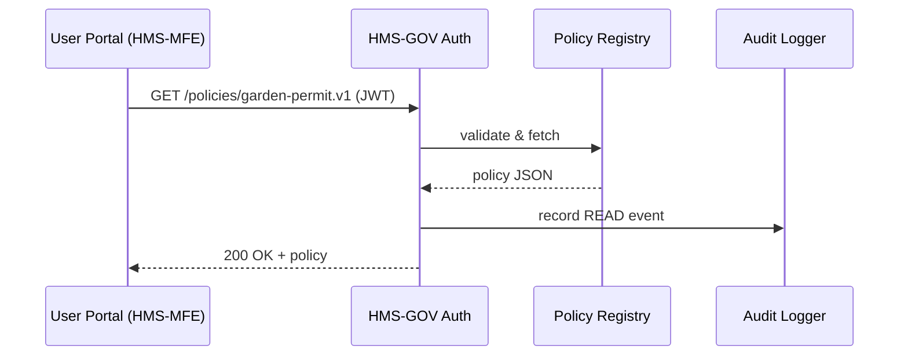
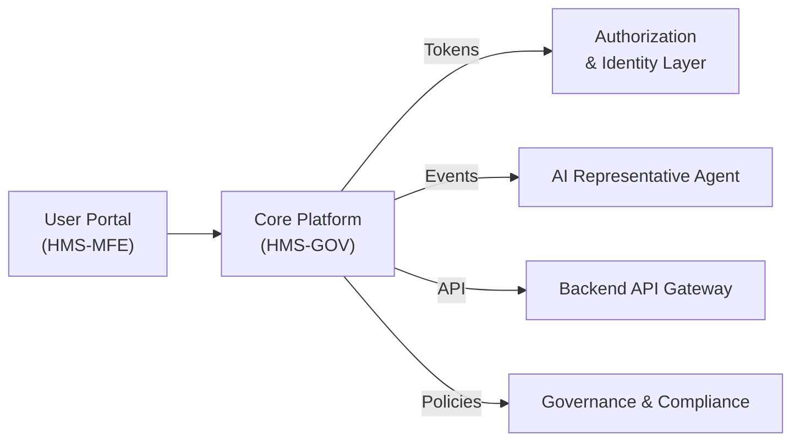

# Chapter 1: Core System Platform (HMS-GOV)

Welcome!  
Imagine you are “Alex,” a citizen who wants to:

1. Apply for a **community garden permit** (city parks department).  
2. Check the **status of a small-business grant** (federal development agency).  
3. Update health insurance information after a change of address.

In the physical world you would wander from window to window in a huge government complex, filling out forms repeatedly. HMS-GOV turns that maze into a single digital “city hall.”  
Everything—login, rules, document vault, audit trail—lives here so that any new module (for example, the upcoming **HMS-CUR** budgeting tool) can simply bolt on without rewiring the whole system.

---

## 1. Why Does HMS-GOV Exist?

Problem (before):  
```
Citizens → Many logins → Many agency portals → Re-enter data ↻
```

Solution (after):  
```
Citizens → 1 login → HMS-GOV → Any agency service
```

Benefits for beginners:

* One identity = less password chaos  
* Consistent policy enforcement = fewer compliance headaches  
* Plug-in friendly = you can add HMS-CUR or any future service with a tiny config file

---

## 2. Key Building Blocks

| Analogy in a real city hall | HMS-GOV Component | What it does |
| --------------------------- | ----------------- | ------------ |
| Security desk               | Authentication Gateway |
| Rule book on the wall       | Policy Registry |
| Clerk’s stamp               | Audit Logger |
| Department counters         | Domain Plug-in Slots |
| Pneumatic mail tubes        | Event Bus |

Let’s unpack these one by one.

### 2.1 Authentication Gateway  
First stop for every request. It checks “Who are you?” and hands out a short-lived token (think of a visitor badge).

### 2.2 Policy Registry  
Stores rules such as “Garden permits need proof of residence.” Keeps them versioned so agencies pass audits.

### 2.3 Audit Logger  
Writes an immutable “paper trail” so a compliance officer can later ask, “Who approved Alex’s permit at 3 pm?”

### 2.4 Plug-in Slots  
A JSON manifest lets new modules register menus, APIs, and permissions. HMS-CUR will use this to appear as a budgeting plug-in later.

### 2.5 Event Bus  
Like vacuum tubes connecting counters: “Permit Approved” events can notify billing, email, or analytics services.

---

## 3. A 5-Minute Hands-On Tour

We will:

1. Register HMS-CUR as a new plug-in.  
2. Log in as Alex.  
3. Read a policy (“garden-permit.v1”).  

### 3.1 Registering a Plug-in

`plugins/hms-cur.json`
```json
{
  "name": "HMS-CUR",
  "routes": ["/cur/**"],
  "permissions": ["budget.read", "budget.write"],
  "version": "0.0.1"
}
```
Explanation: Drop this file in the `plugins` folder; HMS-GOV auto-loads it at startup, adds menu items, and injects CUR permissions into the policy store.

### 3.2 Logging In

```python
import requests

resp = requests.post("https://gov.example.com/auth/login",
                     json={"email": "alex@example.com",
                           "password": "garden123"})
token = resp.json()["access_token"]
print(token[:15], "...")  # prints a JWT prefix
```
We hit the Authentication Gateway and receive a JWT token—Alex’s visitor badge.

### 3.3 Reading a Policy

```python
hdrs = {"Authorization": f"Bearer {token}"}
policy = requests.get(
    "https://gov.example.com/policies/garden-permit.v1", headers=hdrs
).json()

print(policy["required_documents"])
```
Output might show `["ProofOfResidence.pdf", "NeighborhoodApprovalForm.pdf"]`.

---

## 4. What Happens Under the Hood?

High-level flow for “Alex fetches a policy”:



Step-by-step:

1. HMS-MFE forwards the request with Alex’s JWT.  
2. Authentication Gateway verifies the token.  
3. Policy Registry returns the requested policy.  
4. Audit Logger saves a “READ” entry.  
5. Response travels back to the front end.

---

## 5. Peeking at the Implementation

`src/gov/auth.ts`
```ts
export function verifyJWT(token: string) {
  // TODO: signature + expiry check
  return JSON.parse(Buffer.from(token.split('.')[1], 'base64').toString());
}
```

`src/gov/policy.ts`
```ts
import fs from 'fs';

export function getPolicy(id: string) {
  // super simple: read file from disk
  return JSON.parse(fs.readFileSync(`./policies/${id}.json`, 'utf8'));
}
```

`src/gov/audit.ts`
```ts
export function log(event: object) {
  console.log("AUDIT:", JSON.stringify(event));
}
```

Keep in mind: real code would include encryption, database storage, and more, but this tiny sample shows the moving parts.

---

## 6. How HMS-GOV Connects to the Rest of the System



Each component will get its own chapter:

* Next up is [User Portal (HMS-MFE)](02_user_portal__hms_mfe__.md) where we build the citizen-facing UI.  
* Deeper identity details live in [Authorization & Identity Layer](03_authorization___identity_layer_.md).  

---

## 7. Summary

You now know:

✓ HMS-GOV is the digital city hall: login desk, rule book, vault, and plug-in sockets.  
✓ Adding HMS-CUR or any module is as easy as dropping a manifest.  
✓ REST calls, JWTs, and audit logs make everything traceable and compliant.

Ready to greet your citizens? Let’s step into the front lobby—the user interface—in the next chapter: [User Portal (HMS-MFE)](02_user_portal__hms_mfe__.md)

---

Generated by [AI Codebase Knowledge Builder](https://github.com/The-Pocket/Tutorial-Codebase-Knowledge)