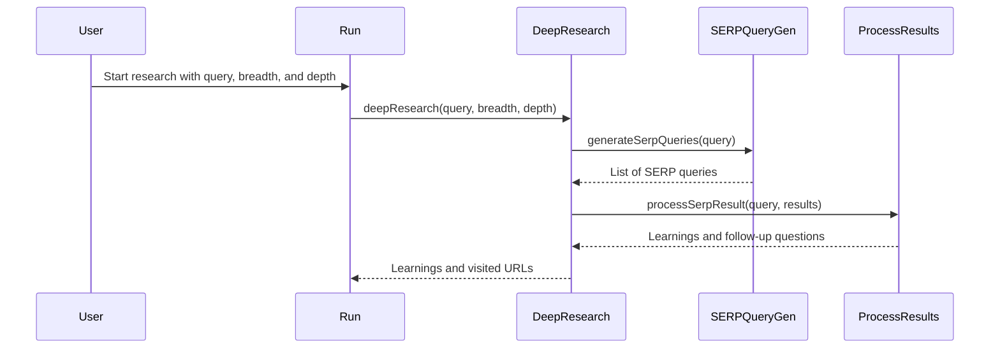

# Chapter 1: Deep Research Agent

Imagine you're a student researching the impact of social media on teenagers. You could spend hours browsing articles, sifting through various websites, and trying to connect the dots.  This is where the Deep Research Agent comes in. It's like having a tireless research assistant that automatically explores the topic for you, going deeper and wider as needed, just like a detective following multiple leads. It uses search engines and AI to gather and synthesize information, saving you valuable time and effort.

## What is a Deep Research Agent?

The Deep Research Agent is the heart of the HMS-AGX project. It takes your research question and automatically explores various related topics. It does this by:

1. Generating smart search queries: It doesn't just search for your exact question. It uses AI to come up with related questions and keywords to explore different aspects of the topic.
2. Gathering information: It uses search engines to find relevant articles, websites, and other resources.
3. Synthesizing information: It uses AI to summarize the information it gathers and identify key learnings.
4. Iterative deepening:  It doesn't just stop at the first layer of results. It uses its findings to generate new queries and explore the topic in more depth.  Think of it like branching out a tree, starting with the trunk (your initial question) and growing branches (related topics) and leaves (specific details).

## Using the Deep Research Agent

Let's walk through a simplified example of how to use the Deep Research Agent.  Imagine your research question is: "What is the impact of social media on teenagers?"

First, you would provide this question as input to the `deepResearch` function. You also need to specify the *breadth* and *depth* of your research.

- **Breadth:** How many different aspects of the topic do you want to explore?  A higher breadth means exploring more diverse perspectives.  Let's set it to 3 for this example.
- **Depth:** How deep do you want to dive into each aspect? A higher depth means exploring each aspect in more detail. Let's set it to 1.

```typescript
// src/run.ts
const { learnings, visitedUrls } = await deepResearch({
  query: "What is the impact of social media on teenagers?",
  breadth: 3,
  depth: 1,
});

console.log(`Learnings:\n${learnings.join('\n')}`);
console.log(`Visited URLs:\n${visitedUrls.join('\n')}`);
```

This code snippet calls the `deepResearch` function with your query, breadth, and depth. The function returns `learnings` (key information extracted from the research) and `visitedUrls` (the sources used).

## Inside the Deep Research Agent

Here's a simplified sequence diagram showing what happens when you call `deepResearch`:



1. You provide the initial query, breadth, and depth.
2. The `deepResearch` function generates multiple search queries using [SERP Query Generation](04_serp_query_generation_.md).
3. It then processes the search results using search engines and [Learning Extraction](05_learning_extraction_.md).
4. If the specified depth is greater than 1, it uses the learnings and [Follow-up Question Generation](06_follow_up_question_generation_.md) to perform further research, effectively going deeper into the topic. This process repeats until the desired depth is reached.  This is covered in more detail in [Iterative Deepening](03_iterative_deepening_.md).
5. Finally, the `deepResearch` function returns the combined learnings and visited URLs.  These learnings are then used to generate a report using [Report Generation](07_report_generation_.md).

## Conclusion

This chapter introduced the Deep Research Agent, the core of HMS-AGX.  We learned how it takes a research question and automatically explores related topics, gathering and synthesizing information.  In the next chapter, we'll explore the concept of [Research Breadth](02_research_breadth_.md) and how it influences the research process.


---

Generated by [AI Codebase Knowledge Builder](https://github.com/The-Pocket/Tutorial-Codebase-Knowledge)