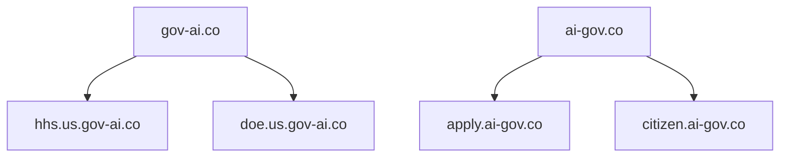
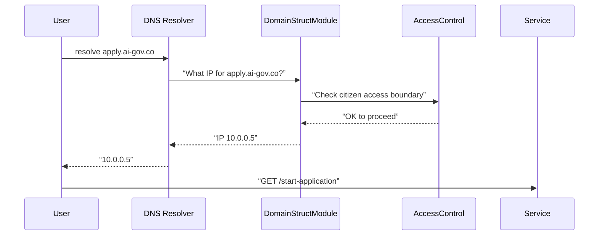

# Chapter 1: Domain Structure

Welcome to the very first chapter of HMS-AGX! In this chapter we'll learn how we organize URLs—just like postal addresses—for federal, state, and local government services.  

---

## 1. Why Domain Structure Matters

Imagine sending a letter. You write:

  123 Main St  
  Springfield, IL 62701  

That “address” tells the post office *exactly* where to send it. In the digital world, we do the same with **domains** and **subdomains**:

  - **Top-level domain** (like `gov-ai.co`) is our “country.”  
  - **Subdomain** (like `hhs.us.gov-ai.co`) is our “state/agency.”  

**Use case**:  
A citizen wants to apply for health benefits—they visit `https://apply.ai-gov.co`. Meanwhile, agency staff manage applications at `https://hhs.us.gov-ai.co`. Our **Domain Structure** abstraction ensures every request is routed correctly, and that governance boundaries and access controls stay in place.

---

## 2. Key Concepts

We break Domain Structure into three simple parts:

1. **TLDs (Top-Level Domains)**  
   - `gov-ai.co` for **admin UIs**  
   - `ai-gov.co` for **citizen portals**

2. **Subdomain Patterns**  
   - Agency admin:  
     `<agency>.<state>.gov-ai.co`  
     e.g. `hhs.us.gov-ai.co`  
   - Public portal/service:  
     `<service>.ai-gov.co`  
     e.g. `apply.ai-gov.co`

3. **Governance Boundaries**  
   - Requests under `*.gov-ai.co` require admin access.  
   - Requests under `*.ai-gov.co` are public-facing.

Here’s a simple mermaid diagram of our hierarchy:



---

## 3. Using Domain Structure in Your Code

We’ll build a tiny helper function that, given an agency or service name, returns the correct domain.

### 3.1 Configuration

```js
// config/domainConfig.js
module.exports = {
  tlds: {
    admin: 'gov-ai.co',
    public: 'ai-gov.co'
  }
};
```
*This file lists our two top-level domains.*

### 3.2 Helper Function

```js
// lib/getDomain.js
const { tlds } = require('../config/domainConfig');

function getDomain({ type, name, state }) {
  if (type === 'admin') {
    return `${name}.${state}.${tlds.admin}`;
  } else if (type === 'public') {
    return `${name}.${tlds.public}`;
  }
  throw new Error('Unknown domain type');
}

module.exports = getDomain;
```
*This function builds a URL host based on `type` (`admin` or `public`), `name` (agency/service), and optional `state`.*

### 3.3 Example Usage

```js
const getDomain = require('./lib/getDomain');

console.log(getDomain({ type: 'admin', name: 'hhs', state: 'us' }));
// Output: hhs.us.gov-ai.co

console.log(getDomain({ type: 'public', name: 'apply' }));
// Output: apply.ai-gov.co
```
*We now have well-formed domains for both staff and citizens!*

---

## 4. What Happens Under the Hood?

Let’s walk through a request step by step:

### 4.1 Sequence Diagram



1. **User** enters `apply.ai-gov.co`.  
2. **DNS Resolver** asks our **Domain Structure Module** for routing info.  
3. Domain code calls **Access Control** to confirm it’s public.  
4. Once approved, DNS returns the service IP back to the user.  
5. The user’s browser connects to the **Service**.

### 4.2 Core Implementation File

```js
// lib/domainStructModule.js
const getDomain = require('./getDomain');
const accessControl = require('./accessControl');

async function resolveHost(hostName) {
  // 1. Parse hostName into type/name/state
  const parts = hostName.split('.');
  // ... parsing logic omitted ...
  // 2. Check access rules
  await accessControl.check(parts);
  // 3. Return IP (lookup or static mapping)
  return '10.0.0.5'; // simplified
}

module.exports = { resolveHost };
```
*Our `resolveHost` function ties everything together: parsing, checking access, then returning an IP.*

---

## 5. Conclusion

Congratulations! You’ve learned how HMS-AGX maps services to friendly, hierarchical URLs—much like postal addresses—so that federal agencies and citizens always land in the right place, with correct governance controls.

Next up, we’ll see how to define the **Program / Protocol Models** that power each service.  
→ [Chapter 2: Program / Protocol Models](02_program___protocol_models_.md)

---

Generated by [AI Codebase Knowledge Builder](https://github.com/The-Pocket/Tutorial-Codebase-Knowledge)