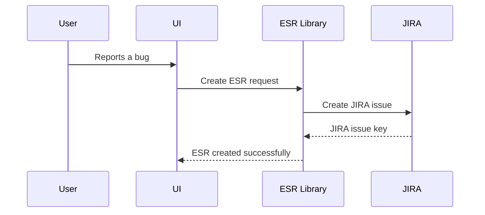

# Chapter 1: ESR (Engineering Support Request)

Imagine you're working on a large software project.  Suddenly, a user reports a bug.  How do you keep track of this bug, who's working on it, and when it's fixed?  That's where an ESR comes in.  An ESR, or Engineering Support Request, is like a digital helpdesk ticket for tracking problems, bugs, and feature requests.  Think of it as a structured way to manage all your support needs.

## What is an ESR?

An ESR is a data structure that holds all the information about a support request.  It's like a container with labeled compartments for different details.  These details typically include:

* **Summary:** A short, descriptive title of the request (e.g., "Button not working on login page").
* **Description:** A more detailed explanation of the problem or feature request.
* **Status:**  The current state of the request (e.g., "Open," "In Progress," "Resolved," "Closed").
* **Priority:** How urgent the request is (e.g., "High," "Medium," "Low").
* **Reporter:** The person who submitted the request.
* **Assignee:** The person responsible for working on the request.

## How ESRs are Used

Let's say a user reports that they can't log in.  You would create a new ESR with the following information:

* **Summary:** "User unable to log in"
* **Description:** "User reports receiving an error message when attempting to log in with correct credentials."
* **Status:** "Open"
* **Priority:** "High"
* **Reporter:** "user123"
* **Assignee:** (unassigned for now)

This ESR now acts as a central point of reference for everyone involved.  As the issue is investigated, updates can be added to the ESR, changing the status, assignee, and adding comments.  Once the bug is fixed, the ESR can be marked as "Resolved" and eventually "Closed."

## ESRs in the `HMS-ESR Library`

The `HMS-ESR Library` uses the `Types::ESR` class to represent ESRs.  While we haven't learned about [Types (Data Structures)](03_types__data_structures__.md) yet, you can think of it as a blueprint for creating ESR objects.

Here's a simplified example of how an ESR might be represented in code:

```ruby
# Example ESR representation (simplified)
esr = {
  key: "ESR-123",
  summary: "User unable to log in",
  description: "User reports receiving an error message...",
  status: "Open",
  priority: "High",
  reporter: "user123",
  assignee: nil
}
```

This is a simplified representation. The actual `Types::ESR` class has more fields, as you'll see in the [Types (Data Structures)](03_types__data_structures__.md) chapter.

## Internal Implementation (Simplified)

The `HMS-ESR Library` interacts with different services (like JIRA or GitHub) to manage ESRs.  Here's a simplified sequence diagram showing how a new ESR might be created:



The [Client Libraries (API Wrappers)](02_client_libraries__api_wrappers__.md) chapter will cover how the library interacts with these external services.

## Conclusion

In this chapter, we learned what an ESR is and how it's used to manage support requests.  We saw a simplified example of how an ESR is represented in code and a high-level overview of how the `HMS-ESR Library` interacts with external services.  In the next chapter, we'll explore the [Client Libraries (API Wrappers)](02_client_libraries__api_wrappers__.md) used to connect to these services.


---

Generated by [AI Codebase Knowledge Builder](https://github.com/The-Pocket/Tutorial-Codebase-Knowledge)