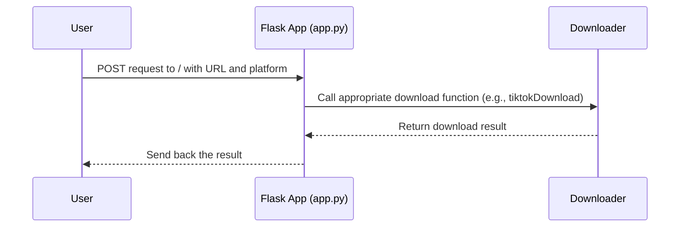

# Chapter 1: Flask App (app.py)

Imagine you want to download videos from different platforms like TikTok, YouTube, and Instagram. You could use separate tools for each, but that's inconvenient.  The `HMS-UTL` project simplifies this process.  The `app.py` file, built using the Flask framework, acts like a central receptionist that handles all your download requests.

## What Problem Does `app.py` Solve?

Let's say you want to download a TikTok video.  Instead of directly interacting with the TikTok downloader, you tell `app.py`, "I want this TikTok video."  `app.py` then figures out that it's a TikTok request and directs it to the appropriate downloader.

## Understanding `app.py`

`app.py` uses the Flask framework, which helps create web applications. Think of Flask as a toolbox that provides ready-made components for building web apps.  `app.py` is the blueprint that defines how these components work together.

### Key Concepts:

1. **Routes:**  Routes are like different doors in your receptionist's office. Each door leads to a specific action. In `app.py`, the main route is `/`.  This is the entry point for all download requests.

2. **Requests:**  A request is like a message you give to the receptionist. It contains information about what you want, like the video URL and the platform (TikTok, YouTube, or Instagram).

3. **Responses:** After processing your request, the receptionist gives you a response.  In `app.py`, the response tells you whether the download was successful and provides the downloaded video information.

### Example Code: The `/` Route

```python
from flask import Flask, request, jsonify
from downloader import Downloader # Imports the Downloader (explained in the next chapter)

app = Flask(__name__) # Creates a Flask app
dl = Downloader() # Creates a Downloader object

@app.route('/', methods=['POST'])
def download_request():
    download_result = { # Placeholder for the download result
                "successfully": False,
                "result": None,
                "reason": "Something went wrong."
            }

    download_rq = request.get_json() # Gets the request data

    if download_rq['source'] == "tiktok": # Checks the platform
        download_result = dl.tiktokDownload(download_rq['url']) # Calls the TikTok downloader
    # ... (similarly for Instagram and YouTube)

    return jsonify(download_result) # Sends the result back

if __name__ == '__main__':
    app.run(host='0.0.0.0', debug=False, port=8000) # Starts the app
```

This code defines the `/` route, which accepts POST requests. It receives the request data, checks the `source` (platform), and calls the appropriate download function from the [Downloader](02_downloader.md). Finally, it sends back the download result.

### Internal Implementation

Here's a simplified sequence diagram showing how `app.py` works:



When a user sends a request to `/`, `app.py` receives it.  It then calls the corresponding download function in the [Downloader](02_downloader.md) based on the platform specified in the request. The `Downloader` handles the actual download process and returns the result to `app.py`, which then sends it back to the user.


## Conclusion

In this chapter, we learned how `app.py` acts as the central entry point for the `HMS-UTL` project, handling download requests and directing them to the appropriate downloaders.  Next, we'll explore the [Downloader](02_downloader.md) and how it handles the actual downloading process.


---

Generated by [AI Codebase Knowledge Builder](https://github.com/The-Pocket/Tutorial-Codebase-Knowledge)