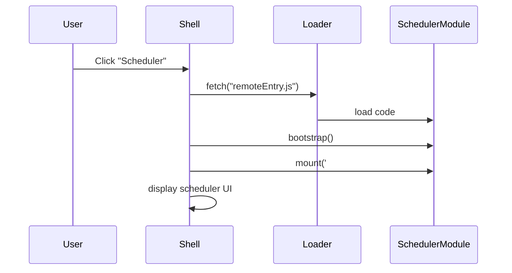

# Chapter 1: Frontend Interface (HMS-MFE)

Welcome to the very first chapter of the HMS-EHR tutorial! In this chapter, we’ll explore the **Frontend Interface (HMS-MFE)**—the “storefront window” your users see. We’ll use a **federal health appointment** scenario to illustrate how modular UI pieces come together into one seamless app.

---

## 1. Why Micro-Frontends?

### Use Case: Scheduling a Federal Clinic Visit
Imagine a citizen portal where veterans can:

1. View their health records  
2. Schedule a clinic appointment  
3. Send feedback to the agency  

Without micro-frontends, a single large app tries to handle everything. Updates to the scheduler might break the feedback form, slowing down deployment.

**Micro-frontends** let each feature live in its own codebase. Teams can develop, test, and deploy the scheduler independently of feedback or records modules—yet users see one unified portal.

---

## 2. Key Concepts

1. **Shell (Container)**  
   The main app that hosts modules. Think of it as the federal service building lobby.

2. **Remote Modules**  
   Independent applications (e.g., Scheduling Booth, Records Booth, Feedback Booth).

3. **Registration & Loading**  
   The shell knows where to fetch each module’s code at runtime.

4. **Lifecycle Hooks**  
   Each module exports `bootstrap`, `mount`, and `unmount` for safe loading and cleanup.

---

## 3. Solving the Use Case

### 3.1 Shell Setup

```html
<!-- index.html -->
<!DOCTYPE html>
<html>
  <head><title>HMS-EHR Portal</title></head>
  <body>
    <div id="hms-app"></div>
    <script src="./shell.js"></script>
  </body>
</html>
```
This loads our shell script and reserves `<div id="hms-app">` as the root.

### 3.2 Registering Modules

```js
// shell.js
import { registerModule, initShell } from './moduleLoader.js';

// Tell the shell where to find each module's entry point
registerModule('Scheduler', 'http://localhost:3001/remoteEntry.js');
registerModule('Records',   'http://localhost:3002/remoteEntry.js');
registerModule('Feedback',  'http://localhost:3003/remoteEntry.js');

// Start the shell after registrations
initShell('#hms-app');
```

> After loading, you’ll see three menu items: **Scheduler**, **Records**, and **Feedback**.

---

## 4. Under the Hood (Non-Code Walkthrough)

When a user clicks **Scheduler**:

1. Shell detects “Scheduler” intent.  
2. Module loader fetches `remoteEntry.js` from the scheduler team.  
3. Shell calls `bootstrap()` to prepare the module.  
4. Shell calls `mount('#hms-app')` to render it.  
5. Old module’s `unmount()` is called if switching away.



---

## 5. Internal Implementation (Code Highlights)

### 5.1 Module Loader (`moduleLoader.js`)

```js
// moduleLoader.js
const registry = {};

export function registerModule(name, url) {
  registry[name] = url;
}

export async function initShell(rootSelector) {
  window.addEventListener('hashchange', loadFromHash);
  loadFromHash();

  async function loadFromHash() {
    const moduleName = window.location.hash.slice(1) || 'Records';
    const url = registry[moduleName];
    const { bootstrap, mount, unmount } = await importRemote(url);
    if (window.currentModule) await window.currentModule.unmount();
    await bootstrap();
    await mount(rootSelector);
    window.currentModule = { unmount };
  }
}

async function importRemote(url) {
  // Simplified dynamic import
  const container = await window.loadScript(url);
  await container.init(__webpack_share_scopes__.default);
  const factory = await container.get('./Module');
  return factory();
}
```

> **Explanation:**  
> - `registerModule` stores URLs.  
> - `initShell` watches the URL hash to decide which module to load.  
> - `importRemote` uses Webpack Module Federation under the hood.

### 5.2 Example Remote Module (`remoteEntry.js`)

```js
// Provided by Scheduler team
const Module = {
  async bootstrap()  { console.log('Scheduler bootstrapped'); },
  async mount(root)  { document.querySelector(root).innerHTML = '<h2>Schedule It!</h2>'; },
  async unmount()    { document.querySelector('#hms-app').innerHTML = ''; }
};

export function get() {
  return () => Module;
}

// Webpack config exports this at runtime for module federation
```

> **Explanation:**  
> - Exports a simple object with lifecycle methods.  
> - On `mount()`, it injects its own UI.

---

## 6. Architecture Overview

```mermaid
flowchart LR
  Shell[Shell (HMS-MFE)]
  subgraph Remotes
    Sched[Scheduler Module]
    Recs[Records Module]
    Fdbk[Feedback Module]
  end

  Shell -->|fetch & mount| Sched
  Shell -->|fetch & mount| Recs
  Shell -->|fetch & mount| Fdbk
```

> The **Shell** dynamically pulls in each box in the **Remotes** cluster.

---

## Conclusion

You’ve learned how HMS-MFE:

- Registers and initializes micro-frontends  
- Dynamically loads each feature (Scheduler, Records, Feedback)  
- Keeps development teams independent but delivers a unified app  

In the next chapter, we’ll see how these UIs connect to the **[Admin/Gov Portal (HMS-GOV)](02_admin_gov_portal__hms_gov__.md)** to manage user roles, permissions, and dashboards.  

Happy coding!

---

Generated by [AI Codebase Knowledge Builder](https://github.com/The-Pocket/Tutorial-Codebase-Knowledge)