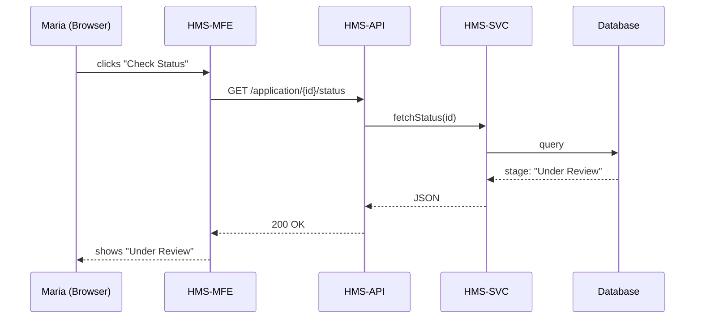

# Chapter 1: Frontend Interface Shells (HMS-MFE & HMS-GOV)

Welcome! In this first chapter we meet the two faces of the “Human-Mission System” (HMS):

* **HMS-MFE** — the citizen-facing Multi-Front-End  
* **HMS-GOV** — the staff-facing government portal

Think of them as a public library’s **lobby** and **control room**: both sit in the same building, share the same décor, yet serve very different visitors. They let people and officials talk to the same HMS-API brain in Chapter 3, while keeping the experience friendly for each role.

---

## 1. Why do we need two shells?

Imagine Maria, a traveler who wants TSA PreCheck. She visits tsa.gov, fills a form, and checks her application status online. Simultaneously, Officer Lee at the Transportation Security Administration (TSA) reviews thousands of such applications on an internal dashboard.

Problems if we used a single UI:

1. Citizens would see intimidating admin tools.  
2. Officers would lack high-powered filters and bulk actions.  
3. Any rule change (say, new ID requirement) must appear in both places, risking duplicate work.

By separating shells but sharing core parts, we solve all three.

---

## 2. Key concepts

| Concept | In Plain Words |
|---------|----------------|
| **Shell** | The outermost web app (routing, theming, auth) that hosts smaller feature modules. |
| **Component Library** | A shared LEGO box (buttons, forms, alerts) inspired by GSA’s U.S. Web Design System. Keeps colors, fonts, and accessibility consistent. |
| **Role-Specific Modules** | Feature bundles loaded only for the right audience. e.g., “My Application Tracker” (MFE) vs. “Policy Dashboard” (GOV). |
| **API Contract** | A promise that both shells call the same REST/GraphQL endpoints defined by HMS-API. |

---

## 3. Quick tour with live snippets

### 3.1 Citizen view (HMS-MFE)

```tsx
// src/mfe/screens/Status.tsx
import { useEffect, useState } from 'react';
import { Card, Spinner } from 'hms-ui';   // shared library

export function Status({ appId }: { appId: string }) {
  const [data, setData] = useState<any>(null);

  useEffect(() => {
    fetch(`/api/application/${appId}/status`)
      .then(res => res.json())
      .then(setData);
  }, [appId]);

  if (!data) return <Spinner label="Loading..." />;
  return <Card title="Your TSA PreCheck Status">{data.stage}</Card>;
}
```

Explanation:  
1. The component pulls status from the same `/api/...` endpoint GOV uses.  
2. `hms-ui` gives us an accessible Card and Spinner without extra design work.  

### 3.2 Administrator view (HMS-GOV)

```tsx
// src/gov/screens/Dashboard.tsx
import { Table } from 'hms-ui';

export function Dashboard({ rows }: { rows: any[] }) {
  return (
    <Table
      caption="Applications Needing Review"
      columns={['Name', 'Stage', 'Submitted']}
      data={rows}
    />
  );
}
```

Explanation:  
GOV shell plugs the same table component into a route only officers can visit.

---

## 4. What happens under the hood?

Below is a zoom-out of a typical citizen status check. Both shells follow identical steps; only the **source of the HTTP call** differs.



Key points:  
• The path is identical when Officer Lee triggers it from HMS-GOV.  
• MFE/GOV do not know database details; they trust HMS-API.

---

## 5. File layout (reference only)

```
frontend/
  mfe/          # Citizen shell
    App.tsx
    routes/
  gov/          # Staff shell
    App.tsx
    routes/
  hms-ui/       # Shared component library
    Button.tsx
    Table.tsx
```

Each shell is a separate SPA (Single-Page Application) that imports `hms-ui`. Build scripts ensure both use the same UI version, avoiding mismatched styles.

---

## 6. Building your first shell locally

```bash
# 1. Install dependencies
npm ci

# 2. Start the citizen shell
npm run dev:mfe

# 3. Start the gov shell in another terminal
npm run dev:gov
```

You should now see:

* http://localhost:3000 — “Apply / Check Status” site (MFE)  
* http://localhost:4000 — “Officer Dashboard” site (GOV)

Both proxy `/api/*` to a mocked backend. Open DevTools → Network to confirm identical requests.

---

## 7. How the shells stay in sync

1. **Shared environment variables** (e.g., `REACT_APP_API_BASE`) guarantee both hit the same HMS-API domain.  
2. **Versioned component library** ensures visual parity; we bump `hms-ui@1.2.0` in both at the same commit.  
3. **Contract tests** run in CI: if HMS-API changes a response shape, failing tests alert both teams simultaneously.

---

## 8. Common pitfalls & tips

| Pitfall | How to avoid |
|---------|--------------|
| Diverging styles | Always import from `hms-ui`, never write custom CSS without a ticket. |
| Duplicate logic | Place shared hooks (e.g., `useApplicationStatus`) in `frontend/common/`. |
| Breaking admin tools in prod | Use feature flags; limit risky modules to GOV's build. |

---

## 9. Recap & what’s next

You learned:

✓ Why separate shells matter  
✓ How they talk to the same HMS-API  
✓ Basic React examples for each role  
✓ Internal request flow and folder structure

Next we’ll see **how users jump between pages and tasks with purpose, not just clicks**. That magic lives in the navigation engine you’ll explore in [Intent-Driven Navigation Engine](02_intent_driven_navigation_engine_.md).

---

Generated by [AI Codebase Knowledge Builder](https://github.com/The-Pocket/Tutorial-Codebase-Knowledge)