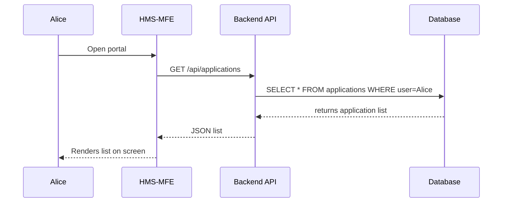

# Chapter 1: Frontend Interfaces

Welcome to the first chapter of HMS-EMR! In this chapter, we’ll explore **Frontend Interfaces**—the user-facing portals that let citizens and administrators interact with our system. Think of these like the service counters at a DMV (public side) and the back-office consoles used by clerks.

---

## 1. Why Frontend Interfaces Matter

Imagine you’re a citizen who needs to check the status of a passport application. You go to a public portal, fill in a form, click “Submit,” and see your application status. Behind the scenes, a clerk logs into a different portal to review and approve your request. Both these portals are **Frontend Interfaces**:

- **HMS-MFE**: For citizens (public portal)  
- **HMS-GOV**: For government staff (admin portal)

Providing clear, responsive, and accessible interfaces speeds up service delivery and keeps everyone informed—just like efficient counters at a public office.

---

## 2. Key Concepts

1. **HMS-MFE (Micro Frontend for Everyone)**  
   - A lightweight portal where citizens view and submit applications.
2. **HMS-GOV (Government Console)**  
   - A secure back-office dashboard for staff to process requests.
3. **Pages & Components**  
   - Building blocks (e.g., headers, forms, lists).
4. **Data Fetching**  
   - How the frontend talks to our [Backend API Layer](06_backend_api_layer_.md) to retrieve or update data.

---

## 3. Example Use Case: Viewing Application Status

**Scenario:** Alice logs into the citizen portal (HMS-MFE) to see her pending passport application.

### 3.1 index.html (entry point)

```html
<!DOCTYPE html>
<html>
  <head>
    <meta charset="UTF-8" />
    <title>HMS Citizen Portal</title>
  </head>
  <body>
    <div id="root"></div>
    <script src="bundle.js"></script>
  </body>
</html>
```
> This minimal HTML loads our bundled JavaScript into a `div#root`.

### 3.2 src/App.js

```jsx
import React from 'react';
import ApplicationList from './components/ApplicationList';

function App() {
  return (
    <div>
      <h1>Welcome to HMS Citizen Portal</h1>
      <ApplicationList />
    </div>
  );
}

export default App;
```
> App.js renders a header and our `ApplicationList` component.

### 3.3 src/components/ApplicationList.js

```jsx
import React, { useEffect, useState } from 'react';

function ApplicationList() {
  const [apps, setApps] = useState([]);

  useEffect(() => {
    fetch('/api/applications')          // Calls Backend API
      .then(res => res.json())
      .then(data => setApps(data));
  }, []);

  return (
    <ul>
      {apps.map(a => (
        <li key={a.id}>{a.type}: {a.status}</li>
      ))}
    </ul>
  );
}

export default ApplicationList;
```
> This component fetches a list of applications (e.g., “Passport: Pending”) and displays them.

---

## 4. Under the Hood: What Happens Step-by-Step

Before we dive into more code, here’s a simple sequence diagram of Alice’s interaction:



1. **Alice** opens the portal.  
2. **HMS-MFE** calls the **Backend API**.  
3. The API queries the **Database** and returns results.  
4. **HMS-MFE** renders the list.

---

## 5. Frontend File Structure & More Internals

A typical frontend folder might look like:

```
frontend/
├─ mfe/                 # HMS-MFE for citizens
│  ├─ src/
│  │  ├─ App.js
│  │  └─ components/
│  │     └─ ApplicationList.js
│  └─ index.html
└─ gov/                 # HMS-GOV for administrators
   ├─ src/
   │  ├─ GovApp.js
   │  └─ components/
   │     └─ GovDashboard.js
   └─ index.html
```

### 5.1 Quick Peek at HMS-GOV Component

```jsx
// gov/src/components/GovDashboard.js
import React, { useEffect, useState } from 'react';

function GovDashboard() {
  const [tasks, setTasks] = useState([]);

  useEffect(() => {
    fetch('/api/pending-approvals')    // Admin API call
      .then(r => r.json())
      .then(setTasks);
  }, []);

  return (
    <div>
      <h2>Pending Approvals</h2>
      {tasks.map(t => <p key={t.id}>{t.applicationType} by {t.user}</p>)}
    </div>
  );
}

export default GovDashboard;
```
> Similar pattern: fetch data and render a list of tasks for clerks.

---

## 6. Conclusion

In this chapter, you learned:

- Why frontend interfaces are crucial (DMV-style service counters).  
- The two portals in HMS-EMR: **HMS-MFE** and **HMS-GOV**.  
- A beginner-friendly code example showing how to fetch and render data.  
- What happens under the hood (sequence diagram).  

Next, we’ll dive into how users navigate with intent in our portals.  
[Chapter 2: Intent-Driven Navigation](02_intent_driven_navigation_.md)

---

Generated by [AI Codebase Knowledge Builder](https://github.com/The-Pocket/Tutorial-Codebase-Knowledge)