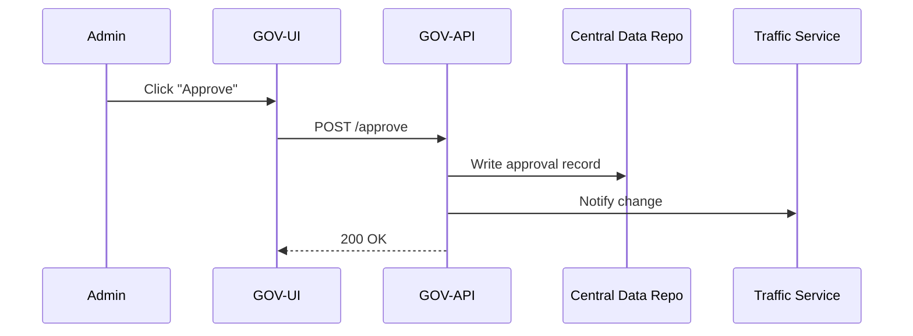

# Chapter 1: Governance Layer / Admin Portal (HMS-GOV)

*“One screen to rule them all.”*  
HMS-GOV is the control tower where policy-makers, city clerks, or agency chiefs log in, see everything that is happening, and say **“yes,” “no,”** or **“change that.”**

---

## 1. Why Do We Need HMS-GOV?  

Imagine the National Capital Planning Commission wants to shorten traffic-light cycles around the National Mall this weekend.  

Traditionally, they would:

1. Call the city’s traffic department.  
2. Wait for engineers to SSH into street cabinets.  
3. Hope nothing breaks.

With HMS-GOV they instead:

1. Open the Admin Portal in a browser.  
2. Review a dashboard that shows every intersection light.  
3. Click **Approve** on the proposed “Weekend Mall Plan.”  
4. Done. The change is logged, auditable, and instantly propagated by other layers (you’ll meet them in later chapters).

---

## 2. Core Concepts in Plain English

| Term | Plain-English Analogy |
|------|-----------------------|
| **Dashboard** | A big wall map in city hall, but interactive. |
| **Policy Proposal** | A “request slip” an agency submits (e.g., *change light timing to 45 sec*). |
| **Approval Workflow** | The mayor’s signature chain—who must say “OK.” |
| **Role-Based Access** | Room keys: traffic engineers can flip lights, finance officers can’t. |
| **Audit Log** | CCTV in the control tower—records every click. |

---

## 3. Quick Tour: Approving a “Traffic-Light” Change

Below is the tiniest possible walkthrough using a mocked API.  
(You don’t need to install anything yet—read the comments.)

```js
// admin_portal_demo.js
// 1. Fetch items waiting for approval
const pending = await fetch('/api/hmsgov/approvals').then(r => r.json());

/*
expected output (simplified):
[
 { id: 42, title: "Weekend Mall Plan", agency: "NCPC", status: "PENDING" }
]
*/

// 2. Approve the first item
await fetch('/api/hmsgov/approvals/42/approve', { method: 'POST' });

// 3. Verify
const updated = await fetch('/api/hmsgov/approvals/42').then(r => r.json());
// -> { id: 42, status: "APPROVED", approvedBy: "alice@ncpc.gov" }
```

Explanation (🎯 super-short):

1. We call the “pending approvals” endpoint—HMS-GOV returns everything awaiting action.  
2. We POST to `/approve`; the system checks our role, stamps the record.  
3. We fetch again to confirm it moved to **APPROVED**.

---

## 4. A Closer Look at the Moving Parts



Walkthrough in words:

1. **Admin** presses **Approve**.  
2. The **UI** (React, Angular, or your favorite micro-frontend) calls the **GOV-API**.  
3. **GOV-API** writes an immutable audit entry inside the [Central Data Repository](07_central_data_repository__hms_dta__.md).  
4. It then pings the Traffic Service (one of many backend services you’ll meet in [Backend Service Layer & APIs](05_backend_service_layer___apis__hms_svc__.md)).  
5. Success is returned to the UI, which updates the dashboard.

---

## 5. Peeking into the Code (Under 20 Lines!)

Below is the heart of the Approvals Controller.  
File: `services/hms-gov/approvals.js`

```js
// Minimal Express-style route
router.post('/:id/approve', async (req, res) => {
  const id = req.params.id;
  const user = req.user.email;                // set by auth middleware

  // 1. store audit log
  await AuditLog.insert({ id, action: 'APPROVED', user });

  // 2. mark record
  await Approvals.update(id, { status: 'APPROVED', approvedBy: user });

  // 3. broadcast (fire-and-forget)
  MessageBus.publish('traffic.change', { id });

  res.sendStatus(200);
});
```

Key ideas:

• `AuditLog.insert` makes the action traceable.  
• `Approvals.update` changes the state.  
• `MessageBus.publish` alerts other layers without us worrying who listens (decoupling FTW!).

---

## 6. Bridging to Other Layers

HMS-GOV never works alone:

- It talks to intelligent helpers introduced in [AI Representative Agent (HMS-AGX)](02_ai_representative_agent__hms_agx__.md) that can *suggest* policy changes.  
- All data it shows comes from the shared [Central Data Repository (HMS-DTA)](07_central_data_repository__hms_dta__.md).  
- Any long-running automation is executed by the [Agent Orchestration Engine (HMS-ACT)](06_agent_orchestration_engine__hms_act__.md).

Think of HMS-GOV as the **face**—other chapters cover the **muscles** and **brain**.

---

## 7. Try It Yourself (Optional Mini-Setup)

1. Clone the repo (placeholder for now).  
2. Run `npm install && npm start` inside `services/hms-gov`.  
3. Open `http://localhost:3000`—you’ll see a dummy dashboard with mock data.  
4. Play: Approve or reject a sample “U.S. Africa Command Training Grant” request.

*(The real integration will unfold as we cover more layers.)*

---

## 8. What You Learned

• HMS-GOV is the **control tower** for human decision-makers.  
• It offers dashboards, role-based actions, and audit logging.  
• A simple approval flow touches UI, API, data, and backend services in a few clear steps.  

Ready to meet the system’s virtual civil-servant?  
Continue to [AI Representative Agent (HMS-AGX)](02_ai_representative_agent__hms_agx__.md).

---

Generated by [AI Codebase Knowledge Builder](https://github.com/The-Pocket/Tutorial-Codebase-Knowledge)