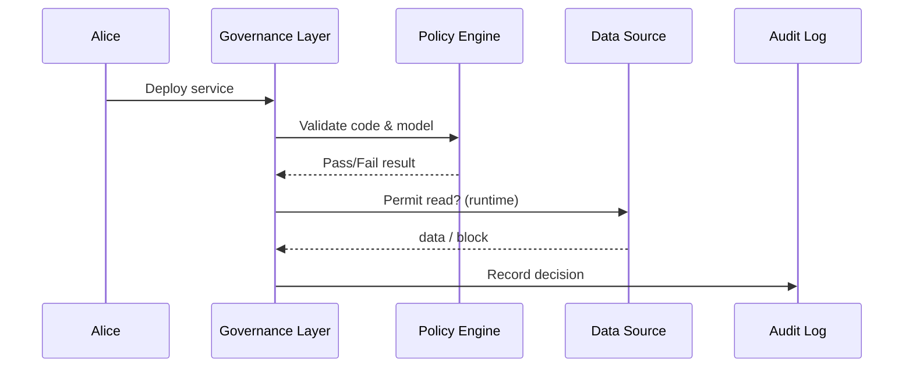

# Chapter 1: Governance Layer (AI Governance Model)

Welcome 👋!  
Imagine you are a developer at the Appalachian Regional Commission (ARC).  
You’ve just finished a tiny AI service that helps citizens check grant eligibility.  
Before **any** part of that service can reach real users, it must pass through one gatekeeper:

> **The Governance Layer** – the constitution of the HMS-CDF platform.

If you remember nothing else: **“Nothing ships unless it passes this layer.”**

---

## 1. Why Do We Need a Governance Layer?

Public-sector software is held to higher standards than a consumer app.  
We must guarantee:

* Transparency – Every decision can be traced.
* Truth – Models use approved data only.
* Safety & Ethics – No biased or harmful output.
* Privacy – Personal data is protected.
* Budget Control – Tax dollars are spent as intended.

The Governance Layer converts these ideals into _code_ so that every microservice, AI agent, and human user follows the same, non-negotiable rules.

---

## 2. A Quick Story: “Ship My Eligibility Bot”

1. Alice (ARC developer) pushes her AI bot to the HMS-CDF repository.  
2. The Governance Layer scans the code, attached model, and deployment script.  
3. A policy check fails: the bot tries to read a table containing **PII** that it is not authorized to access.  
4. The layer blocks deployment and logs a red-flag alert.  
5. Alice updates her data call, the bot passes all checks, and the pipeline continues.

No e-mail threads, no manual review queues—just an automatic, enforceable constitution.

---

## 3. Key Building Blocks

| Building Block | Friendly Analogy | What It Does |
| --- | --- | --- |
| Policy Contract | A seat-belt law | Defines must-follow rules in plain YAML/JSON. |
| Checkpoints | Airport security gates | Automatically run tests: audits, bias scans, privacy linting. |
| Runtime Guards | Speed governors on buses | Block or log unsafe behavior during execution. |
| Audit Ledger | Federal Register | Immutable record of what happened, when, and by whom. |

---

## 4. Declaring a Policy (5-Line Example)

Below is the smallest possible policy file that still protects sensitive data:

```yaml
# file: policies/no_pii_access.yml
rule: no_pii_access
description: >
  Service may not read tables that contain Personally Identifiable Information (PII).
on_event: "service.read.table"
condition: "table.tags.contains('PII')"
action: "block & alert"
```

Explanation:

1. `on_event` – the activity we monitor (reading a DB table).  
2. `condition` – trigger if the table is tagged `PII`.  
3. `action` – stop the operation and raise an alert.

---

## 5. Attaching the Policy to Your Code

Alice adds one annotation to her deployment script:

```bash
hms-cdf deploy \
  --service eligibility-bot \
  --policies policies/no_pii_access.yml
```

Result: the Governance Layer will now enforce that rule each time the bot runs.

---

## 6. What Happens Under the Hood?



Step-by-step (no code yet):

1. Alice’s deploy request hits the Governance Layer API.  
2. The layer hands artifacts to the Policy Engine.  
3. If _all_ policies pass, deployment proceeds; else it stops.  
4. During runtime, every sensitive call is re-checked.  
5. All decisions are written to the immutable Audit Log.

---

## 7. Peek at the Implementation (Simplified)

File: `governance/check.py` (truncated to <20 lines)

```python
import yaml, json, time

def load_policy(path):
    with open(path) as f:
        return yaml.safe_load(f)

def evaluate(event, policy):
    if event["type"] != policy["on_event"]:
        return True         # not applicable
    if "PII" in event["table"].get("tags", []):
        return False        # block
    return True

def guard(event, policies):
    for p in policies:
        if not evaluate(event, p):
            log(event, "BLOCK")
            raise PermissionError("Governance violation")
    log(event, "ALLOW")

def log(event, decision):
    print(json.dumps({"ts": time.time(),
                      "event": event,
                      "decision": decision}))
```

What you see:

* `load_policy`—reads the YAML file.  
* `evaluate`—checks the condition.  
* `guard`—loops through all attached policies, blocks if any fail.  
* `log`—writes a tiny audit entry (in prod this goes to [System Observability & Ops Center](19_system_observability___ops_center__hms_ops__.md)).

---

## 8. How This Fits with Other Chapters

* Human reviewers supplement automated rules in [Human-in-the-Loop (HITL) Oversight Mechanism](02_human_in_the_loop__hitl__oversight_mechanism_.md).  
* Successful policies flow through the [Policy Deployment Pipeline (CI/CD for Rules)](04_policy_deployment_pipeline__ci_cd_for_rules__.md).  
* Real-time compliance metrics surface in [System Observability & Ops Center](19_system_observability___ops_center__hms_ops__.md).

---

## 9. Try It Yourself: A 60-Second Lab

1. Clone the repo (placeholder for now):  
   `git clone https://github.com/example/hms-cdf.git`
2. Create the YAML policy shown above inside `policies/`.  
3. Run the guard locally:

```python
from governance.check import guard, load_policy

event = {"type": "service.read.table", "table": {"name": "citizens", "tags": ["PII"]}}
policies = [load_policy("policies/no_pii_access.yml")]

guard(event, policies)   # raises PermissionError
```

You just blocked unauthorized data access—congrats! 🎉

---

## 10. Recap

* The Governance Layer is the platform’s **constitution**—no code bypasses it.  
* Policies live as human-readable files, enforced automatically.  
* Audit trails guarantee transparency for auditors, citizens, and Congress alike.

In the next chapter we add human expertise on top of these automated checks.  
Ready? Continue to → [Human-in-the-Loop (HITL) Oversight Mechanism](02_human_in_the_loop__hitl__oversight_mechanism_.md).

---

Generated by [AI Codebase Knowledge Builder](https://github.com/The-Pocket/Tutorial-Codebase-Knowledge)