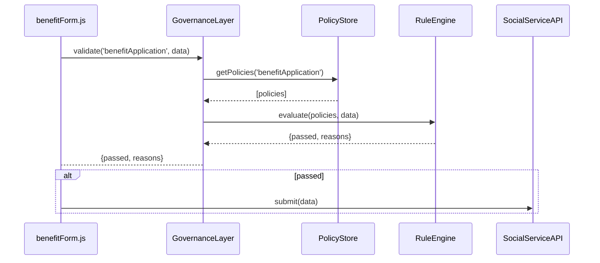

# Chapter 1: Governance Layer

Welcome to the first chapter of HMS-MFE! In this chapter, we’ll explore the Governance Layer—the “rulebook and referee” of our system.

## Why Do We Need a Governance Layer?

Imagine you’re building a citizen portal for a federal agency (e.g., Social Services). Citizens submit personal data—age, income, health info—and your portal must:

- Enforce privacy and data-retention policies  
- Check eligibility rules (e.g., age ≥ 18)  
- Log who did what and when (audit trails)  

Without a centralized rule manager, you’d scatter policies everywhere and risk non-compliance. The Governance Layer solves this by:

1. Defining policies in one place  
2. Automatically enforcing them across all services  
3. Keeping an audit log  

## Central Use Case: Citizen Benefit Application

Use case: A citizen fills out an online form for unemployment benefits. Before the form data goes to backend services, the Governance Layer:

- Loads relevant policies (age, residency, privacy)  
- Validates the form data against those policies  
- Rejects or approves the data flow  

Below, we’ll see how that works in code.

---

## Key Concepts

1. **Policy Definition**  
   A policy is a small rule, e.g. “applicant must be ≥ 18 years old.”  
2. **Policy Store**  
   A centralized repository (file or database) where policies live.  
3. **Rule Engine (Referee)**  
   Component that fetches policies, runs checks, and returns pass/fail.  
4. **Audit Log**  
   Records each policy check for compliance reviews.

---

## 1. Defining a Policy

Create a simple JSON file under `governance/policies/minAge.json`:

```json
{
  "id": "minAge",
  "description": "Applicant must be at least 18 years old",
  "check": "data => data.age >= 18"
}
```

Explanation:  
- `id` — unique name  
- `description` — human-readable text  
- `check` — a JS expression evaluated at runtime

---

## 2. Fetching & Evaluating Policies

Here’s how an application form calls the Governance Layer:

```js
// src/forms/benefitForm.js
import Governance from '../governance/GovernanceLayer'

async function handleSubmit(formData) {
  const result = await Governance.validate('benefitApplication', formData)
  if (!result.passed) {
    alert('Your application failed: ' + result.reasons.join(', '))
  } else {
    // forward to backend
  }
}
```

Explanation:  
- `validate()` loads all policies tagged “benefitApplication”  
- Returns `{ passed: true/false, reasons: [...] }`  

---

## 3. What Happens Under the Hood?

### Sequence Diagram



1. **Form** calls `validate()`  
2. **GovernanceLayer** fetches policies from **PolicyStore**  
3. **RuleEngine** checks each policy  
4. Result returns to the form  
5. If passed, data is sent onward  

---

## 4. Inside the GovernanceLayer

**File:** `governance/GovernanceLayer.js`

```js
// governance/GovernanceLayer.js
import PolicyStore from './PolicyStore'
import RuleEngine from './RuleEngine'

class GovernanceLayer {
  async validate(tag, data) {
    const policies = await PolicyStore.getByTag(tag)
    return RuleEngine.evaluateAll(policies, data)
  }
}

export default new GovernanceLayer()
```

Explanation:  
- `PolicyStore.getByTag(tag)` loads matching policies  
- `RuleEngine.evaluateAll()` returns pass/fail plus reasons  

---

### PolicyStore (simplified)

```js
// governance/PolicyStore.js
const allPolicies = {
  benefitApplication: [ require('./policies/minAge.json') ]
}
export default {
  async getByTag(tag) {
    return allPolicies[tag] || []
  }
}
```

### RuleEngine (simplified)

```js
// governance/RuleEngine.js
export default {
  evaluateAll(policies, data) {
    const reasons = []
    policies.forEach(p => {
      const passed = eval(p.check)(data)
      if (!passed) reasons.push(p.description)
    })
    return { passed: reasons.length === 0, reasons }
  }
}
```

Explanation:  
- We use `eval` on the `check` string for demo purposes  
- Real code would compile or use functions directly  

---

## Conclusion

You’ve learned how the **Governance Layer**:

- Centralizes policy definitions  
- Enforces rules before data flows onward  
- Keeps your system compliant (audit-friendly)  

In the next chapter, we’ll see how the **[Management Layer](02_management_layer_.md)** builds on these rules to orchestrate workflows.

---

Generated by [AI Codebase Knowledge Builder](https://github.com/The-Pocket/Tutorial-Codebase-Knowledge)