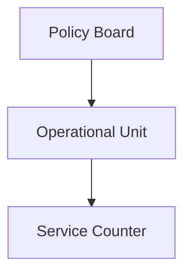
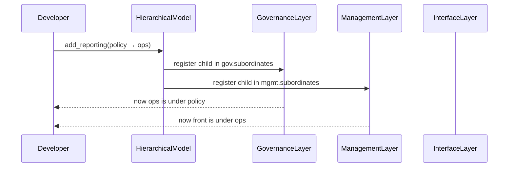

# Chapter 1: Hierarchical Model

Welcome to the first chapter of HMS-ACH! In this chapter we’ll learn about the **Hierarchical Model**, an abstraction that organizes components into clear layers—just like an organizational chart in any federal agency. By the end, you’ll understand how to represent a policy board, operational units, and customer counters in code.

---

## 1. Why a Hierarchical Model?

Imagine you’re building an online permit system for a state’s Department of Motor Vehicles (DMV). Every permit request:

1. Must comply with statewide **policies**.
2. Is processed by local **operational units**.
3. Ends at a public-facing **service counter** where citizens interact.

If responsibilities are tangled, requests get lost, approvals stall, and citizens get frustrated. The **Hierarchical Model** cleanly separates:

- **Governance Layer** (policy board)  
- **Management Layer** (operational unit)  
- **Interface Layer** (customer counter)  

This structure makes it simple to see “who does what” and “who reports to whom.”

---

## 2. Key Concepts

1. **Tier**  
   A level in the hierarchy (e.g., policy, operations, interface).  
2. **Node**  
   A specific unit at that tier (e.g., “Safety Policy Board,” “DMV Region 1 Office,” “DMV Counter A”).  
3. **Reporting Path**  
   Defines parent→child relationships:  
   Policy Board → Operational Unit → Service Counter.

Mermaid diagram of this simple org chart:



---

## 3. Solving the DMV Use Case

Let’s write minimal code to build this hierarchy for our DMV permit workflow.

```python
# File: app.py
from hierarchical_model import HierarchicalModel, Tier

# 1. Define each tier/node
policy = Tier(name="Safety Policy Board", level=1)
ops    = Tier(name="DMV Region 1 Office",   level=2)
front  = Tier(name="DMV Counter A",          level=3)

# 2. Build the model
model = HierarchicalModel()
model.add_tier(policy)
model.add_tier(ops)
model.add_tier(front)

# 3. Define reporting paths
model.add_reporting(parent=policy, child=ops)
model.add_reporting(parent=ops,    child=front)

# 4. Visualize or inspect
print(model)
```

What happens:

- We create three `Tier` objects at levels 1, 2, 3.  
- We register them in a `HierarchicalModel`.  
- We link them so that the policy board “reports to” the operational unit, which in turn “reports to” the service counter.  
- `print(model)` yields a tree-like view showing the flow of responsibility.

---

## 4. Under the Hood: Step-by-Step

**High-level flow** when `model.add_reporting()` is called:



---

## 5. Peek at the Code

### 5.1 Tier Class

```python
# File: hierarchical_model.py
class Tier:
    def __init__(self, name, level):
        self.name = name        # e.g. "Safety Policy Board"
        self.level = level      # numeric hierarchy
        self.subordinates = []  # holds child Tier objects
```

> This class represents one “box” in the org chart.

### 5.2 HierarchicalModel Class

```python
# File: hierarchical_model.py (continued)
class HierarchicalModel:
    def __init__(self):
        self.tiers = {}  # map level → Tier

    def add_tier(self, tier):
        self.tiers[tier.level] = tier

    def add_reporting(self, parent, child):
        parent.subordinates.append(child)
```

> The `HierarchicalModel` stores tiers by level and links them via `subordinates`.

---

## 6. What You’ve Learned

- A **Hierarchical Model** cleanly separates **governance**, **management**, and **interface** concerns.  
- You can represent real-world government workflows—like a DMV permit pipeline—as code.  
- Under the hood, each “tier” is just an object with a list of subordinates.  

Next, we’ll dive into the **[Governance Layer](02_governance_layer_.md)** and see how policies really work under the hood.

---

Generated by [AI Codebase Knowledge Builder](https://github.com/The-Pocket/Tutorial-Codebase-Knowledge)