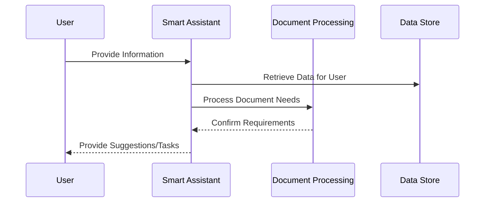

# Chapter 1: HMS-A2A

Welcome to the first chapter of our tutorial on `HMS-A2A`! If you're a beginner exploring the fascinating world of AI smart assistants within government services, you're in the right place. This chapter will introduce you to `HMS-A2A`, which acts like your intelligent sidekick to help you navigate complex government systems with ease. Let's dive in!

---

## What is HMS-A2A?

### Motivation and Use Case

Imagine you're applying for government services, such as a new driver's license or a passport renewal. The paperwork and procedures can often seem overwhelming and confusing. Here’s where `HMS-A2A` comes in. It acts as a personal assistant, guiding you through the process by providing helpful suggestions, ensuring you have all the necessary documents, and even automating parts of the procedure when possible.

`HMS-A2A` is designed to make your experience smoother and more efficient by:

- Understanding your needs and the services available.
- Providing real-time guidance and suggestions.
- Automating repetitive tasks to save you time.

Let's look at how this works in practice!

## Understanding Key Concepts

### Key Concept 1: Smart Assistance

Think of `HMS-A2A` like a friend who knows everything about government services. It uses artificial intelligence to understand your needs based on the information you provide and then offers guidance tailored specifically to you.

### Key Concept 2: Suggestions and Tasks

Not only can `HMS-A2A` make suggestions, but it can also perform certain tasks for you. For example, it might pre-fill forms with your known information or alert you to any missing documents in your application.

## How to Use HMS-A2A

Let’s walk through a simple example: renewing a driver's license. Here’s how `HMS-A2A` can help:

```python
# Simplified example of using HMS-A2A to renew a driver's license

# Initializing the smart assistant
smart_assistant = HMS_A2A()

# Providing user information
user_info = {
    "name": "John Doe",
    "license_number": "B1234567",
    "document_expiry": "2023-05-15"
}

# Requesting assistance
smart_assistant.renew_driver_license(user_info)
```

### Explanation

- **Initialization**: We create an instance of `HMS-A2A`, the smart assistant.
- **User Information**: We supply the necessary details like name, license number, and expiry date.
- **Task Request**: We ask the assistant to help renew the driver’s license.

`HMS-A2A` would then check the information, provide reminders for any missing documents, and possibly automate filling out forms for you.

## Behind the Scenes

Curious about what happens under the hood when you call `HMS_A2A`? Let’s take a look.

Here’s a high-level flow in a sequence diagram:



### Step-by-Step Breakdown

1. **User Interaction**: You provide your details to the smart assistant.
2. **Data Retrieval**: The assistant checks data relevant to you.
3. **Document Processing**: It assesses what documents you have or need.
4. **User Guidance**: Finally, it offers suggestions or automated task completions.

### Internal Implementation

Inside the `hms-a2a_main.txt`:

```plaintext
# Placeholder for the working mechanism of HMS-A2A
# Processes user inputs and returns guidance
class HMS_A2A:
    def renew_driver_license(self, user_info):
        # Step 1: Validate info
        # Step 2: Check renewal requirements
        # Step 3: Automate form filling if applicable
        pass
```

This code snippet highlights the core process of interacting with the assistant. It validates the information, checks requirements, and potentially automates steps for user convenience.

---

## Conclusion

In this chapter, you’ve learned that `HMS-A2A` is your AI-powered smart assistant for interfacing with government services, making tedious tasks easier. You also explored a simple example use case of renewing a driver's license. Now, equipped with a basic understanding, you're ready to dive deeper into the functionality of `HMS-A2A` in the next chapter.

Ready for more? Let’s explore [HMS-MKT](02_hms_mkt_.md) in the next chapter. It promises to extend our understanding and capabilities even further.

Remember, you're not alone on this journey—`HMS-A2A` is here to assist!

---

Generated by [AI Codebase Knowledge Builder](https://github.com/The-Pocket/Tutorial-Codebase-Knowledge)