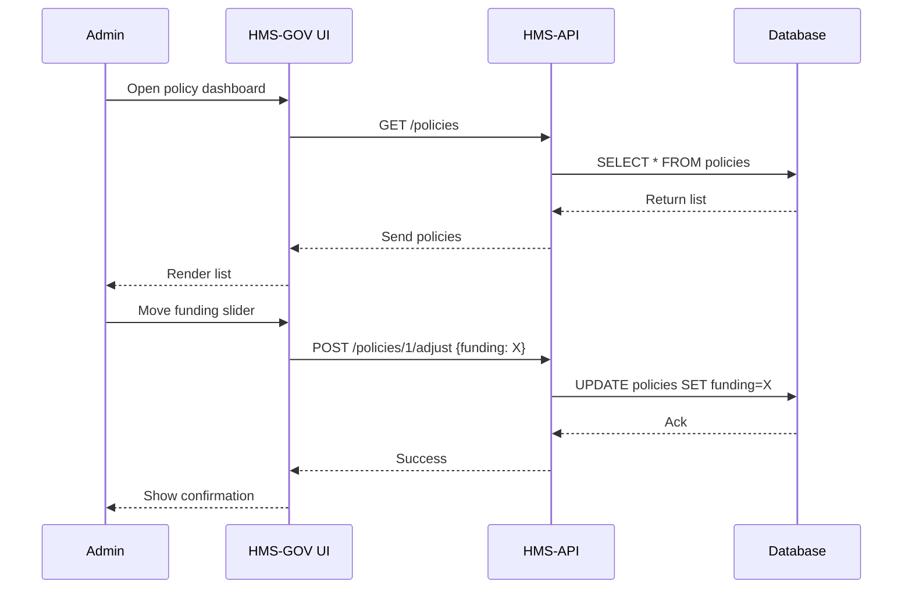

# Chapter 1: HMS-GOV (Admin/Gov Portal)

Welcome to the first chapter of the HMS-A2A tutorial! In this chapter, we’ll explore **HMS-GOV**, the control center for policy-makers and administrators. You’ll learn how to review, tweak, and approve policies—just like in a real legislative chamber’s dashboard.

---

## 1. Motivation & Central Use Case

**Problem:** Policy-makers need a single place to see all active government programs, inspect their performance, and adjust parameters (e.g., funding levels, deadlines) in real time.

**Use Case Example:**  
A federal agency wants to monitor the “No Poverty” program. An administrator logs into HMS-GOV, reviews key metrics (like households served), then moves a slider to increase monthly funding. Within seconds, the new funding goal is saved and reflected in downstream systems.

---

## 2. Key Concepts

1. **Dashboard**  
   A home page listing all policies and their status.

2. **Policy Detail View**  
   Drill into one program to see charts, metrics, and adjustable parameters.

3. **Data Source**  
   HMS-GOV fetches metrics from **HMS-API** ([Chapter 4](04_hms_api__backend_api__.md)).

4. **UI Controls**  
   Specialized components (e.g., `v-snack-feather`, `icon-box-feather`, `gallery-images-rounded`) styled to government branding—sliders, checkboxes, info cards.

5. **Delegation & Approval**  
   Ability to delegate tasks or send for formal sign-off in a multi-step legislative workflow.

---

## 3. Using HMS-GOV to Solve Our Use Case

Below is a minimal flow: fetch policies, display them, adjust funding, and save.

```js
// src/pages/PolicyDashboard.vue
<script>
export default {
  data() {
    return { policies: [] }
  },
  async created() {
    // 1. Fetch list of policies
    this.policies = await this.$api.get('/policies') 
  },
}
</script>

<template>
  <div>
    <h1>Policy Dashboard</h1>
    <div v-for="p in policies" :key="p.id">
      <icon-box-feather :icon="'file-text'" />
      <span>{{ p.name }}</span>
      <!-- Link to detail view -->
      <router-link :to="`/policy/${p.id}`">Manage</router-link>
    </div>
  </div>
</template>
```
*This simple page loads policies and lists them with an icon and “Manage” link.*

Next, the detail view with a funding slider:

```js
// src/components/PolicySlider.vue
<template>
  <div>
    <label>Funding: {{ funding }} USD</label>
    <v-slider
      v-model="funding"
      :min="0" :max="1000000" :step="10000"
      @change="saveFunding"
    />
  </div>
</template>

<script>
export default {
  props: ['policyId', 'initialFunding'],
  data() {
    return { funding: this.initialFunding }
  },
  methods: {
    async saveFunding() {
      // 2. POST updated funding
      await this.$api.post(`/policies/${this.policyId}/adjust`, {
        funding: this.funding
      })
      this.$snackbar.success('Funding updated')
    }
  }
}
</script>
```
*The `v-slider` lets the admin tune funding. On change, we send the update to HMS-API.*

---

## 4. What Happens Under the Hood

Here’s a simple sequence of calls when an admin updates funding:



### 4.1 File Structure Overview
```
hms-gov/
├── src/
│   ├── pages/
│   │   └── PolicyDashboard.vue
│   └── components/
│       └── PolicySlider.vue
└── ...
```

---

## 5. Inside the Code (Highlights)

**API Wrapper** (`src/plugins/api.js`):
```js
// Simplified HTTP client
import axios from 'axios'
export const api = axios.create({
  baseURL: process.env.VUE_APP_API_URL
})
// Usage: this.$api = api in main.js
```

**UI Components Registration** (`main.js`):
```js
import Vue from 'vue'
import { api } from './plugins/api'
import VSnack from 'v-snack-feather'
Vue.prototype.$api = api
Vue.component('v-snack-feather', VSnack)
// ...register other gov-themed components...
```

These few lines hook up the network layer and the branded components you saw in Section 3.

---

## 6. Conclusion & Next Steps

You’ve just built a mini admin portal:

- Fetched and displayed a list of policies  
- Drilled into one policy and adjusted its funding  
- Saw how HMS-GOV talks to **HMS-API** under the hood  

In the next chapter, we’ll switch perspective and build **HMS-MKT (Citizen Portal)**, where citizens interact with the same programs you manage here. See you there!

[Chapter 2: HMS-MKT (Citizen Portal)](02_hms_mkt__citizen_portal__.md)

---

Generated by [AI Codebase Knowledge Builder](https://github.com/The-Pocket/Tutorial-Codebase-Knowledge)