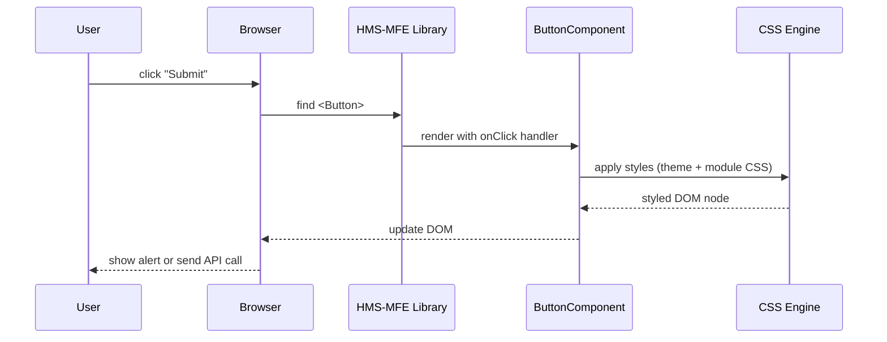

# Chapter 1: HMS-MFE Frontend Components

Welcome to the first chapter! HMS-MFE Frontend Components are the reusable UI building blocks—think of them like the modular parts you snap together when renovating a city building. They give every portal a consistent look and speed up development and maintenance.

---

## 1. Motivation & Central Use Case

Imagine **Citizens** filling out a federal immigration form online. Every input field, button, and layout panel must look and behave the same across different government portals (Office of Immigrant and Employee Rights, Government Ethics, Missile Defense Agency dashboards, etc.). HMS-MFE components solve:

- Consistency: All forms and dialogs look unified.
- Speed: Developers assemble pages from ready-made parts.
- Maintainability: Fix style or behavior in one place, and every portal updates automatically.

**Use Case**: Building a “Visa Application” form using HMS-MFE’s `TextInput`, `Select`, and `Button` components.

---

## 2. Key Concepts

1. **Component Library**  
   A set of ready-made, styled UI pieces (Buttons, Inputs, Modals).

2. **Theme & Styles**  
   Shared design tokens (colors, fonts, spacing) so all components follow federal branding.

3. **Composition**  
   Combine simple components into complex forms or pages.

---

## 3. Using HMS-MFE Components

Below is a minimal example of a visa application form.

```jsx
// src/pages/VisaForm.tsx
import { TextInput, Select, Button } from 'hms-mfe-components';

export default function VisaForm() {
  return (
    <form>
      <TextInput label="Full Name" name="fullName" required />
      <TextInput label="Date of Birth" name="dob" type="date" />
      <Select
        label="Citizenship"
        name="country"
        options={['USA','Canada','Other']}
      />
      <Button onClick={() => alert('Submitted')}>Submit Application</Button>
    </form>
  );
}
```

- **TextInput** renders a labeled input field.  
- **Select** renders a dropdown.  
- **Button** renders a styled button.  

When a citizen clicks **Submit Application**, an alert pops up (in real life, it would call an API).

---

## 4. Internals Walkthrough

Here’s what happens when the user clicks the **Submit** button:



1. **Browser** sees a click event on `<Button>`.  
2. **HMS-MFE Library** delegates to the internal `ButtonComponent`.  
3. `ButtonComponent` asks the **CSS Engine** to apply consistent theme styles.  
4. The styled element is re-rendered to the DOM.  
5. The `onClick` handler fires (alert or API call).

---

## 5. Inside the Button Component

File: `src/components/Button.tsx`

```tsx
import React from 'react';
import styles from './Button.module.css';

export function Button({ children, onClick }) {
  return (
    <button className={styles.primary} onClick={onClick}>
      {children}
    </button>
  );
}
```

- **styles.primary** comes from `Button.module.css`:

```css
/* Button.module.css */
.primary {
  background-color: #005ea2; /* Federal blue */
  color: #fff;
  padding: 0.5rem 1rem;
  border: none;
  border-radius: 4px;
}
.primary:hover {
  background-color: #004a80;
}
```

This CSS module ensures no clashes with other portal styles.

---

## 6. What You’ve Learned

- **Why** reusable UI components matter for government portals.  
- **How** to build a simple visa application form using `TextInput`, `Select`, and `Button`.  
- A high-level **sequence** from user click to styled button in the DOM.  
- A peek “under the hood” at a component’s code and CSS module.

Up next, we’ll see how these components fit into a full portal structure in  
[Chapter 2: HMS-GOV Admin/Gov Portal](02_hms_gov_admin_gov_portal_.md).

---

Generated by [AI Codebase Knowledge Builder](https://github.com/The-Pocket/Tutorial-Codebase-Knowledge)